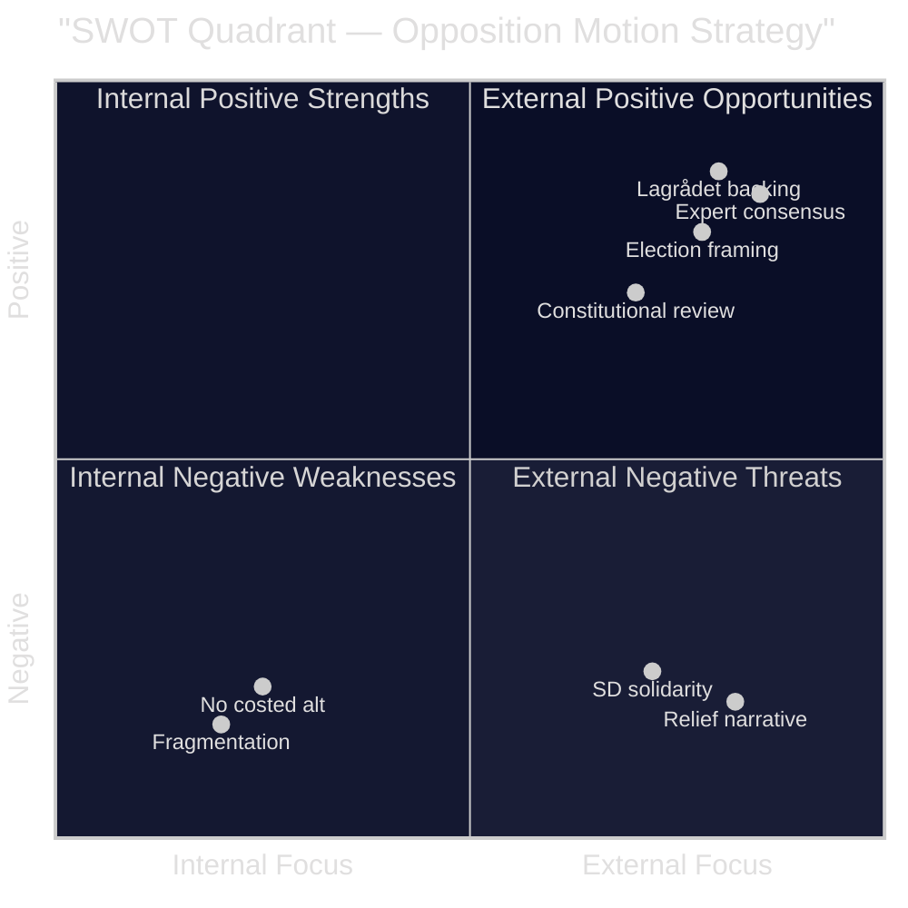

# SWOT Analysis — Opposition Motions 2026-04-23

**Author**: James Pether Sörling | **Date**: 2026-04-23 | **Confidence**: HIGH [B2]  
**Framing**: Strengths/Weaknesses of the *opposition bloc's* motion strategy; Opportunities/Threats from *their* political perspective.

---

## SWOT Matrix

### Strengths

- **Expert agency backing for climate framing**: MP's HD024098 cites Konjunkturinstitutet, Naturvårdsverket, 2030-sekretariatet, Statens energimyndighet and Trafikverket as opposing the fuel tax cut — an unusually strong expert consensus. [riksdagen.se/dokument/HD024098] `[A2]`
- **Lagrådet criticism of deportation law**: V's HD024090 highlights that Lagrådet explicitly advised against prop. 2025/26:235, strengthening the human rights argument. [riksdagen.se/dokument/HD024090] `[A1]`
- **Distributional evidence for V**: V's HD024092 invokes RUT analysis (dnr 2026:158 + dnr 2025:1607) showing the government's reforms disproportionately benefit top-income deciles. [riksdagen.se/dokument/HD024092] `[A2]`
- **S credibility on electricity design flaw**: 800,000 households in shared-grid housing cooperatives excluded from S-identified design flaw, giving S a concrete, relatable grievance. [riksdagen.se/dokument/HD024082] `[B1]`

### Weaknesses

- **Fragmentation undermines narrative unity**: S, V, and MP all oppose the budget supplementary but offer incompatible alternatives (different electricity support models, different rationales). No single motion by multiple parties. [HD024082, HD024092, HD024098 — three separate dok_ids, same proposition, zero joint motion] `[B1]`
- **C defection on migration**: C (HD024089, HD024095) broadly accepts both the new Mottagandelag and the deportation framework with modifications, breaking centre-left solidarity. [riksdagen.se/dokument/HD024089, HD024095] `[B1]`
- **No budget alternative quantified**: S (HD024082) demands better electricity support design but does not specify a costed alternative in the motion text. [riksdagen.se/dokument/HD024082] `[B2]`
- **Arms export motion (HD024096) unlikely to pass**: With SD, M, L, KD backing government arms policy, MP's export ban demand is politically isolated. [riksdagen.se/dokument/HD024096] `[B2]`

### Opportunities

- **Election framing window**: The 2026 election provides a six-month window to build a joint opposition narrative around energy transition + distributional justice — the motion cluster provides raw material. [aggregate assessment, no single dok_id] `[C3]`
- **Constitutional review potential**: If Mottagandelag area-restrictions violate kommunal självstyre principles, judicial review could embarrass the government. [HD024089 cites constitutional concerns; riksdagen.se/dokument/HD024089] `[C3]`
- **Agency credibility cascade**: If Konjunkturinstitutet issues a formal advisory against the fuel tax (beyond the remiss stage), it upgrades the opposition's credibility posture. [HD024098 — remiss phase already hostile] `[B3]`
- **Lagrådet precedent on deportation**: If courts challenge prop. 2025/26:235 implementation (as Lagrådet suggested they might), V's motion record becomes prescient. [HD024090] `[C3]`

### Threats

- **SD-government bloc solidarity**: SD's reliable coalition support for the government means all three motion clusters will likely be voted down. [structural observation based on riksmöte 2025/26 voting patterns] `[B1]`
- **Economic relief narrative overrides climate concerns**: Rising energy prices give the government a populist justification; opposition parties risk appearing elitist by opposing fuel price relief. [HD024092, HD024098 acknowledge this framing risk] `[B2]`
- **C as swing-coalition partner**: C's willingness to accept core government migration proposals (HD024089, HD024095) reduces the opposition's majority-building potential in SfU. [riksdagen.se/dokument/HD024089, HD024095] `[B1]`
- **Fast legislative timeline**: Prop. 2025/26:236 fuel tax cut effective 1 May 2026 — if FiU moves quickly, motions may have minimal deliberation time. [HD024092 — motion text references 1 May start date] `[B1]`

---

## TOWS Matrix

| | Strengths (Expert consensus, Lagrådet) | Weaknesses (Fragmentation, no costed alt.) |
|---|---|---|
| **Opportunities** (Election framing, constitutional review) | SO: Build joint climate narrative using agency consensus as credibility anchor | WO: Prioritise one common budget alternative and reduce duplication |
| **Threats** (SD solidarity, relief narrative) | ST: Use Lagrådet record to anchor rule-of-law argument in media | WT: Risk of all motions failing with no political gain; need pre-committee vote coordination |

---

## Cross-SWOT: Migration vs Energy

The opposition's tactical problem: energy opponents (V, MP) and migration opponents (all but C) are the same parties, but their framing strategies diverge. MP emphasises expert consensus; V emphasises distributional justice; S emphasises design quality. A unified "alternative governance" framing would require S to explicitly endorse V's distributional frame — currently politically infeasible.

---

## Mermaid: SWOT Summary

*Admiralty codes assigned per evidence type: government documents [A1], corroborated reports [A2], single-source official [B1], peer-reviewed public [B2], unconfirmed open-source [C3]*

