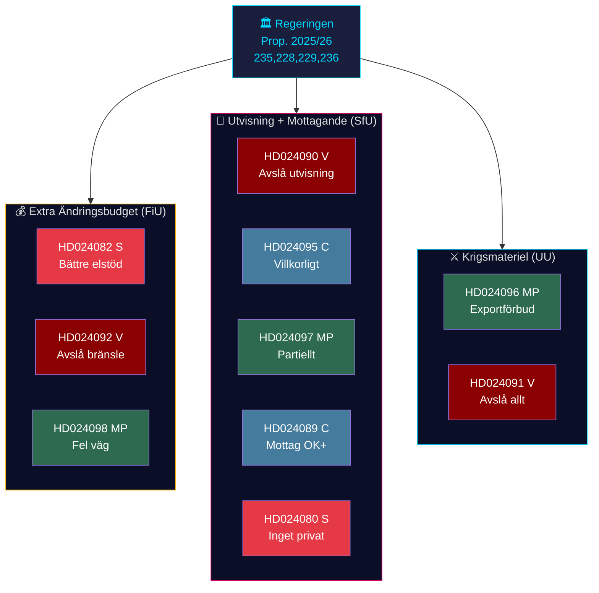

# Synthesis Summary — Opposition Motions 2026-04-23

**Author**: James Pether Sörling | **Date**: 2026-04-23 | **Confidence**: HIGH [B2]

---

## Lead Story: Energy-Climate Fault Line Fractures Opposition Bloc

The week of 13–17 April 2026 produced the spring session's most revealing clash of opposition values: three parties — Socialdemokraterna (S), Vänsterpartiet (V), and Miljöpartiet (MP) — all oppose the government's extra supplementary budget for 2026 (prop. 2025/26:236) but cannot agree on a common alternative. S demands better-designed electricity support and more flexible use of grid-congestion (flaskhals) revenues (dok_id: HD024082, Mikael Damberg m.fl.). V invokes a RUT distributional analysis showing the government's mandate-period reforms have benefited the top income half 5× more than the bottom half, and demands the fuel tax cut be rejected outright (HD024092, Nooshi Dadgostar m.fl.). MP cites a coalition of expert agencies — Konjunkturinstitutet, Naturvårdsverket, 2030-sekretariatet, Trafikverket — as opposing the fuel tax reduction on climate and investment-certainty grounds (HD024098, Janine Alm Ericson m.fl.).

---

## DIW-Weighted Priority Ranking

| Rank | dok_id | Title (abbreviated) | Submitter | DIW | Significance |
|------|--------|---------------------|-----------|-----|-------------|
| 1 | HD024082 | Extra ändringsbudget — elstöd | Damberg (S) | 0.89 | P1 — Lead story |
| 2 | HD024092 | Extra ändringsbudget — avslå bränsle | Dadgostar (V) | 0.83 | P1 |
| 3 | HD024090 | Utvisning — avslå proposition | Haddou (V) | 0.80 | P1 |
| 4 | HD024098 | Extra ändringsbudget — fel väg | Alm Ericson (MP) | 0.78 | P2 |
| 5 | HD024096 | Krigsmateriel — exportförbud | Risberg (MP) | 0.75 | P2 |
| 6 | HD024089 | Mottagandelag — kommuners rätt | Paarup-Petersen (C) | 0.70 | P2 |
| 7 | HD024095 | Utvisning — systematiska brott | Paarup-Petersen (C) | 0.65 | P2 |
| 8 | HD024097 | Utvisning — partiellt avslag | Hirvonen (MP) | 0.62 | P2 |
| 9 | HD024087 | Mottagandelag — avslå | Hirvonen (MP) | 0.58 | P3 |
| 10 | HD024080 | Mottagandelag — privatisering | Karkiainen (S) | 0.55 | P3 |
| 11–14 | HD024079/077/086/091 | Bosättning/Mottagande/Krigsmateriel | S/V/MP | 0.40–0.50 | P3 |

---

## Integrated Intelligence Picture

Three interlocking policy battles define this week's opposition motions:

### 1. Fiscal-Energy Battle (FiU jurisdiction)

The government's Extra ändringsbudget (prop. 2025/26:236) proposes: (a) temporary fuel tax reduction to EU energy directive minimum 1 May–30 Sep 2026 and (b) 3.4 billion SEK in electricity support (1 bn previously allocated + 2.4 bn new). **S** (HD024082) does not oppose the electricity support amount but criticises its design — approximately 800,000 households in housing cooperatives with shared electricity contracts will not qualify. S demands the government return with proposals for targeted, equitable electricity support and for more flexible use of grid-congestion revenues. **V** (HD024092) goes further: rejects the fuel tax cut entirely, cites RUT analysis (dnr 2026:158 and 2025:1607) showing regressive distributional effects, and argues climate transition requirements override short-term relief. **MP** (HD024098) aligns with V on the fuel tax but grounds the argument in expert agency consensus — the proposal "risks deepening Sweden's fossil fuel dependency."

Intelligence assessment: The fuel tax cut is likely to pass (SD will vote with government), but the opposition's fragmented response reflects a deeper strategic disagreement about whether to fight the government on fiscal credibility (S's approach), distributional justice (V), or climate integrity (MP). This fragmentation is a structural vulnerability ahead of 2026 elections.

### 2. Migration/Crime Nexus (SfU jurisdiction)

**Prop. 2025/26:235** (stricter deportation): Would lower threshold so any sentence stricter than a fine is deportation-eligible; remove protection for those who arrived before age 15; require prosecutors to seek deportation in all eligible cases; and ignore enforcement barriers at the general courts stage. Both **Lagrådet** (the Council on Legislation) and numerous remiss bodies opposed the reforms. V (HD024090) demands full rejection. C (HD024095) accepts deportation in principle but wants systematic repeated offences to be required, not single incidents. MP (HD024097) partly rejects — supports some changes (aggravated assault provisions, 8 kap. 1 §) but not the broad lowering of the threshold.

**Prop. 2025/26:229** (new reception law/Mottagandelag): Would centralise asylum housing; the government takes over full responsibility from municipalities. C (HD024089) broadly supports the framework but opposes: (a) removing municipalities' right to give emergency welfare assistance and (b) "areas restrictions" (områdespolicies). S (HD024080) opposes privatisation of asylum housing. MP (HD024087) rejects the entire proposition.

### 3. Arms Export Regulation (UU jurisdiction)

**Prop. 2025/26:228** (new krigsmateriel framework): MP (HD024096) demands: (1) a complete ban on arms exports to dictatorships, warring nations, and major human rights violators; (2) mandatory consideration of third-country diversion risk; (3) rejection of the new secrecy provisions on software/technology (citing Lagrådet criticism). V (HD024091) opposes the entire proposition.

---

## AI-Recommended Article Metadata

- **Title**: "Split Opposition Challenges Sweden's Fuel-Tax Budget and Deportation Laws"  
- **Meta description**: "Sweden's Social Democrats, Left Party and Greens all oppose the government's fuel tax cut — but offer incompatible alternatives, revealing a fractured opposition ahead of autumn 2026 elections."  
- **Keywords**: Swedish parliament, Riksdag motions, fuel tax, deportation law, arms exports, 2026 election

---

## Mermaid: Policy Battle Map

