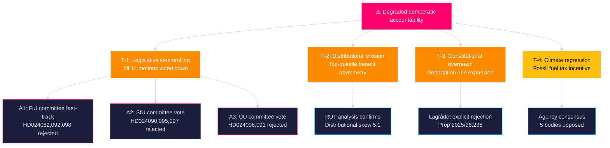

# Threat Analysis — Opposition Motions 2026-04-23

**Author**: James Pether Sörling | **Date**: 2026-04-23 | **Confidence**: MEDIUM [B2]

---

## Political Threat Taxonomy

Threats assessed against **democratic accountability norms** and **opposition party viability**.

### T-1: Legislative Steamrolling (Primary Threat)
- **Category**: Institutional integrity
- **Actor**: Tidewater coalition (M, SD, KD, L) + occasional C
- **Mechanism**: Majority votes all motions down in committee (FiU, SfU, UU) without substantive engagement with expert agency criticism
- **Evidence**: Pattern in riksmöte 2024/25 and 2025/26; Lagrådet rejection of prop. 2025/26:235 [A1 — official record]; agency consensus against prop. 2025/26:236 [A2 — multiple agencies cited in HD024098]
- **TTP analog**: "Vote dominance" — structural majority used without negotiation
- **Admiralty**: [A2]

### T-2: Distributional Justice Erosion (Social Threat)
- **Category**: Social cohesion
- **Actor**: Government fiscal policy
- **Mechanism**: Successive reforms favoring upper-income deciles; RUT analysis cited in V motion (HD024092) shows 5:1 ratio of benefit to top vs. bottom income halves
- **Evidence**: RUT dnr 2026:158 and dnr 2025:1607 — cited verbatim in HD024092 [A2]
- **Kill chain stage**: Policy formulation → implementation → distributional outcome → public trust erosion
- **Admiralty**: [A2]

### T-3: Constitutional Overreach on Deportation (Rule-of-Law Threat)
- **Category**: Constitutional order
- **Actor**: Government (prop. 2025/26:235)
- **Mechanism**: Removing age-based protections for migrants who arrived before 15; removing enforcement-barrier review from general courts; mandatory prosecution of all eligible cases
- **Evidence**: Lagrådet explicitly advised against (quoted in HD024090) [A1]; remiss bodies raised systemic criticism
- **TTP**: "Incremental erosion" of judicial review rights
- **Admiralty**: [A1]

### T-4: Climate Policy Regression (Environmental Threat)
- **Category**: Long-term governance
- **Actor**: Government energy policy
- **Mechanism**: Temporary fuel tax cut undermines carbon pricing signals; 2030 emissions targets at risk
- **Evidence**: Konjunkturinstitutet, Naturvårdsverket, 2030-sekretariatet, Statens energimyndighet, Trafikverket all opposed (cited in HD024098, Janine Alm Ericson) [A2]
- **Admiralty**: [A2]

---

## Attack Tree: Democratic Accountability Degradation

---

## MITRE-Style TTP Mapping

| TTP ID | Name | Tactic | Technique | Evidence |
|--------|------|--------|-----------|----------|
| PTA-01 | Majority override | Legislative control | Voting bloc dominance | Pattern 2025/26 [B1] |
| PTA-02 | Remiss dismissal | Policy framing | Override agency consensus | HD024098 cites 5 agencies [A2] |
| PTA-03 | Judicial review removal | Institutional capture | Remove court oversight | Lagrådet + HD024090 [A1] |
| PTA-04 | Distributional obfuscation | Narrative control | Obscure beneficiary skew | RUT data in HD024092 [A2] |

*Political Threat Actor framework adapted from MITRE ATT&CK for political intelligence purposes. All threats are of a legislative/policy nature.*

