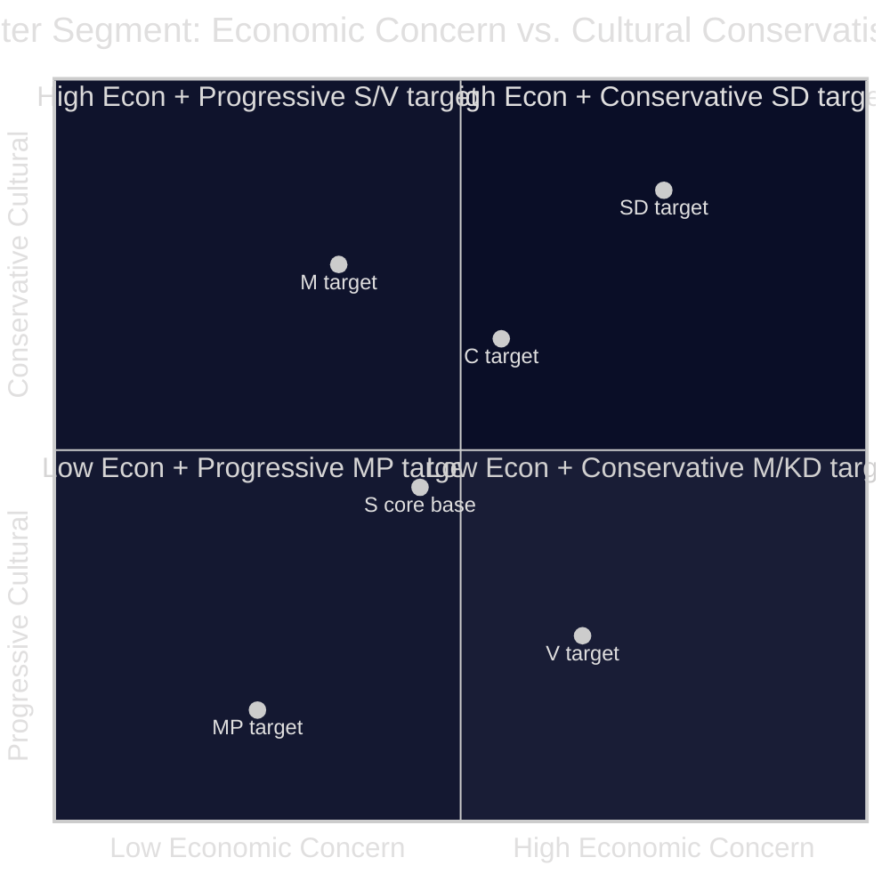

# Voter Segmentation Analysis — Opposition Motions 2026-04-23

**Author**: James Pether Sörling | **Date**: 2026-04-23 | **Confidence**: MEDIUM [B2–C3]

---

## Target Voter Segments by Party (this week's motions)

### S — Socialdemokraterna (HD024082)

**Primary target**: Cooperative housing residents (*bostadsrättsinnehavare*) — approximately 800,000 households who were excluded from the electricity support scheme by a design flaw in prop. 2025/26:236. These are primarily urban and suburban middle-income households, core S electoral territory that drifted toward M/SD in 2022.

**Voter tension**: The 800,000 cooperative households overlap with voters who might support the fuel tax cut for other reasons. S must offer a compelling alternative that fixes the design flaw without appearing to oppose energy relief broadly.

---

### V — Vänsterpartiet (HD024092)

**Primary target**: Low-income workers and renters in car-dependent areas who spend a disproportionate share of income on fuel. V's motion cites RUT analysis (dnr 2026:158) showing that the fuel tax cut skews 5:1 toward higher-income households — the inverse of V's target segment.

**Voter tension**: V's base is partly urban non-car-dependent (where the fuel cut is less salient) and partly peripheral workers (where any energy relief is welcome regardless of distributional analysis). The RUT argument plays well in V's intellectual base but may not resonate with peripheral V voters.

---

### MP — Miljöpartiet (HD024098)

**Primary target**: Climate-concerned voters, primarily urban, highly educated, who frame energy pricing as a climate tool. MP's motion's five-agency citation strategy appeals to voters who trust scientific and bureaucratic expertise.

**Voter tension**: MP is at the 4% threshold. The party needs to maximize turnout among its core voters rather than expand. The agency-citation approach is credible with the base but does not add new segments.

---

### C — Centerpartiet (HD024089, HD024095)

**Primary target**: Rural and small-town voters with pragmatic liberal instincts. C's moderate positioning on migration (accepting the framework, opposing extreme elements) and absence of opposition on energy reflect a rural electorate that is culturally conservative but economically pragmatic.

**Voter tension**: C must distinguish itself from both M and S. The current motion pattern shows C differentiating on rule-of-law grounds (opposing deportation without procedural safeguards) while accepting the economic framework. This is a coherent "liberal conservative" position.

---

## Segment Map

*Assessment confidence: MEDIUM [C3]. Quadrant placement is structural inference from motion content, not polling data.*

