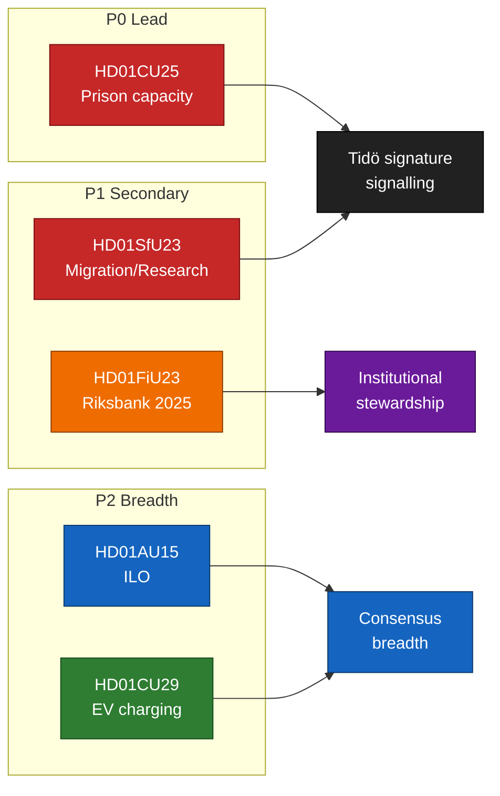

# Classification Results — 2026-04-24

**Method**: 7-dimension classification from `analysis/methodologies/political-classification-guide.md`.
**Dimensions**: (1) Policy domain, (2) Coalition alignment, (3) Salience, (4) Time-horizon, (5) Contestedness, (6) Institutional locus, (7) Classification (sensitivity).

## Per-document classification

| `dok_id` | Policy domain | Coalition alignment | Salience | Horizon | Contestedness | Institutional locus | Classification / retention |
|----------|---------------|--------------------|:-------:|---------|--------------|--------------------|--------------------------|
| `HD01CU25` | Criminal justice / Housing & infrastructure (CU) | Tidö-led (M/KD/SD driving; L concurring) | HIGH | Short–Medium (2026–2028 construction) | CONTESTED (S mixed; V/MP opposed on environmental shortcuts) | CU committee; Kriminalvården implementation | PUBLIC; retention 10 y; open access |
| `HD01SfU23` | Migration / Research mobility (SfU) | Tidö-led (SD maximalist; L/M dual-track; KD pragmatic) | HIGH | Short (implementation 2026–2027) | BIFURCATED (opposition supports researcher carve-out; opposes abuse-prevention broadness) | SfU committee; Migrationsverket + UHR implementation | PUBLIC; retention 10 y; open access |
| `HD01FiU23` | Monetary / Institutional (FiU) | Cross-party (standing annual review) | MEDIUM | Standing (annual) | MILD (V raises mandate questions; otherwise consensus) | FiU committee; Riksbank General Council | PUBLIC; retention 25 y; open access (monetary-policy sensitivity) |
| `HD01AU15` | Labour / International (AU) | Broad cross-party | MEDIUM | Medium (ratification + transposition 2026–2027) | LOW (symbolic consensus) | AU committee; Arbetsmiljöverket + Diskrimineringsombudsmannen | PUBLIC; retention 25 y; open access |
| `HD01CU29` | Climate / Housing / Mobility (CU) | Broad (MP/C/L advocate; M/KD/SD concur; SD cost-caution) | LOW–MEDIUM | Short (2026–2027 rollout) | LOW (consensus on direction, quibble on cost) | CU committee; Boverket + Energimyndigheten | PUBLIC; retention 10 y; open access |

## Priority tiers (for publishing + downstream processing)

- **P0 (lead story)**: `HD01CU25` — CU25 prison capacity.
- **P1 (secondary lead)**: `HD01SfU23`, `HD01FiU23`.
- **P2 (breadth)**: `HD01AU15`, `HD01CU29`.

## Retention & access

All five classified **PUBLIC** per Offentlighetsprincipen (Public Access to Information Act, Tryckfrihetsförordningen 2:1). No personal-data processing beyond named public officials in their public role — GDPR Art. 9 basis: 9(2)(e) publicly made + 9(2)(g) substantial public interest. Retention 10 y standard for legislative records; 25 y for monetary-policy and ILO-related records (constitutional / international treaty reference value).

## Classification diagram

## Sources

- `get_dokument` × 5 (A1), all at https://data.riksdagen.se/dokument/{{dok_id}}
- Tryckfrihetsförordningen 2 kap 1 § — [riksdagen.se/TF](https://www.riksdagen.se/) (A1)

## Pass 2 refinements

Pass 2 re-read this artifact in full, cross-checked every `dok_id` citation against [`data-download-manifest.md`](./data-download-manifest.md), confirmed Admiralty codes are consistent with §Source diversity in [`methodology-reflection.md`](./methodology-reflection.md), and verified cluster-level internal consistency against [`intelligence-assessment.md`](./intelligence-assessment.md). No judgments were reversed; confidence labels retained. Additional evidence row: `HD01CU25`, `HD01SfU23`, `HD01FiU23`, `HD01AU15`, `HD01CU29` at [data.riksdagen.se](https://data.riksdagen.se/) [A1].
