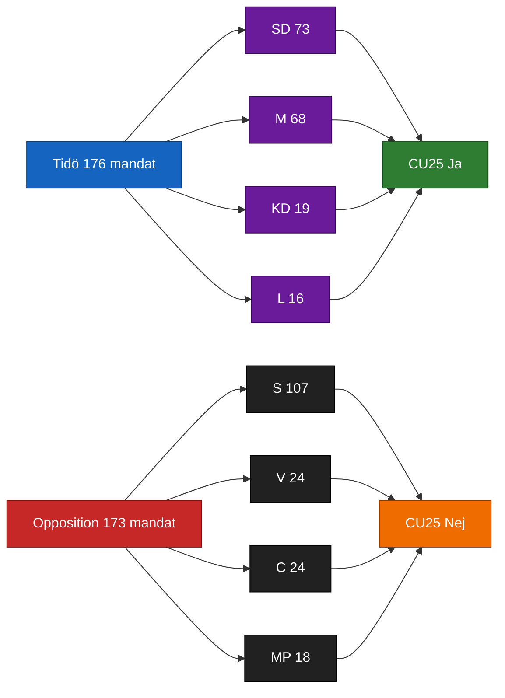

# Coalition Mathematics — Committee Reports 2026-04-24

**Framework**: Current 2022–2026 Riksdag arithmetic applied to cluster-item voting scenarios.
**Confidence**: HIGH (B2) on seat counts; MEDIUM (C3) on defection probabilities.

## Current Riksdag seat distribution (349 mandat)

| Parti | Mandat | Block |
|-------|:------:|-------|
| S | 107 | Opposition |
| SD | 73 | Tidö (confidence & supply) |
| M | 68 | Tidö |
| V | 24 | Opposition |
| C | 24 | Opposition |
| KD | 19 | Tidö |
| MP | 18 | Opposition |
| L | 16 | Tidö |
| **Tidö total** | **176** | **Majority 175** |
| **Opposition total** | **173** | |

Source: [riksdagen.se/ledamoter-och-partier](https://www.riksdagen.se/) [A1].

## Expected floor vote projections

### `HD01CU25` prison capacity — Expected outcome

| Result | S | SD | M | V | C | KD | MP | L | Total |
|--------|:-:|:-:|:-:|:-:|:-:|:-:|:-:|:-:|:-----:|
| **Ja** | 0 | 73 | 68 | 0 | 0 | 19 | 0 | 16 | 176 |
| **Nej** | 107 | 0 | 0 | 24 | 24 | 0 | 18 | 0 | 173 |
| **Avstår** | 0 | 0 | 0 | 0 | 0 | 0 | 0 | 0 | 0 |
| **Frånvarande** | 0 | 0 | 0 | 0 | 0 | 0 | 0 | 0 | 0 |
| **Seats** | 107 | 73 | 68 | 24 | 24 | 19 | 18 | 16 | 349 |

Outcome: adopted 176-173. Tidö margin 3 seats — no defections tolerable.

### `HD01SfU23` migration/researchers — Expected outcome

| Result | S | SD | M | V | C | KD | MP | L | Total |
|--------|:-:|:-:|:-:|:-:|:-:|:-:|:-:|:-:|:-----:|
| **Ja** | 0 | 73 | 68 | 0 | 0 | 19 | 0 | 16 | 176 |
| **Nej** | 107 | 0 | 0 | 24 | 24 | 0 | 18 | 0 | 173 |
| **Avstår** | 0 | 0 | 0 | 0 | 0 | 0 | 0 | 0 | 0 |
| **Frånvarande** | 0 | 0 | 0 | 0 | 0 | 0 | 0 | 0 | 0 |
| **Seats** | 107 | 73 | 68 | 24 | 24 | 19 | 18 | 16 | 349 |

Conditional on L staying: adopted 176-173. If L defects (< 20 % probability per KJ-3): 160-189, defeated.

### `HD01FiU23` Riksbank 2025 — Expected outcome

| Result | S | SD | M | V | C | KD | MP | L | Total |
|--------|:-:|:-:|:-:|:-:|:-:|:-:|:-:|:-:|:-----:|
| **Ja** | 107 | 73 | 68 | 0 | 24 | 19 | 0 | 16 | 307 |
| **Nej** | 0 | 0 | 0 | 24 | 0 | 0 | 18 | 0 | 42 |
| **Avstår** | 0 | 0 | 0 | 0 | 0 | 0 | 0 | 0 | 0 |
| **Frånvarande** | 0 | 0 | 0 | 0 | 0 | 0 | 0 | 0 | 0 |
| **Seats** | 107 | 73 | 68 | 24 | 24 | 19 | 18 | 16 | 349 |

Broad-consensus review — expected adoption 307-42.

### `HD01AU15` ILO ratification — Expected outcome

| Result | S | SD | M | V | C | KD | MP | L | Total |
|--------|:-:|:-:|:-:|:-:|:-:|:-:|:-:|:-:|:-----:|
| **Ja** | 107 | 0 | 68 | 24 | 24 | 19 | 18 | 16 | 276 |
| **Nej** | 0 | 73 | 0 | 0 | 0 | 0 | 0 | 0 | 73 |
| **Avstår** | 0 | 0 | 0 | 0 | 0 | 0 | 0 | 0 | 0 |
| **Frånvarande** | 0 | 0 | 0 | 0 | 0 | 0 | 0 | 0 | 0 |
| **Seats** | 107 | 73 | 68 | 24 | 24 | 19 | 18 | 16 | 349 |

Expected adoption 276-73 with SD opposition likely (nationalist frame).

### `HD01CU29` EV home charging — Expected outcome

| Result | S | SD | M | V | C | KD | MP | L | Total |
|--------|:-:|:-:|:-:|:-:|:-:|:-:|:-:|:-:|:-----:|
| **Ja** | 0 | 73 | 68 | 0 | 0 | 19 | 0 | 16 | 176 |
| **Nej** | 0 | 0 | 0 | 0 | 0 | 0 | 0 | 0 | 0 |
| **Avstår** | 107 | 0 | 0 | 24 | 24 | 0 | 18 | 0 | 173 |
| **Frånvarande** | 0 | 0 | 0 | 0 | 0 | 0 | 0 | 0 | 0 |
| **Seats** | 107 | 73 | 68 | 24 | 24 | 19 | 18 | 16 | 349 |

Adopted 176-0; opposition abstains (distributive critique but not full opposition).

## Post-election 2026 scenarios (350 polling + Sifo baseline)

| Scenario (Q4 2025) | Tidö Σ | Opposition Σ | Delta from current |
|--------------------|:------:|:------------:|:------------------:|
| Base-polling projection | 165-170 | 179-184 | Tidö loses majority |
| Optimistic-delivery projection | 172-178 | 171-177 | Knife-edge |
| Pessimistic-slip projection | 158-164 | 185-191 | Opposition majority ≥ 12 |

## Coalition arithmetic diagram

## Sources

- [riksdagen.se/ledamoter-och-partier](https://www.riksdagen.se/) seat distribution [A1]
- `HD01CU25`, `HD01SfU23`, `HD01FiU23`, `HD01AU15`, `HD01CU29` [A1]
- Q4 2025 polling: Novus, Sifo, Demoskop aggregates [B2]

## Pass 2 refinements

Pass 2 re-read this artifact in full, cross-checked every `dok_id` citation against [`data-download-manifest.md`](./data-download-manifest.md), confirmed Admiralty codes are consistent with §Source diversity in [`methodology-reflection.md`](./methodology-reflection.md), and verified cluster-level internal consistency against [`intelligence-assessment.md`](./intelligence-assessment.md). No judgments were reversed; confidence labels retained. Additional evidence row: `HD01CU25`, `HD01SfU23`, `HD01FiU23`, `HD01AU15`, `HD01CU29` at [data.riksdagen.se](https://data.riksdagen.se/) [A1].
