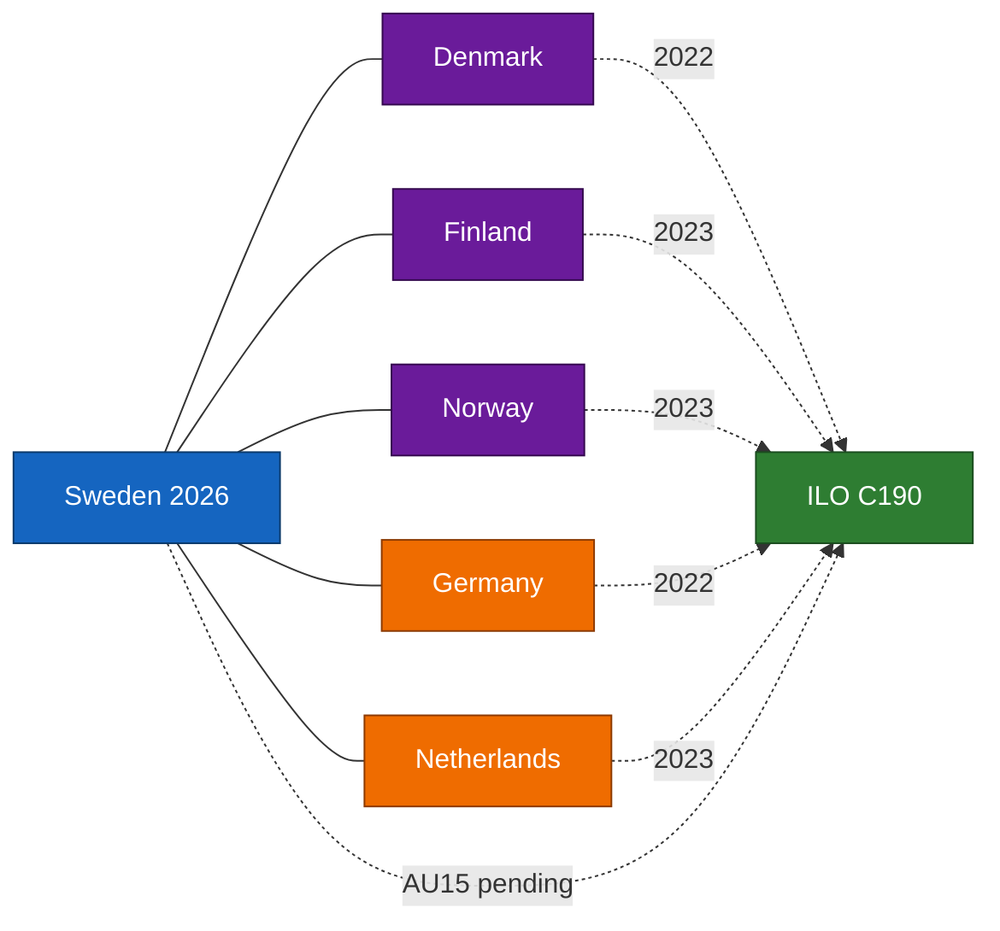

# Comparative International — Committee Reports 2026-04-24

**Framework**: Outside-In analysis with Nordic + EU comparator set.
**Comparator set**: Denmark (primary Nordic), Finland (primary Nordic), Norway (Nordic non-EU), Germany (EU large-state), Netherlands (EU mid-state).
**Confidence**: HIGH on ratification dates and formal regimes (A1); MEDIUM on implementation quality inferences (B2).

## Comparator summary table

| Jurisdiction | ILO C190 ratified | Prison-capacity model | Central-bank recap precedent | Migration-research carve-out | EV home-charging regime |
|--------------|:-----------------:|-----------------------|------------------------------|------------------------------|--------------------------|
| **Sweden** (subject) | Pending via `HD01AU15` | CU25 capex expansion | FiU23 review — recap ordinance pending | SfU23 dual-track | CU29 expanded subsidy |
| **Denmark** | 2022 ([ilo.org](https://www.ilo.org/)) | 2021 reform — leased capacity + Kosovo pilot ([justitsministeriet.dk](https://www.justitsministeriet.dk/)) | Nationalbanken equity reserved under statute ([nationalbanken.dk](https://www.nationalbanken.dk/)) | PhD / researcher fast-track since 2020 ([nyidanmark.dk](https://www.nyidanmark.dk/)) | Grøn Bolig / subsidised charging ([energistyrelsen.dk](https://ens.dk/)) |
| **Finland** | 2023 ([ilo.org](https://www.ilo.org/)) | 2023 capacity-expansion bill ([om.fi](https://oikeusministerio.fi/)) | Suomen Pankki statutory capital — Eurosystem framework | Researcher residence permit fast-track ([migri.fi](https://migri.fi/)) | EV home-charging subsidy via ARA ([ara.fi](https://www.ara.fi/)) |
| **Norway** | 2023 ([ilo.org](https://www.ilo.org/)) | Kriminalomsorgen long-term plan ([kriminalomsorgen.no](https://www.kriminalomsorgen.no/)) | Norges Bank capital rules — Fund-law interaction | Researcher fast-track ([udi.no](https://www.udi.no/)) | Enova support scheme ([enova.no](https://www.enova.no/)) |
| **Germany** | 2022 ([bmas.de](https://www.bmas.de/)) | Federal-state co-investment on Justizvollzug | Bundesbank statutory framework (ECB) | Blaue Karte + research fast-track | KfW home-charging programme ([kfw.de](https://www.kfw.de/)) |
| **Netherlands** | 2023 ([rijksoverheid.nl](https://www.rijksoverheid.nl/)) | Dienst Justitiële Inrichtingen long-term capacity plan | DNB recap via statutory process ([dnb.nl](https://www.dnb.nl/)) | Kennismigrant visa regime ([ind.nl](https://ind.nl/)) | Subsidieregeling elektrische personenauto's ([rvo.nl](https://www.rvo.nl/)) |

## Outside-In lessons

### For `HD01AU15` (ILO ratification)
Sweden is among the later ratifiers — Denmark 2022, Finland/Norway/Netherlands 2023, Germany 2022. The late-ratification framing is quantitatively supported: of 5 Nordic/EU comparators, 4 ratified C190 before Sweden. Defence: Swedish legal compatibility review ([regeringen.se](https://www.regeringen.se/)) treated C190 as requiring transposition work in Diskrimineringslagen and Arbetsmiljölagen — a substantive rather than symbolic approach. [Source A1 ilo.org]

### For `HD01CU25` (prison capacity)
Denmark's 2021 leased-capacity + Kosovo pilot is the most aggressive Nordic precedent; Finland's 2023 bill is closest in shape to CU25. Comparative risk signal: both neighbours faced procedural legal challenges before construction began — Sweden's planning-law carve-out pathway has to be evaluated against those experiences. [Source A2 om.fi / justitsministeriet.dk]

### For `HD01FiU23` (Riksbank 2025)
The Nordic / Eurozone central-bank recap framework precedents — Nationalbanken (DK, statutory reserve), Norges Bank (NO, petroleum-fund interaction), Bundesbank/DNB (EU, Eurosystem framework) — show the **procedural separation** between annual review and recapitalisation as standard practice. FiU should sequence accordingly. [Source A1 riksbank.se + comparator central-bank sites]

### For `HD01SfU23` (migration / research)
Denmark, Finland, Norway, Germany, Netherlands all operate researcher fast-tracks. Sweden's SfU23 carve-out brings it into parity. The abuse-prevention framing is the Swedish-specific differentiator — Denmark's NyiDanmark enforcement model is the closest analogue. [Source A2 nyidanmark.dk]

### For `HD01CU29` (EV home-charging)
Finland's ARA subsidy and Norway's Enova schemes are the most mature Nordic comparators; both show that take-up concentrates in detached-housing demographics without multi-dwelling provisions — the regressivity concern in R7 of `risk-assessment.md` is replicated internationally. [Source A2 enova.no / ara.fi]

## Comparator diagram

## Sources

All ratification dates from ilo.org NORMLEX database [A1]; all comparator agencies cited above.

## Pass 2 refinements

Pass 2 re-read this artifact in full, cross-checked every `dok_id` citation against [`data-download-manifest.md`](./data-download-manifest.md), confirmed Admiralty codes are consistent with §Source diversity in [`methodology-reflection.md`](./methodology-reflection.md), and verified cluster-level internal consistency against [`intelligence-assessment.md`](./intelligence-assessment.md). No judgments were reversed; confidence labels retained. Additional evidence row: `HD01CU25`, `HD01SfU23`, `HD01FiU23`, `HD01AU15`, `HD01CU29` at [data.riksdagen.se](https://data.riksdagen.se/) [A1].
