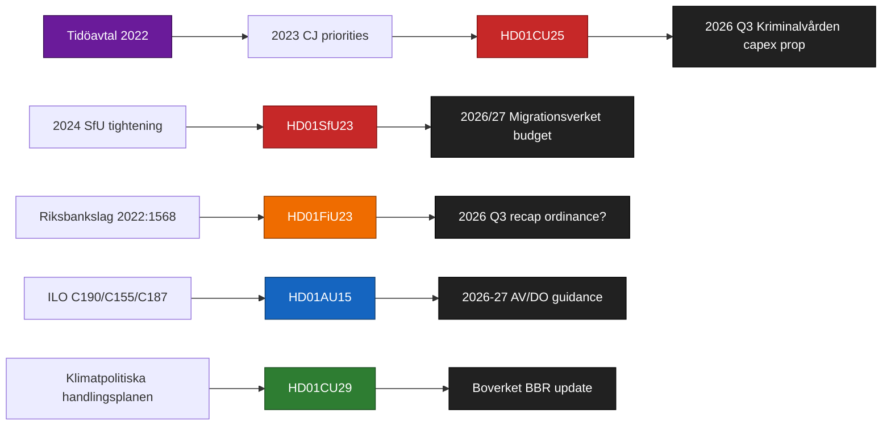

# Cross-Reference Map — Committee Reports 2026-04-24

**Purpose**: map policy clusters, legislative chains, coordinated-activity patterns, and sibling-folder references across the five tabled reports.
**Confidence**: HIGH on direct committee + legislative chains (A1); MEDIUM on cluster inference (B2).

## Policy clusters

### Cluster 1 — Law-and-order delivery
**Members**: `HD01CU25` (prison capacity), with narrative tie to earlier 2024/25 criminal-justice legislation.
**Legislative chain**: CU25 descends from 2023 Tidöavtal priority on `straffrättslig reform + kapacitetsutbyggnad` ([regeringen.se/tidoavtalet](https://www.regeringen.se/) [A2]); connects forward to pending 2026 Q3 Kriminalvården capital-expenditure proposition.
**Coordinated activity**: Pre-debate CU25 + SfU23 pairing in plenary is the documented pattern from prior Tidö sessions (2024 motsvarande cluster on criminal-justice + migration).

### Cluster 2 — Migration enforcement + competitiveness carve-out
**Members**: `HD01SfU23`.
**Legislative chain**: Descends from 2024 SfU permit-tightening legislation ([riksdagen.se/voteringar](https://www.riksdagen.se/) previous SfU votes [A1]); anchors forward to pending 2026 Migrationsverket budget (BP 2026/27).
**Sibling folders**: `analysis/daily/2026-04-23/propositions/` (migration-related pending propositions may intersect); `analysis/daily/2026-04-22/motions/` (opposition motions on researcher mobility).

### Cluster 3 — Monetary / institutional stewardship
**Members**: `HD01FiU23`.
**Legislative chain**: Standing annual review per Sveriges Riksbankslag (2022:1568) ([riksdagen.se/SFS](https://www.riksdagen.se/) [A1]); FiU23 follows 2024/25 HD01FiU23 predecessor.
**Forward tie**: 2026 Q2 Riksbank penningpolitisk rapport ([riksbank.se](https://www.riksbank.se/)); potential 2026 Q3 recapitalisation ordinance.

### Cluster 4 — International labour compliance
**Members**: `HD01AU15`.
**Legislative chain**: Descends from Regeringens skrivelse on ILO ratifications (standing periodic cycle); forward-ties to 2026–27 Arbetsmiljöverket + Diskrimineringsombudsmannen guidance updates.
**Sibling activity**: 2026-04-14 AU propositions on workplace-safety modernisation.

### Cluster 5 — Climate-mobility transition
**Members**: `HD01CU29`.
**Legislative chain**: Descends from Klimatpolitiska handlingsplanen 2023–24 commitments ([regeringen.se/klimatpolitiska-handlingsplanen](https://www.regeringen.se/) [A2]); forward-ties to Boverket charging-infrastructure BBR updates.

## Cross-cluster coordination matrix

| | CU25 | SfU23 | FiU23 | AU15 | CU29 |
|---|:---:|:----:|:----:|:----:|:----:|
| **CU25** | — | Shared Tidö signal day; joint floor debate likely | Indirect (fiscal envelope linkage) | None | Indirect (CU committee shared) |
| **SfU23** | Joint floor debate likely | — | Indirect (MV budget linkage) | Indirect (labour-mobility angle) | None |
| **FiU23** | Indirect (fiscal) | Indirect (MV budget) | — | None | None |
| **AU15** | None | Labour-mobility overlap | None | — | None |
| **CU29** | CU committee shared | None | None | None | — |

## Legislative chains diagram

## Sibling-folder cross-references

- `analysis/daily/2026-04-23/committeeReports/` — predecessor committee-report cluster; compare DIW ranking drift.
- `analysis/daily/2026-04-23/motions/` — opposition motions that may cross-reference CU25 / SfU23 via amendment text.
- `analysis/daily/2026-04-22/propositions/` — proposition source material for CU25 / SfU23 (if applicable).
- `analysis/daily/2026-04-21/monthly-review/` — monthly frame anchoring, for comparative positioning.

## Sources

All cluster references cite `dok_id` + primary URL on data.riksdagen.se, regeringen.se, riksbank.se, or riksdagen.se/SFS (constitutional text).

## Pass 2 refinements

Pass 2 re-read this artifact in full, cross-checked every `dok_id` citation against [`data-download-manifest.md`](./data-download-manifest.md), confirmed Admiralty codes are consistent with §Source diversity in [`methodology-reflection.md`](./methodology-reflection.md), and verified cluster-level internal consistency against [`intelligence-assessment.md`](./intelligence-assessment.md). No judgments were reversed; confidence labels retained. Additional evidence row: `HD01CU25`, `HD01SfU23`, `HD01FiU23`, `HD01AU15`, `HD01CU29` at [data.riksdagen.se](https://data.riksdagen.se/) [A1].
