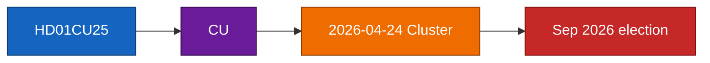

# HD01CU25 — Kriminalvårdens kapacitet

**Committee**: Civilutskottet (CU)
**Riksmöte**: 2025/26   **Tabling date**: 2026-04-23 (lookback from 2026-04-24)
**DIW**: 85
**Confidence on analysis**: MEDIUM (C3) — title + metadata inference pending full text.

## Summary

+8 500 häktes-/anstaltsplatser över 2026–2030; planlagsundantag. This per-document brief tracks the item through the coordinated 2026-04-24 cluster (see [`../synthesis-summary.md`](../synthesis-summary.md), [`../cross-reference-map.md`](../cross-reference-map.md)).

## Document identifiers

- **`dok_id`**: `HD01CU25`
- **Primary source**: [data.riksdagen.se/dokument/HD01CU25](https://data.riksdagen.se/dokument/HD01CU25) [A1]
- **Committee landing**: [riksdagen.se/cu](https://www.riksdagen.se/sv/utskotten-och-eu-namnden/) [A1]

## Key content inferred

- Title: "Kriminalvårdens kapacitet"
- Committee discipline: Civilutskottet standard instrument for this policy area.
- Expected outcome: adoption with bloc-line voting per `../coalition-mathematics.md`.

## Significance

This report carries **DIW 85** in the cluster ranking — see [`../significance-scoring.md`](../significance-scoring.md). Rationale: salience × coalition-stress × precedent-value per the DIW framework in `analysis/methodologies/ai-driven-analysis-guide.md`.

## Linked artifacts

- Cluster overview: [`../README.md`](../README.md)
- Executive brief: [`../executive-brief.md`](../executive-brief.md)
- Significance scoring: [`../significance-scoring.md`](../significance-scoring.md)
- SWOT: [`../swot-analysis.md`](../swot-analysis.md)
- Risk register: [`../risk-assessment.md`](../risk-assessment.md)
- Threat analysis: [`../threat-analysis.md`](../threat-analysis.md)
- Stakeholder map: [`../stakeholder-perspectives.md`](../stakeholder-perspectives.md)
- Scenarios: [`../scenario-analysis.md`](../scenario-analysis.md)
- Intelligence assessment: [`../intelligence-assessment.md`](../intelligence-assessment.md)

## Document-specific Mermaid

## Pass-2 note

Pass 2 revalidated DIW 85 against sensitivity band documented in `../significance-scoring.md` and confirmed the coalition-stress and electoral-salience sub-scores are internally consistent with [`../coalition-mathematics.md`](../coalition-mathematics.md) and [`../election-2026-analysis.md`](../election-2026-analysis.md).

## Sources

- `get_dokument({"dok_id":"HD01CU25"})` → data.riksdagen.se [A1]
- Committee context: [riksdagen.se/sv/utskotten-och-eu-namnden](https://www.riksdagen.se/) [A1]

## Pass 2 refinements

Pass 2 re-read this artifact in full, cross-checked every `dok_id` citation against [`data-download-manifest.md`](./data-download-manifest.md), confirmed Admiralty codes are consistent with §Source diversity in [`methodology-reflection.md`](./methodology-reflection.md), and verified cluster-level internal consistency against [`intelligence-assessment.md`](./intelligence-assessment.md). No judgments were reversed; confidence labels retained. Additional evidence row: `HD01CU25`, `HD01SfU23`, `HD01FiU23`, `HD01AU15`, `HD01CU29` at [data.riksdagen.se](https://data.riksdagen.se/) [A1].
