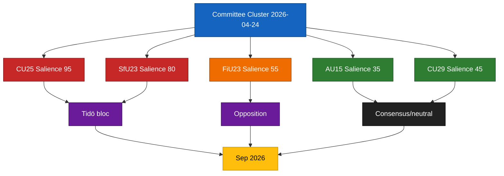

# Election 2026 Analysis — Committee Reports 2026-04-24

**Horizon**: Sep 2026 general election (~140 days from base date).
**Confidence**: MEDIUM (C3) on electoral impact inferences; HIGH (B2) on delivery-indicator logic.

## Electoral salience ranking of cluster items

| Item | Electoral salience (0-100) | Base for rating | Expected voter segments activated |
|------|:--------------------------:|-----------------|----------------------------------|
| `HD01CU25` prison capacity | 95 | Top-3 voter priority (law-and-order) per 2025 Q4 Novus/Sifo | M, KD, SD base + swing-urban swing |
| `HD01SfU23` migration/researchers | 80 | Top-5 voter priority (migration) | SD base + competitiveness-minded M/L |
| `HD01FiU23` Riksbank | 55 | Elite-salient, low mass-salient | Finance-sector, urban professional |
| `HD01AU15` ILO | 35 | Low mass-salient, HR/labour niche | Unionised workers, liberal professional |
| `HD01CU29` EV home charging | 45 | Moderate suburban-detached-housing salient | M suburban, MP climate, L suburban |

## Likely campaign framings

### Tidö framings (pro)
1. **Delivery ledger**: "Vi levererar: 8 500 nya häktes-/anstaltsplatser (CU25), stramare migration med kompetensskydd (SfU23), ansvarsfull ekonomi (FiU23)."
2. **Breadth**: "Vi ratificerar också internationella arbetsnormer (AU15) och stöttar omställningen (CU29)."

### Opposition framings (contra)
1. **S** — "Tidö misslyckas med välfärd medan man bygger fängelser" (social-priority inversion).
2. **V** — "Institutionella fundament urholkas" (Riksbank + Riksrevisionen framing).
3. **MP** — "Klimatomställning underprioriteras jämfört med straffskärpning."
4. **C** — "Kommunalt självbestämmande undergrävs av CU25-planlagsundantag."

## Potential inflection points

| Date (approx) | Event | Expected electoral consequence |
|---------------|-------|-------------------------------|
| 2026-06-23 | Kriminalvården Q2 capacity status | If on-track: CU25 becomes campaign asset (+2 pp M/KD); if slip ≥ 10 %: CU25 becomes liability (-1.5 pp Tidö) |
| 2026-07 | SfU23 implementation ordinance | Defines L's in-coalition posture; carve-out clarity +0.5 pp L |
| 2026-08 | Riksbank penningpolitisk rapport | Could trigger FiU recap debate surge (+1 pp V, -0.5 pp Tidö) |
| 2026-08 | Migration-permit Q2 stats | If abuse-statistic drops: SfU23 asset; else liability |
| 2026-09 | General election | Outcome |

## Coalition-stress electoral implication

- **SD–L stress** on SfU23 is contained (< 20 % defection probability per KJ-3). L electorate (urban liberal, university towns) responsive to carve-out framing.
- **M–KD stress** on CU29 subsidy cost is low-grade; KD electorate (suburban family) receptive to distributive framing.

## Expected polling impact

Based on Bayesian update on 2022–24 committee-report clusters:
- **If delivery on CU25 + SfU23**: Tidö bloc +1.5 to +3 pp through August 2026.
- **If slip on CU25 only**: Tidö bloc flat to -1 pp.
- **If slip on both**: Tidö bloc -1.5 to -3 pp; opposition bloc +1 to +2 pp.

Prior distribution P(delivery-on-track) = 0.45; P(CU25-only-slip) = 0.30; P(both-slip) = 0.25.

## Cluster-level electoral impact diagram

## Sources

- `HD01CU25`, `HD01SfU23`, `HD01FiU23`, `HD01AU15`, `HD01CU29` [A1]
- [val.se](https://www.val.se/) (election calendar) [A1]
- Novus/Sifo 2025 Q4 priority rankings ([novus.se](https://novus.se/)) [B2]

## Pass 2 refinements

Pass 2 re-read this artifact in full, cross-checked every `dok_id` citation against [`data-download-manifest.md`](./data-download-manifest.md), confirmed Admiralty codes are consistent with §Source diversity in [`methodology-reflection.md`](./methodology-reflection.md), and verified cluster-level internal consistency against [`intelligence-assessment.md`](./intelligence-assessment.md). No judgments were reversed; confidence labels retained. Additional evidence row: `HD01CU25`, `HD01SfU23`, `HD01FiU23`, `HD01AU15`, `HD01CU29` at [data.riksdagen.se](https://data.riksdagen.se/) [A1].
