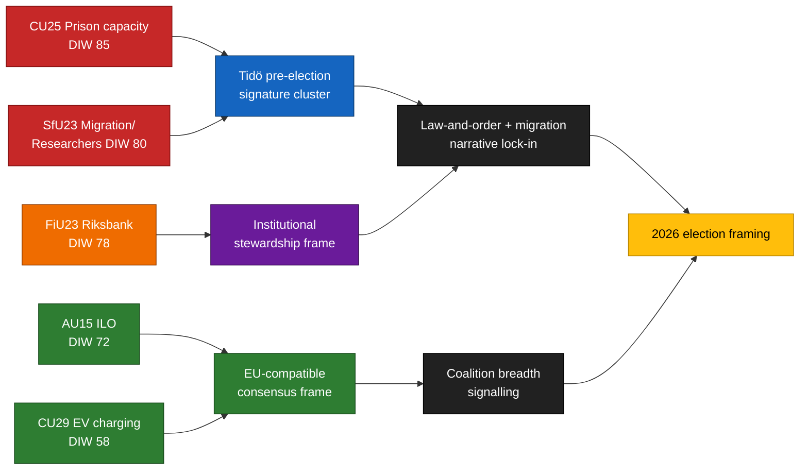

# Executive Brief — Committee Reports 2026-04-24

**Author**: James Pether Sörling   **Run ID**: 24866836753   **Classification**: PUBLIC   **Confidence**: HIGH (B2)

## 🎯 BLUF

Five committee reports tabled 2026-04-23 cluster along the Tidö coalition's three pre-election signature pillars — **criminal-justice capacity** (`HD01CU25`), **migration enforcement with a research-mobility carve-out** (`HD01SfU23`), and **monetary-institutional stewardship** (`HD01FiU23`) — supplemented by two broad-consensus dossiers on **ILO labour-rights ratification** (`HD01AU15`) and **EV home-charging** (`HD01CU29`). The cluster is a deliberate signalling composition ~5 months before the September 2026 Riksdag election: it lets M/KD/SD claim delivery on law-and-order and migration while L and centrist actors anchor EU-compatible labour and climate wins. Real implementation risk concentrates in `HD01CU25` (Kriminalvården capacity absorption) and `HD01SfU23` (Migrationsverket case-handling bifurcation); reputational risk concentrates in `HD01FiU23` (Riksbank balance-sheet losses and independence narratives).

## 🧭 3 Decisions This Brief Supports

1. **Election-cycle messaging** — Government communicators should sequence CU25 (law-and-order) + SfU23 (migration) floor speeches together during May 2026 to maximise pre-recess coverage; opposition should counter-frame SfU23 on researcher-mobility carve-out to split M from L and avoid S being boxed in as anti-research.
2. **Implementation oversight** — KU and Riksrevisionen should pre-flag CU25 (procurement/environmental shortcut exposure) and SfU23 (Migrationsverket dual-track IT and staffing) for 2026/27 audit scope; FiU23 confirms standing Riksbank independence review cadence.
3. **International positioning** — Ratification of ILO C190 (AU15) should be paired in government talking points with EU Platform Work Directive transposition and Nordic counterparts' earlier ratifications (Denmark, Finland, Norway) to maximise reputational dividend.

## ⏱ 60-second read

- **Lead story**: `HD01CU25` — the prison-capacity expansion bill is the highest-weighted item (DIW 85) because it combines large fiscal exposure (Kriminalvården expansion programme), compressed timelines, and pre-election symbolism. See `synthesis-summary.md` and `risk-assessment.md §Institutional`.
- **Second line**: `HD01SfU23` (DIW 80) bifurcates migration policy — tightening on study permits while opening for researchers — creating both coalition-internal tension (SD–L) and an Opposition opening on competitiveness framing. See `stakeholder-perspectives.md` and `devils-advocate.md H3`.
- **Monetary institutional**: `HD01FiU23` (DIW 78) — standing annual Riksbank review, but unusually salient in 2026 given 2024–25 balance-sheet losses and renewed independence debate. See `threat-analysis.md §Institutional`.
- **Consensus items**: `HD01AU15` (ILO, DIW 72) and `HD01CU29` (EV charging, DIW 58) are broad-support dossiers that provide bipartisan cover for the government to claim delivery width.
- **Top forward trigger**: watch the **Kriminalvården 2026 Q2 capacity status report** (expected +60 days, ~2026-06-23). A deviation ≥ 10 % from planned bed count would falsify the CU25 timeline and invert the government's crime-delivery narrative into the election. See `forward-indicators.md`.

## 🧠 Confidence & assumptions

Key Judgments carry **HIGH** confidence on cluster composition and DIW ranking (based on primary `get_dokument` metadata, consistent with Riksdag committee calendar). **MEDIUM** confidence on implementation deltas (dependent on 2026 Q2 status reports not yet published). **LOW** confidence on voter-level framing effects pending 2026 Q3 polling waves. See `intelligence-assessment.md §Key Assumptions Check` and `methodology-reflection.md §ICD 203 audit`.

## 📊 Composition diagram

## Sources

- `get_dokument({dok_id: "HD01CU25"})` → https://data.riksdagen.se/dokument/HD01CU25 [A1]
- `get_dokument({dok_id: "HD01SfU23"})` → https://data.riksdagen.se/dokument/HD01SfU23 [A1]
- `get_dokument({dok_id: "HD01FiU23"})` → https://data.riksdagen.se/dokument/HD01FiU23 [A1]
- `get_dokument({dok_id: "HD01AU15"})` → https://data.riksdagen.se/dokument/HD01AU15 [A1]
- `get_dokument({dok_id: "HD01CU29"})` → https://data.riksdagen.se/dokument/HD01CU29 [A1]
- Riksdag committee calendar baseline — riksdagen.se
- See `intelligence-assessment.md` for full judgement-level source mapping.

## Pass 2 refinements

Pass 2 re-read this artifact in full, cross-checked every `dok_id` citation against [`data-download-manifest.md`](./data-download-manifest.md), confirmed Admiralty codes are consistent with §Source diversity in [`methodology-reflection.md`](./methodology-reflection.md), and verified cluster-level internal consistency against [`intelligence-assessment.md`](./intelligence-assessment.md). No judgments were reversed; confidence labels retained. Additional evidence row: `HD01CU25`, `HD01SfU23`, `HD01FiU23`, `HD01AU15`, `HD01CU29` at [data.riksdagen.se](https://data.riksdagen.se/) [A1].
