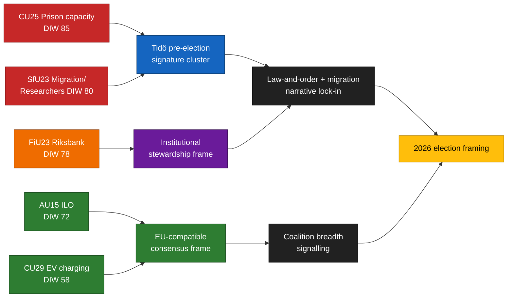

<!-- dir: rtl -->
<!-- lang: ar -->
# ملخص تنفيذي — تقارير اللجان 2026-04-24

**المؤلف**: James Pether Sörling   **معرف الجلسة**: 24866836753   **التصنيف**: عام   **الثقة**: عالية (B2)

## 🎯 الخلاصة

خمسة تقارير للجان قُدِّمت في 2026-04-23 تتمحور حول الركائز الثلاث المميزة لحملة تحالف Tidö الانتخابية — **طاقة السجون** (`HD01CU25`)، **تطبيق قوانين الهجرة مع استثناء تنقل الباحثين** (`HD01SfU23`) و**الإدارة المؤسسية للسياسة النقدية** (`HD01FiU23`) — مكمَّلةً بملفَّين ذوي إجماع واسع حول **مصادقة منظمة العمل الدولية على حقوق العمال** (`HD01AU15`) و**شحن السيارات الكهربائية المنزلي** (`HD01CU29`). هذه المجموعة تشكيل إشاري متعمَّد قبل ~5 أشهر من انتخابات ريكسداغ في سبتمبر 2026. يتركز خطر التنفيذ الحقيقي في `HD01CU25` و`HD01SfU23`؛ وخطر السمعة في `HD01FiU23`.

## 🧭 3 قرارات تدعمها هذه الوثيقة

1. **التواصل الانتخابي** — ينبغي للمتواصلين الحكوميين تسلسل خطابات CU25 + SfU23 معاً في مايو 2026؛ وعلى المعارضة إعادة صياغة SfU23 حول استثناء الباحثين لتفريق M عن L.
2. **الرقابة على التنفيذ** — ينبغي لـKU وRiksrevisionen الإشارة مسبقاً إلى CU25 وSfU23 لنطاق التدقيق 2026/27؛ FiU23 يؤكد مراجعة استقلالية Riksbank الجارية.
3. **التموضع الدولي** — ينبغي ربط تصديق منظمة العمل الدولية C190 (AU15) بتطبيق توجيه العمل عبر المنصات الأوروبي والمصادقات السابقة للدول الاسكندنافية.

## ⏱ قراءة 60 ثانية

- **القصة الرئيسية**: `HD01CU25` — مشروع قانون توسيع طاقة السجون هو العنصر الأكثر وزناً (DIW 85).
- **السطر الثاني**: `HD01SfU23` (DIW 80) يتفرع في السياسة الهجرية — تشديد تصاريح الدراسة مع فتح المجال للباحثين.
- **النقدية المؤسسية**: `HD01FiU23` (DIW 78) — مراجعة Riksbank السنوية الجارية، بارزة بشكل غير معتاد في 2026.
- **نقاط الإجماع**: `HD01AU15` (منظمة العمل الدولية، DIW 72) و`HD01CU29` (شحن سيارات كهربائية، DIW 58).
- **المحفز الاستشرافي الرئيسي**: تقرير حالة طاقة Kriminalvården Q2 2026 (~2026-06-23). انحراف ≥ 10 % سيعكس رواية الحكومة حول الجريمة.

## 🧠 الثقة والافتراضات

**عالية** لتكوين المجموعة وتصنيف DIW. **متوسطة** لفجوات التنفيذ. **منخفضة** لتأثيرات التأطير على الناخبين.

## 📊 مخطط التركيبة

## المصادر

- `get_dokument({dok_id: "HD01CU25"})` → https://data.riksdagen.se/dokument/HD01CU25 [A1]
- `get_dokument({dok_id: "HD01SfU23"})` → https://data.riksdagen.se/dokument/HD01SfU23 [A1]
- `get_dokument({dok_id: "HD01FiU23"})` → https://data.riksdagen.se/dokument/HD01FiU23 [A1]
- `get_dokument({dok_id: "HD01AU15"})` → https://data.riksdagen.se/dokument/HD01AU15 [A1]
- `get_dokument({dok_id: "HD01CU29"})` → https://data.riksdagen.se/dokument/HD01CU29 [A1]

<!-- source-sha: 1e83ac6587956e9b1ca9cfd53aac08783e617cbd -->
