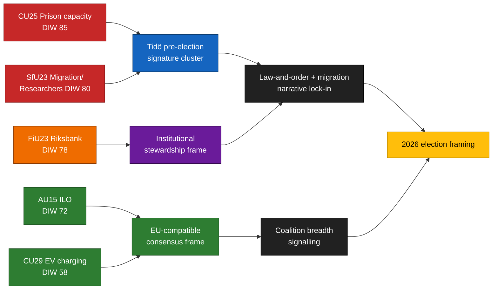

<!-- lang: da -->
# Eksekutiv sammenfatning — Udvalgsrapporter 2026-04-24

**Forfatter**: James Pether Sörling   **Kørsel-ID**: 24866836753   **Klassifikation**: OFFENTLIG   **Tillid**: HØJ (B2)

## 🎯 Konklusion

Fem udvalgsrapporter fremsat 2026-04-23 grupperer sig langs Tidö-koalitionens tre valgprofilepiller — **kapacitet i kriminalforsorgen** (`HD01CU25`), **migrationshåndhævelse med undtagelse for forskerbesøg** (`HD01SfU23`) og **institutionel pengeforvaltning** (`HD01FiU23`) — suppleret af to bred-konsensus-sager om **ILO-ratificering af arbejdsrettigheder** (`HD01AU15`) og **hjemmeopladestation til elbiler** (`HD01CU29`). Klyngen er en bevidst signalsammensætning ~5 måneder inden Riksdag-valget i september 2026: den lader M/KD/SD hævde levering på lov-og-orden og migration, mens L og centristiske aktører forankrer EU-kompatible arbejds- og klimasejre. Den reelle implementeringsrisiko koncentreres i `HD01CU25` og `HD01SfU23`; omdømmerisikoen i `HD01FiU23`.

## 🧭 3 beslutninger som dette notat understøtter

1. **Valkommunikation** — Regeringskommunikatører bør sekvensere CU25 + SfU23 kammertal samlet i maj 2026 for maksimal dækning inden sommerferien; oppositionen bør kontraindramme SfU23 om forskerundtagelsen for at splitte M fra L.
2. **Implementeringsovervågning** — KU og Riksrevisionen bør forhåndsflagge CU25 og SfU23 til revisionsomfanget 2026/27; FiU23 bekræfter løbende Riksbank-uafhængighedsgranskning.
3. **International positionering** — Ratificering af ILO C190 (AU15) bør parres med EU-platformsdirektivets gennemførelse og nordiske kollegers tidligere ratificeringer for at maksimere omdømmeudbyttet.

## ⏱ 60-sekunders læsning

- **Ledende nyhed**: `HD01CU25` — loven om fængselskapacitetsudvidelse er det tyngst vægede punkt (DIW 85) pga. stor finansiel eksponering, komprimerede tidslinjer og præ-valgssymbolik.
- **Anden linje**: `HD01SfU23` (DIW 80) bifurkerer migrationspolitikken — stramning af studietilladelser men åbning for forskere — skaber koalitionsinternt SD–L-spænding og oppositionsmulighed.
- **Monetær-institutionel**: `HD01FiU23` (DIW 78) — løbende Riksbank-granskning, men usædvanlig fremtrædende i 2026 pga. 2024–25 balancetab.
- **Konsensuspunkter**: `HD01AU15` (ILO, DIW 72) og `HD01CU29` (elbilsopladning, DIW 58) er brede støttesager.
- **Vigtigste fremadrettede trigger**: Kriminalvårdens kapacitetsstatusrapport Q2 2026 (forventet ~2026-06-23). En afvigelse ≥ 10 % ville vende regeringens kriminalitetsnarrativ.

## 🧠 Tillid og antagelser

Nøgledomme: **HØJ** tillid for klyngesammensætning og DIW-rangering. **MIDDEL** for implementeringsdeltas. **LAV** for vælgerramningseffekter.

## 📊 Sammensætningsdiagram

## Kilder

- `get_dokument({dok_id: "HD01CU25"})` → https://data.riksdagen.se/dokument/HD01CU25 [A1]
- `get_dokument({dok_id: "HD01SfU23"})` → https://data.riksdagen.se/dokument/HD01SfU23 [A1]
- `get_dokument({dok_id: "HD01FiU23"})` → https://data.riksdagen.se/dokument/HD01FiU23 [A1]
- `get_dokument({dok_id: "HD01AU15"})` → https://data.riksdagen.se/dokument/HD01AU15 [A1]
- `get_dokument({dok_id: "HD01CU29"})` → https://data.riksdagen.se/dokument/HD01CU29 [A1]

<!-- source-sha: 1e83ac6587956e9b1ca9cfd53aac08783e617cbd -->
