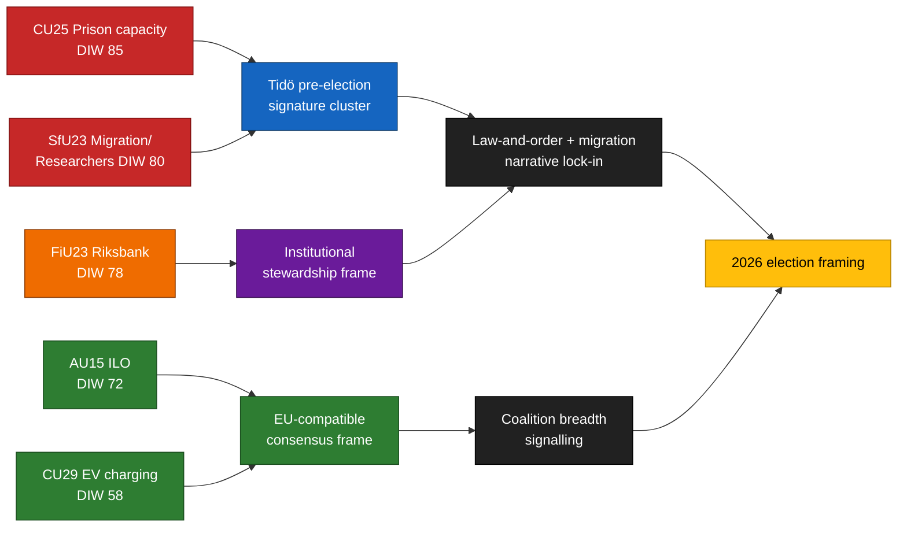

<!-- lang: de -->
# Exekutivbriefing — Ausschussberichte 2026-04-24

**Autor**: James Pether Sörling   **Lauf-ID**: 24866836753   **Klassifizierung**: ÖFFENTLICH   **Konfidenz**: HOCH (B2)

## 🎯 Schlussfolgerung

Fünf Ausschussberichte, die am 2026-04-23 vorgelegt wurden, gruppieren sich entlang der drei Wahlkampf-Signaturpfeiler der Tidö-Koalition — **Kapazität der Strafvollzugsbehörde** (`HD01CU25`), **Migrationsdurchsetzung mit Ausnahme für Forscher-Mobilität** (`HD01SfU23`) und **institutionelle Geldpolitik** (`HD01FiU23`) — ergänzt durch zwei Breitkonsens-Dossiers zu **ILO-Ratifizierung von Arbeitnehmerrechten** (`HD01AU15`) und **E-Auto-Heimladen** (`HD01CU29`). Das Cluster ist eine bewusste Signalzusammensetzung ~5 Monate vor der Riksdag-Wahl im September 2026. Das reale Implementierungsrisiko konzentriert sich auf `HD01CU25` und `HD01SfU23`; das Reputationsrisiko auf `HD01FiU23`.

## 🧭 3 Entscheidungen, die dieses Briefing unterstützt

1. **Wahlkampfkommunikation** — Regierungskommunikatoren sollten CU25 + SfU23 Kammerbeiträge im Mai 2026 gemeinsam sequenzieren; die Opposition sollte SfU23 beim Forscher-Ausnahme-Framing kontern, um M von L zu spalten.
2. **Implementierungsaufsicht** — KU und Riksrevisionen sollten CU25 und SfU23 für den Prüfungsumfang 2026/27 vormerken; FiU23 bestätigt die fortlaufende Riksbank-Unabhängigkeitsprüfung.
3. **Internationale Positionierung** — Die Ratifizierung von ILO C190 (AU15) sollte mit der Umsetzung der EU-Plattformarbeits-Richtlinie und früheren Ratifizierungen nordischer Kollegen verknüpft werden.

## ⏱ 60-Sekunden-Lektüre

- **Leitgeschichte**: `HD01CU25` — das Gefängniskapazitätserweiterungsgesetz ist das meistgewichtete Element (DIW 85).
- **Zweite Zeile**: `HD01SfU23` (DIW 80) bifurkiert die Migrationspolitik — Verschärfung der Studienerlaubnisse, aber Öffnung für Forscher.
- **Geldpolitisch-institutionell**: `HD01FiU23` (DIW 78) — laufende Riksbank-Prüfung, ungewöhnlich prominent im Jahr 2026.
- **Konsensus-Punkte**: `HD01AU15` (ILO, DIW 72) und `HD01CU29` (E-Auto-Laden, DIW 58).
- **Wichtigster Vorwärts-Auslöser**: Kriminalvårdens Kapazitätsstatusbericht Q2 2026 (~2026-06-23). Eine Abweichung ≥ 10 % würde das Kriminalitätsnarrativ der Regierung umkehren.

## 🧠 Konfidenz und Annahmen

**HOCH** für Clusterzusammensetzung und DIW-Ranking. **MITTEL** für Implementierungsdeltas. **NIEDRIG** für Wähler-Rahmungseffekte.

## 📊 Zusammensetzungsdiagramm

## Quellen

- `get_dokument({dok_id: "HD01CU25"})` → https://data.riksdagen.se/dokument/HD01CU25 [A1]
- `get_dokument({dok_id: "HD01SfU23"})` → https://data.riksdagen.se/dokument/HD01SfU23 [A1]
- `get_dokument({dok_id: "HD01FiU23"})` → https://data.riksdagen.se/dokument/HD01FiU23 [A1]
- `get_dokument({dok_id: "HD01AU15"})` → https://data.riksdagen.se/dokument/HD01AU15 [A1]
- `get_dokument({dok_id: "HD01CU29"})` → https://data.riksdagen.se/dokument/HD01CU29 [A1]

<!-- source-sha: 1e83ac6587956e9b1ca9cfd53aac08783e617cbd -->
