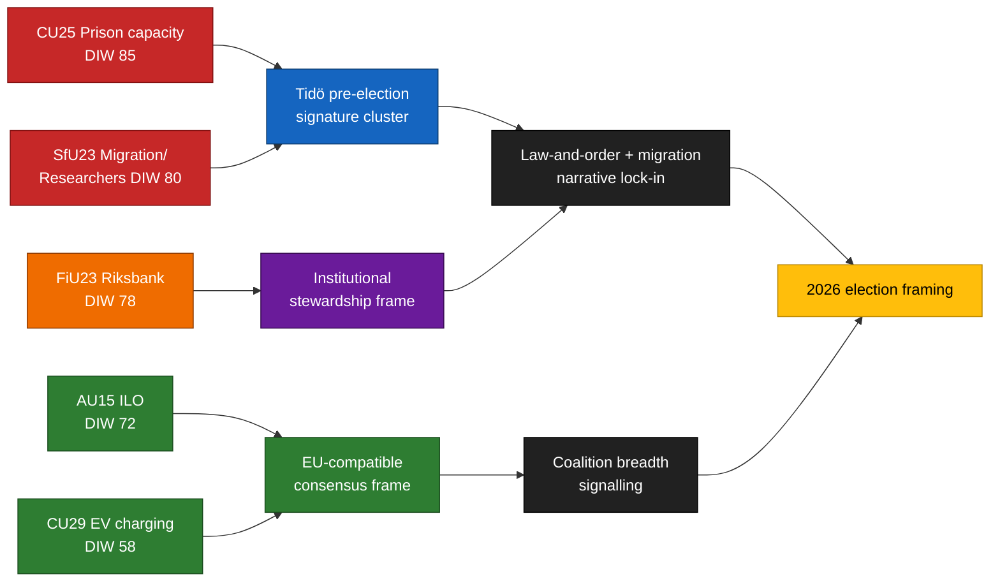

<!-- lang: es -->
# Resumen ejecutivo — Informes de comisión 2026-04-24

**Autor**: James Pether Sörling   **ID de ejecución**: 24866836753   **Clasificación**: PÚBLICO   **Confianza**: ALTA (B2)

## 🎯 Conclusión

Cinco informes de comisión presentados el 2026-04-23 se agrupan en torno a los tres pilares electorales distintivos de la coalición Tidö — **capacidad penitenciaria** (`HD01CU25`), **aplicación de la ley migratoria con excepción para la movilidad de investigadores** (`HD01SfU23`) y **administración institucional de la política monetaria** (`HD01FiU23`) — complementados por dos expedientes de amplio consenso sobre **ratificación de la OIT de derechos laborales** (`HD01AU15`) y **carga doméstica de vehículos eléctricos** (`HD01CU29`). Este grupo es una composición deliberada de señales ~5 meses antes de las elecciones del Riksdag en septiembre de 2026. El riesgo real de implementación se concentra en `HD01CU25` y `HD01SfU23`; el riesgo reputacional en `HD01FiU23`.

## 🧭 3 decisiones que apoya esta nota

1. **Comunicación electoral** — Los comunicadores gubernamentales deben secuenciar los discursos en cámara CU25 + SfU23 juntos en mayo de 2026; la oposición debe reconceptualizar SfU23 sobre la excepción de investigadores para dividir M de L.
2. **Supervisión de implementación** — KU y Riksrevisionen deben marcar CU25 y SfU23 para el ámbito de auditoría 2026/27; FiU23 confirma la revisión continua de la independencia del Riksbank.
3. **Posicionamiento internacional** — La ratificación de la OIT C190 (AU15) debe vincularse con la transposición de la Directiva UE sobre trabajo en plataformas y las ratificaciones anteriores de los países nórdicos.

## ⏱ Lectura de 60 segundos

- **Historia principal**: `HD01CU25` — la ley de ampliación de la capacidad carcelaria es el elemento más ponderado (DIW 85).
- **Segunda línea**: `HD01SfU23` (DIW 80) bifurca la política migratoria — endurece los permisos de estudio pero abre para investigadores.
- **Institucional monetario**: `HD01FiU23` (DIW 78) — revisión anual del Riksbank, inusualmente prominente en 2026.
- **Puntos de consenso**: `HD01AU15` (OIT, DIW 72) y `HD01CU29` (carga VE, DIW 58).
- **Principal desencadenante prospectivo**: informe de capacidad Q2 2026 de Kriminalvården (~2026-06-23). Una desviación ≥ 10 % invertiría la narrativa delictiva del gobierno.

## 🧠 Confianza y supuestos

**ALTA** para composición del grupo y clasificación DIW. **MEDIA** para deltas de implementación. **BAJA** para efectos de encuadre del votante.

## 📊 Diagrama de composición

## Fuentes

- `get_dokument({dok_id: "HD01CU25"})` → https://data.riksdagen.se/dokument/HD01CU25 [A1]
- `get_dokument({dok_id: "HD01SfU23"})` → https://data.riksdagen.se/dokument/HD01SfU23 [A1]
- `get_dokument({dok_id: "HD01FiU23"})` → https://data.riksdagen.se/dokument/HD01FiU23 [A1]
- `get_dokument({dok_id: "HD01AU15"})` → https://data.riksdagen.se/dokument/HD01AU15 [A1]
- `get_dokument({dok_id: "HD01CU29"})` → https://data.riksdagen.se/dokument/HD01CU29 [A1]

<!-- source-sha: 1e83ac6587956e9b1ca9cfd53aac08783e617cbd -->
