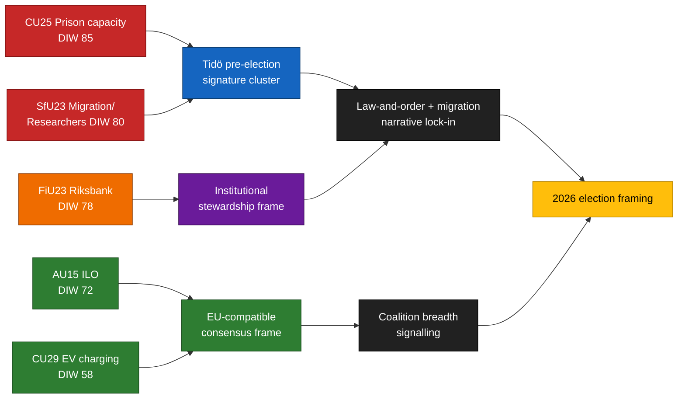

<!-- lang: fi -->
# Tiivistelmä — Valiokuntamietinnöt 2026-04-24

**Tekijä**: James Pether Sörling   **Ajoidentifiointi**: 24866836753   **Luokitus**: JULKINEN   **Luottamus**: KORKEA (B2)

## 🎯 Johtopäätös

Viisi valiokuntamietintöä, jotka esiteltiin 2026-04-23, ryhmittyvät Tidö-koalition kolmen vaalikampanjakehyksen ympärille — **kriminaalihuollon kapasiteetti** (`HD01CU25`), **maahanmuuton toimeenpano tutkijaliikkuvuuden poikkeuksella** (`HD01SfU23`) ja **rahapolitiikan institutionaalinen hallinto** (`HD01FiU23`) — täydennettynä kahdella laajaa yhteisymmärrystä nauttivalla asialla: **ILO-ratifiointi työoikeuksista** (`HD01AU15`) ja **sähköautojen kotilatauksesta** (`HD01CU29`). Ryhmittymä on tarkoituksellinen signaalikokoonpano ~5 kuukautta ennen syyskuun 2026 vaaleja. Todellinen toteutusriski keskittyy `HD01CU25`- ja `HD01SfU23`-asioihin; maineisriski `HD01FiU23`-asiaan.

## 🧭 3 päätöstä, joita tämä tiivistelmä tukee

1. **Vaalikampanjaviestintä** — Hallituksen viestijöiden tulisi ajoittaa CU25 + SfU23 kammaripuheenvuorot toukokuulle 2026; opposition tulisi vastakehystää SfU23 tutkijapoikkeuksen kautta M:n ja L:n välisen hajaannuksen aikaansaamiseksi.
2. **Toteutuksen valvonta** — KU:n ja Riksrevisionenin tulisi ennakkomerkitä CU25 ja SfU23 vuosien 2026/27 tarkastusaihioihin; FiU23 vahvistaa jatkuvan Riksbankin riippumattomuuskatsauksen.
3. **Kansainvälinen asemoituminen** — ILO C190:n ratifiointi (AU15) tulee yhdistää EU:n alustatyödirektiivin täytäntöönpanoon ja pohjoismaisten kollegoiden aikaisempiin ratifiointeihin.

## ⏱ 60 sekunnin lukeminen

- **Päätarina**: `HD01CU25` — vankilakapasiteetin laajennuslaki on eniten painotettu asia (DIW 85).
- **Toinen rivi**: `HD01SfU23` (DIW 80) bifurkoi maahanmuuttopolitiikan — kiristää opiskeluluvat mutta avaa tutkijoille.
- **Rahapolitiikka-institutionaalinen**: `HD01FiU23` (DIW 78) — jatkuva Riksbank-katsaus, epätavallisen merkittävä 2026.
- **Yhteisymmärryskohdat**: `HD01AU15` (ILO, DIW 72) ja `HD01CU29` (sähköauton lataus, DIW 58).
- **Tärkein ennakoiva laukaisin**: Kriminaalihuollon kapasiteettistatusraportti Q2 2026 (~2026-06-23). ≥ 10 %:n poikkeama kääntäisi hallituksen rikosvastaus-narratiivin.

## 🧠 Luottamus ja oletukset

Keskeisten arvioiden **KORKEA** luottamus ryhmittymäkoostumukselle ja DIW-sijoitukselle. **KOHTUULLINEN** toteutusdeltoille. **MATALA** äänestäjäkehystysefekteille.

## 📊 Kokoonpanokaavio

## Lähteet

- `get_dokument({dok_id: "HD01CU25"})` → https://data.riksdagen.se/dokument/HD01CU25 [A1]
- `get_dokument({dok_id: "HD01SfU23"})` → https://data.riksdagen.se/dokument/HD01SfU23 [A1]
- `get_dokument({dok_id: "HD01FiU23"})` → https://data.riksdagen.se/dokument/HD01FiU23 [A1]
- `get_dokument({dok_id: "HD01AU15"})` → https://data.riksdagen.se/dokument/HD01AU15 [A1]
- `get_dokument({dok_id: "HD01CU29"})` → https://data.riksdagen.se/dokument/HD01CU29 [A1]

<!-- source-sha: 1e83ac6587956e9b1ca9cfd53aac08783e617cbd -->
