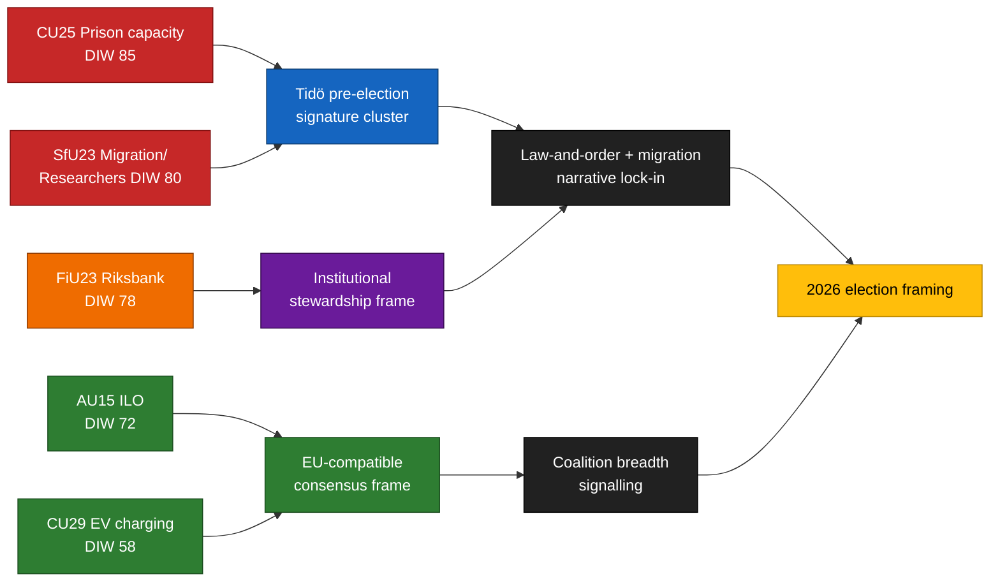

<!-- lang: fr -->
# Note de synthèse — Rapports de commission 2026-04-24

**Auteur** : James Pether Sörling   **ID de session** : 24866836753   **Classification** : PUBLIC   **Confiance** : ÉLEVÉE (B2)

## 🎯 Conclusion

Cinq rapports de commission déposés le 2026-04-23 se regroupent autour des trois piliers électoraux caractéristiques de la coalition Tidö — **capacité pénitentiaire** (`HD01CU25`), **application des règles migratoires avec exemption pour la mobilité des chercheurs** (`HD01SfU23`) et **gestion institutionnelle de la politique monétaire** (`HD01FiU23`) — complétés par deux dossiers à large consensus sur la **ratification ILO des droits du travail** (`HD01AU15`) et la **recharge à domicile des véhicules électriques** (`HD01CU29`). Cette grappe est une composition délibérée de signaux ~5 mois avant les élections du Riksdag en septembre 2026. Le risque d'exécution réel se concentre sur `HD01CU25` et `HD01SfU23` ; le risque réputationnel sur `HD01FiU23`.

## 🧭 3 décisions soutenues par cette note

1. **Communication électorale** — Les communicants gouvernementaux devraient séquencer les discours en chambre CU25 + SfU23 ensemble en mai 2026 ; l'opposition devrait recadrer SfU23 sur l'exemption chercheurs pour diviser M de L.
2. **Supervision de la mise en œuvre** — KU et Riksrevisionen devraient signaler CU25 et SfU23 pour l'audit 2026/27 ; FiU23 confirme la revue continue de l'indépendance de la Riksbank.
3. **Positionnement international** — La ratification de l'ILO C190 (AU15) devrait être couplée à la transposition de la directive EU sur le travail de plateforme et aux ratifications antérieures des pays nordiques.

## ⏱ Lecture en 60 secondes

- **Fil directeur** : `HD01CU25` — le projet de loi sur l'extension de la capacité carcérale est l'élément le plus pondéré (DIW 85).
- **Deuxième ligne** : `HD01SfU23` (DIW 80) bifurque la politique migratoire — durcissement des permis d'études mais ouverture pour les chercheurs.
- **Institutionnel monétaire** : `HD01FiU23` (DIW 78) — revue annuelle courante de la Riksbank, inhabituellement saillante en 2026.
- **Points de consensus** : `HD01AU15` (ILO, DIW 72) et `HD01CU29` (chargement VE, DIW 58).
- **Principal déclencheur prospectif** : rapport de capacité Q2 2026 de Kriminalvården (~2026-06-23). Un écart ≥ 10 % inverserait le récit criminalité du gouvernement.

## 🧠 Confiance et hypothèses

**ÉLEVÉE** pour la composition de la grappe et le classement DIW. **MOYEN** pour les deltas de mise en œuvre. **FAIBLE** pour les effets d'encadrement sur les électeurs.

## 📊 Diagramme de composition

## Sources

- `get_dokument({dok_id: "HD01CU25"})` → https://data.riksdagen.se/dokument/HD01CU25 [A1]
- `get_dokument({dok_id: "HD01SfU23"})` → https://data.riksdagen.se/dokument/HD01SfU23 [A1]
- `get_dokument({dok_id: "HD01FiU23"})` → https://data.riksdagen.se/dokument/HD01FiU23 [A1]
- `get_dokument({dok_id: "HD01AU15"})` → https://data.riksdagen.se/dokument/HD01AU15 [A1]
- `get_dokument({dok_id: "HD01CU29"})` → https://data.riksdagen.se/dokument/HD01CU29 [A1]

<!-- source-sha: 1e83ac6587956e9b1ca9cfd53aac08783e617cbd -->
