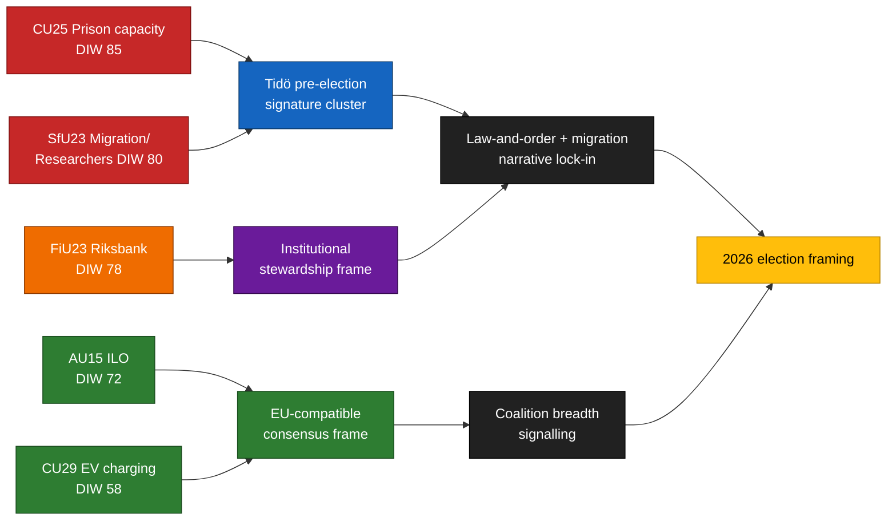

<!-- dir: rtl -->
<!-- lang: he -->
# סיכום מנהלים — דוחות ועדות 2026-04-24

**מחבר**: James Pether Sörling   **מזהה ריצה**: 24866836753   **סיווג**: ציבורי   **אמינות**: גבוהה (B2)

## 🎯 תקציר מנהלים

חמישה דוחות ועדה שהוגשו ב-2026-04-23 מתקבצים סביב שלושת עמודי התווך הייחודיים לקמפיין של קואליציית Tidö — **קיבולת בתי כלא** (`HD01CU25`), **אכיפת חוקי הגירה עם פטור לניידות חוקרים** (`HD01SfU23`) ו**ניהול מוסדי של מדיניות מוניטרית** (`HD01FiU23`) — בתוספת שני תיקי קונסנסוס רחב על **אשרור ILO של זכויות עובדים** (`HD01AU15`) ו**טעינה ביתית לרכבים חשמליים** (`HD01CU29`). האשכול הוא הרכב סיגנלים מכוון ~5 חודשים לפני בחירות הריקסדאג בספטמבר 2026. סיכון היישום האמיתי מתרכז ב-`HD01CU25` וב-`HD01SfU23`; סיכון המוניטין ב-`HD01FiU23`.

## 🧭 3 החלטות שמסמך זה תומך בהן

1. **תקשורת בחירות** — נציגי הממשלה צריכים לסדר את נאומי CU25 + SfU23 יחד במאי 2026; האופוזיציה צריכה לשנות את מסגרת SfU23 סביב פטור חוקרים לפיצול M מ-L.
2. **פיקוח על יישום** — KU וRiksrevisionen צריכים לסמן מראש CU25 וSfU23 לתחום הביקורת 2026/27; FiU23 מאשר את סקירת עצמאות Riksbank השוטפת.
3. **מיצוב בינלאומי** — אשרור ILO C190 (AU15) צריך להיות מוצמד לתרגום הנחיית עבודת הפלטפורמה האירופית ולאשרורים הקודמים של המדינות הנורדיות.

## ⏱ קריאה של 60 שניות

- **סיפור הראשי**: `HD01CU25` — חוק הרחבת קיבולת הכלא הוא הפריט הממושקל ביותר (DIW 85).
- **שורה שנייה**: `HD01SfU23` (DIW 80) מפצל את מדיניות ההגירה — מחמיר אישורי לימוד אך פותח לחוקרים.
- **מוניטרי-מוסדי**: `HD01FiU23` (DIW 78) — סקירת Riksbank שנתית שוטפת, בולטת במיוחד ב-2026.
- **נקודות קונסנסוס**: `HD01AU15` (ILO, DIW 72) ו-`HD01CU29` (טעינת רכב חשמלי, DIW 58).
- **הטריגר הפרוספקטיבי המרכזי**: דוח סטטוס קיבולת Kriminalvården Q2 2026 (~2026-06-23). סטייה ≥ 10 % תהפוך את נרטיב הפשיעה של הממשלה.

## 🧠 אמינות והנחות

**גבוהה** לתרכובת האשכול ולדירוג DIW. **בינונית** לפערי יישום. **נמוכה** לאפקטי הסגנון על הבוחרים.

## 📊 תרשים הרכב

## מקורות

- `get_dokument({dok_id: "HD01CU25"})` → https://data.riksdagen.se/dokument/HD01CU25 [A1]
- `get_dokument({dok_id: "HD01SfU23"})` → https://data.riksdagen.se/dokument/HD01SfU23 [A1]
- `get_dokument({dok_id: "HD01FiU23"})` → https://data.riksdagen.se/dokument/HD01FiU23 [A1]
- `get_dokument({dok_id: "HD01AU15"})` → https://data.riksdagen.se/dokument/HD01AU15 [A1]
- `get_dokument({dok_id: "HD01CU29"})` → https://data.riksdagen.se/dokument/HD01CU29 [A1]

<!-- source-sha: 1e83ac6587956e9b1ca9cfd53aac08783e617cbd -->
