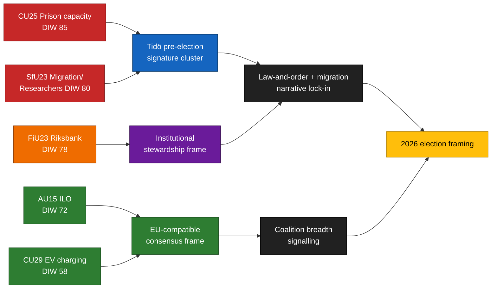

<!-- lang: ja -->
# エグゼクティブブリーフ — 委員会報告書 2026-04-24

**著者**: James Pether Sörling   **実行ID**: 24866836753   **分類**: 公開   **信頼度**: 高 (B2)

## 🎯 結論

2026-04-23に提出された5件の委員会報告書は、Tidö連立政権の3つの選挙看板政策を軸に集まっている — **刑務所収容能力** (`HD01CU25`)、**研究者移動の例外を設けた移民法執行** (`HD01SfU23`)、**金融機関の統治** (`HD01FiU23`) — さらに**ILO労働権批准** (`HD01AU15`) および**電気自動車の自宅充電** (`HD01CU29`) に関する2件の広範な合意案件が加わる。このクラスターは2026年9月のリクスダーグ選挙約5ヶ月前の意図的なシグナル構成である。実際の実施リスクは `HD01CU25` と `HD01SfU23` に集中し、評判リスクは `HD01FiU23` に集中している。

## 🧭 このブリーフが支援する3つの意思決定

1. **選挙キャンペーン戦略** — 政府の広報担当者は2026年5月にCU25 + SfU23の院内演説をまとめて行うべき；野党はSfU23の研究者例外を使ってMとLの分断を狙うべき。
2. **実施監視** — KUとRiksrevisionenは2026/27年度監査対象としてCU25とSfU23を事前登録すべき；FiU23は継続中のリクスバンク独立性審査を確認する。
3. **国際的なポジショニング** — ILO C190批准(AU15)はEUプラットフォーム労働指令の移行と北欧諸国の早期批准と関連付けるべき。

## ⏱ 60秒で読む

- **トップ記事**: `HD01CU25` — 刑務所収容能力拡大法案が最も重視されている(DIW 85)。
- **2番目**: `HD01SfU23` (DIW 80) — 移民政策を二分する：学生ビザを厳格化しつつ研究者には開放する。
- **金融機関**: `HD01FiU23` (DIW 78) — 継続中のリクスバンク年次審査、2026年は2024〜25年の貸借対照表損失により例外的に重要。
- **合意案件**: `HD01AU15` (ILO, DIW 72) と `HD01CU29` (EV充電, DIW 58)。
- **主要先行指標**: Kriminalvårdens 2026年Q2収容能力状況報告書(~2026-06-23)。計画病床数から10%以上の乖離があれば政府の犯罪対策ナラティブが逆転する。

## 🧠 信頼度と前提条件

クラスター構成とDIW順位付けに **高** 信頼度。実施デルタに **中** 信頼度。有権者フレーミング効果に **低** 信頼度。

## 📊 構成図

## 情報源

- `get_dokument({dok_id: "HD01CU25"})` → https://data.riksdagen.se/dokument/HD01CU25 [A1]
- `get_dokument({dok_id: "HD01SfU23"})` → https://data.riksdagen.se/dokument/HD01SfU23 [A1]
- `get_dokument({dok_id: "HD01FiU23"})` → https://data.riksdagen.se/dokument/HD01FiU23 [A1]
- `get_dokument({dok_id: "HD01AU15"})` → https://data.riksdagen.se/dokument/HD01AU15 [A1]
- `get_dokument({dok_id: "HD01CU29"})` → https://data.riksdagen.se/dokument/HD01CU29 [A1]

<!-- source-sha: 1e83ac6587956e9b1ca9cfd53aac08783e617cbd -->
