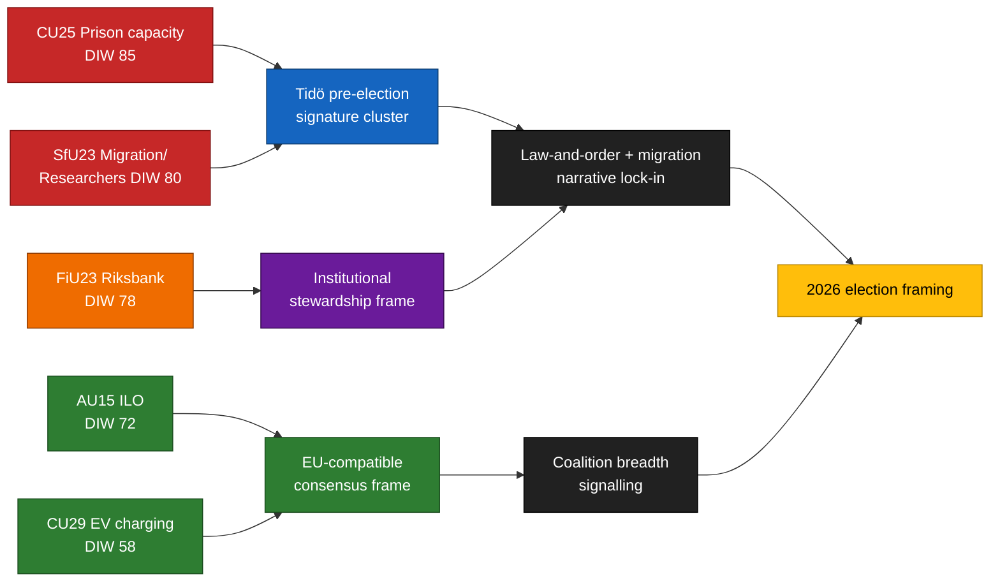

<!-- lang: ko -->
# 집행 브리핑 — 위원회 보고서 2026-04-24

**저자**: James Pether Sörling   **실행 ID**: 24866836753   **분류**: 공개   **신뢰도**: 높음 (B2)

## 🎯 결론

2026-04-23에 제출된 5개의 위원회 보고서는 Tidö 연립정부의 3가지 선거 핵심 과제를 중심으로 모여 있다 — **교도소 수용 능력** (`HD01CU25`), **연구자 이동성 예외를 둔 이민법 집행** (`HD01SfU23`), **통화정책 기관 거버넌스** (`HD01FiU23`) — **ILO 노동권 비준** (`HD01AU15`) 및 **전기차 가정용 충전** (`HD01CU29`)에 관한 광범위한 합의 안건 2개가 추가된다. 이 클러스터는 2026년 9월 리크스다그 선거 약 5개월 전의 의도적인 신호 구성이다. 실제 이행 위험은 `HD01CU25`와 `HD01SfU23`에 집중되고; 평판 위험은 `HD01FiU23`에 집중된다.

## 🧭 이 브리핑이 지원하는 3가지 결정

1. **선거 커뮤니케이션** — 정부 대변인들은 CU25 + SfU23 본회의 연설을 2026년 5월에 함께 배치해야 한다; 야당은 SfU23을 연구자 예외를 중심으로 재구성하여 M과 L을 분열시켜야 한다.
2. **이행 감독** — KU와 Riksrevisionen은 CU25와 SfU23을 2026/27 감사 범위로 사전 표시해야 한다; FiU23은 Riksbank 독립성 검토 지속을 확인한다.
3. **국제 포지셔닝** — ILO C190 비준(AU15)은 EU 플랫폼 노동 지침 이행 및 북유럽 국가들의 이전 비준과 연계해야 한다.

## ⏱ 60초 읽기

- **주요 기사**: `HD01CU25` — 교도소 수용 능력 확장 법안이 가장 높은 가중치를 받음(DIW 85).
- **두 번째**: `HD01SfU23` (DIW 80) — 이민 정책을 이분화: 학생 비자 강화하되 연구자에게는 개방.
- **금융 기관**: `HD01FiU23` (DIW 78) — 연간 Riksbank 검토, 2024~25 대차대조표 손실로 2026년에 특히 부각.
- **합의 항목**: `HD01AU15` (ILO, DIW 72) 및 `HD01CU29` (EV 충전, DIW 58).
- **주요 선행 트리거**: Kriminalvårdens 2026년 Q2 수용 능력 상태 보고서(~2026-06-23). 계획 침상 수에서 ≥10% 편차 발생 시 정부의 범죄 대응 서사가 역전된다.

## 🧠 신뢰도와 가정

클러스터 구성 및 DIW 순위에 **높은** 신뢰도. 이행 델타에 **중간** 신뢰도. 유권자 프레이밍 효과에 **낮은** 신뢰도.

## 📊 구성 다이어그램

## 출처

- `get_dokument({dok_id: "HD01CU25"})` → https://data.riksdagen.se/dokument/HD01CU25 [A1]
- `get_dokument({dok_id: "HD01SfU23"})` → https://data.riksdagen.se/dokument/HD01SfU23 [A1]
- `get_dokument({dok_id: "HD01FiU23"})` → https://data.riksdagen.se/dokument/HD01FiU23 [A1]
- `get_dokument({dok_id: "HD01AU15"})` → https://data.riksdagen.se/dokument/HD01AU15 [A1]
- `get_dokument({dok_id: "HD01CU29"})` → https://data.riksdagen.se/dokument/HD01CU29 [A1]

<!-- source-sha: 1e83ac6587956e9b1ca9cfd53aac08783e617cbd -->
