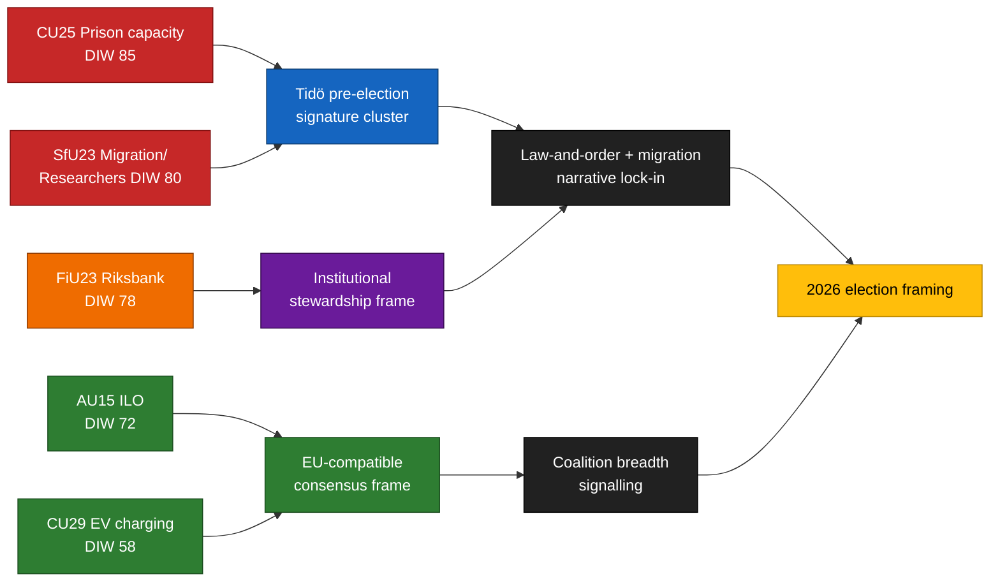

<!-- lang: nl -->
# Uitvoerende briefing — Commissierapporten 2026-04-24

**Auteur**: James Pether Sörling   **Uitvoerings-ID**: 24866836753   **Classificatie**: OPENBAAR   **Betrouwbaarheid**: HOOG (B2)

## 🎯 Conclusie

Vijf commissierapporten ingediend op 2026-04-23 groeperen zich rond de drie verkiezingskenmerkende pijlers van de Tidö-coalitie — **gevangeniscapaciteit** (`HD01CU25`), **migratiehandhaving met uitzondering voor onderzoekersmobiliteit** (`HD01SfU23`) en **institutioneel monetair beheer** (`HD01FiU23`) — aangevuld met twee breed-consensus-dossiers over **ILO-ratificatie van arbeidsrechten** (`HD01AU15`) en **thuisladen voor elektrische voertuigen** (`HD01CU29`). Het cluster is een bewuste signaalsamenstelling ~5 maanden voor de Riksdag-verkiezingen in september 2026. Het werkelijke implementatierisico concentreert zich op `HD01CU25` en `HD01SfU23`; het reputatierisico op `HD01FiU23`.

## 🧭 3 beslissingen die deze briefing ondersteunt

1. **Verkiezingscommunicatie** — Regeringscommunicatoren moeten CU25 + SfU23 kamerdebatten samen in mei 2026 plannen; de oppositie moet SfU23 herkaderen via de onderzoekersvrijstelling om M van L te splitsen.
2. **Implementatietoezicht** — KU en Riksrevisionen moeten CU25 en SfU23 vooraf markeren voor het auditdomein 2026/27; FiU23 bevestigt de voortdurende Riksbank-onafhankelijkheidsreview.
3. **Internationale positionering** — Ratificatie van ILO C190 (AU15) moet worden gekoppeld aan de omzetting van de EU-platformwerkrichtlijn en eerdere ratificaties van Noordse collega's.

## ⏱ 60-seconden lezing

- **Hoofdverhaal**: `HD01CU25` — de wet uitbreiding gevangeniscapaciteit is het zwaarst gewogen element (DIW 85).
- **Tweede regel**: `HD01SfU23` (DIW 80) splitst migratiebeleid — aanscherping van studievergunningen maar opening voor onderzoekers.
- **Monetair-institutioneel**: `HD01FiU23` (DIW 78) — voortdurende Riksbank-review, ongewoon prominent in 2026.
- **Consensuspunten**: `HD01AU15` (ILO, DIW 72) en `HD01CU29` (EV-laden, DIW 58).
- **Belangrijkste trigger**: Kriminalvårdens capaciteitsstatusrapport Q2 2026 (~2026-06-23). Een afwijking ≥ 10 % zou het criminaliteitsnarrief van de regering omkeren.

## 🧠 Betrouwbaarheid en aannames

**HOOG** voor clustersamenstelling en DIW-rangschikking. **MIDDEL** voor implementatiedeltas. **LAAG** voor kiezersframingeffecten.

## 📊 Samenstellingsdiagram

## Bronnen

- `get_dokument({dok_id: "HD01CU25"})` → https://data.riksdagen.se/dokument/HD01CU25 [A1]
- `get_dokument({dok_id: "HD01SfU23"})` → https://data.riksdagen.se/dokument/HD01SfU23 [A1]
- `get_dokument({dok_id: "HD01FiU23"})` → https://data.riksdagen.se/dokument/HD01FiU23 [A1]
- `get_dokument({dok_id: "HD01AU15"})` → https://data.riksdagen.se/dokument/HD01AU15 [A1]
- `get_dokument({dok_id: "HD01CU29"})` → https://data.riksdagen.se/dokument/HD01CU29 [A1]

<!-- source-sha: 1e83ac6587956e9b1ca9cfd53aac08783e617cbd -->
