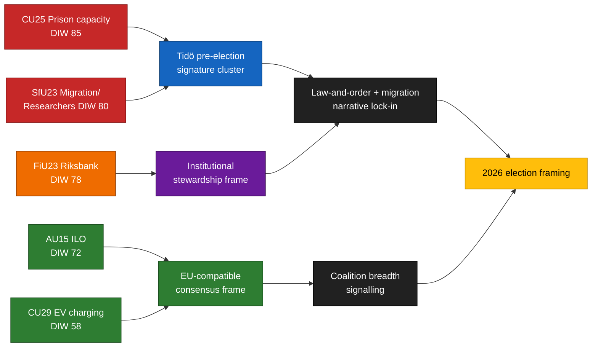

<!-- lang: no -->
# Beslutningsnotat — Komitérapporter 2026-04-24

**Forfatter**: James Pether Sörling   **Kjøring-ID**: 24866836753   **Klassifisering**: OFFENTLIG   **Tillit**: HØY (B2)

## 🎯 Konklusjon

Fem komitérapporter fremlagt 2026-04-23 grupperer seg langs Tidö-koalisjonens tre valsignaturpilarer — **kapasitet i kriminalomsorgen** (`HD01CU25`), **migrasjonshåndhevelse med unntak for forskermobilitet** (`HD01SfU23`) og **institusjonelt forvaltarskap for pengepolitikken** (`HD01FiU23`) — supplert av to bred-konsensus-saker om **ILO-ratifisering av arbeidsrettigheter** (`HD01AU15`) og **hjemmelading for elbiler** (`HD01CU29`). Klyngen er en bevisst signalsammensetning ~5 måneder før Riksdag-valget i september 2026. Den reelle implementeringsrisikoen konsentreres i `HD01CU25` og `HD01SfU23`; omdømmerisikoen i `HD01FiU23`.

## 🧭 3 beslutninger dette notatet støtter

1. **Valkampanjekommunikasjon** — Regjeringskommunikatører bør sekvensere CU25 + SfU23 kammertaler samlet i mai 2026 for maksimal dekning før sommerferien; opposisjonen bør kontrarammesette SfU23 rundt forskerunntak for å splitte M fra L.
2. **Implementeringsovervåking** — KU og Riksrevisionen bør forhåndsmarkere CU25 og SfU23 for revisjonsomfanget 2026/27; FiU23 bekrefter løpende Riksbank-uavhengighetsgransking.
3. **Internasjonal posisjonering** — Ratifisering av ILO C190 (AU15) bør parres med EU-plattformsdirektivets gjennomføring og nordiske kollegers tidligere ratifiseringer.

## ⏱ 60-sekunders lesning

- **Ledende nyhet**: `HD01CU25` — fengselkapasitetsutvidelsesloven er det tyngst vektede punktet (DIW 85).
- **Andre linje**: `HD01SfU23` (DIW 80) bifurkerer migrasjonspolitikken — strammer studietillatelser men åpner for forskere.
- **Monetær-institusjonell**: `HD01FiU23` (DIW 78) — løpende Riksbank-gransking, usedvanlig fremtredende i 2026.
- **Konsensuspunkter**: `HD01AU15` (ILO, DIW 72) og `HD01CU29` (elbilslading, DIW 58).
- **Viktigste fremadskuende trigger**: Kriminalvårdens kapasitetsstatusrapport Q2 2026 (~2026-06-23). Avvik ≥ 10 % ville snu regjeringens kriminalitetsnarrativ.

## 🧠 Tillit og antagelser

Nøkkeldomslut: **HØY** tillit for klyngesammensetning og DIW-rangering. **MIDDELS** for implementeringsdeltas. **LAV** for velgerinnrammingseffekter.

## 📊 Sammensetningsdiagram

## Kilder

- `get_dokument({dok_id: "HD01CU25"})` → https://data.riksdagen.se/dokument/HD01CU25 [A1]
- `get_dokument({dok_id: "HD01SfU23"})` → https://data.riksdagen.se/dokument/HD01SfU23 [A1]
- `get_dokument({dok_id: "HD01FiU23"})` → https://data.riksdagen.se/dokument/HD01FiU23 [A1]
- `get_dokument({dok_id: "HD01AU15"})` → https://data.riksdagen.se/dokument/HD01AU15 [A1]
- `get_dokument({dok_id: "HD01CU29"})` → https://data.riksdagen.se/dokument/HD01CU29 [A1]

<!-- source-sha: 1e83ac6587956e9b1ca9cfd53aac08783e617cbd -->
