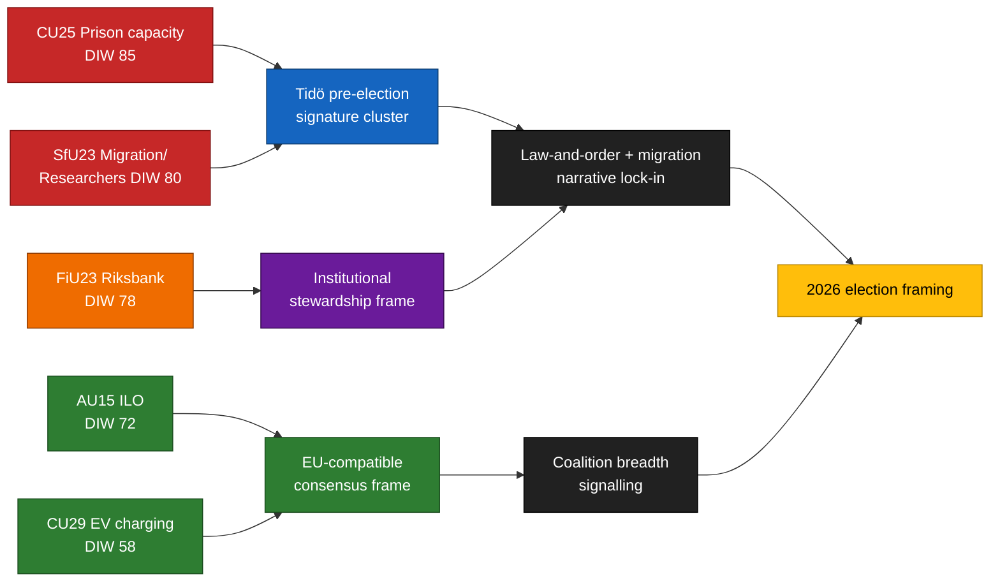

<!-- lang: sv -->
# Exekutiv sammanfattning — Utskottsbetänkanden 2026-04-24

**Författare**: James Pether Sörling   **Körnings-ID**: 24866836753   **Klassificering**: OFFENTLIG   **Konfidensgrad**: HÖG (B2)

## 🎯 Slutsats

Fem utskottsbetänkanden som lades fram 2026-04-23 grupperas kring Tidö-koalitionens tre valsignaturpelare — **kapacitet inom kriminalvård** (`HD01CU25`), **migrationsverkställighet med ett undantag för forskarrörighet** (`HD01SfU23`) och **institutionellt förvaltarskap för penningpolitiken** (`HD01FiU23`) — kompletterat av två bredkonsensus-ärenden om **ILO-ratificering av arbetsrättigheter** (`HD01AU15`) och **hemmaladdning för elfordon** (`HD01CU29`). Klustret är en medveten signalsammansättning ~5 månader inför riksdagsvalet i september 2026: det låter M/KD/SD hävda leverans på lag-och-ordning och migration medan L och centristiska aktörer förankrar EU-kompatibla arbets- och klimatsegrar. Den verkliga implementeringsrisken koncentreras i `HD01CU25` (kapacitetsabsorption hos Kriminalvården) och `HD01SfU23` (bifurkation av ärendehantering hos Migrationsverket); rykterisken koncentreras i `HD01FiU23` (Riksbankens balansräkningsförluster och oberoende-narrativ).

## 🧭 3 beslut som denna sammanfattning stödjer

1. **Valkampanjskommunikation** — Regeringskommunikatörer bör sekvensera CU25 (lag-och-ordning) + SfU23 (migration) kammartal tillsammans under maj 2026 för att maximera bevakning före riksdagsuppehållet; oppositionen bör motramla SfU23 kring undantaget för forskarrörighet för att splittra M från L och undvika att S hamnar i forskarfientlig box.
2. **Implementeringsövervakning** — KU och Riksrevisionen bör föranmäla CU25 (upphandlings-/miljögenvägsexponering) och SfU23 (Migrationsverkets dubbla IT- och personalspår) för revisionsomfånget 2026/27; FiU23 bekräftar löpande granskning av Riksbankens oberoende.
3. **Internationell positionering** — Ratificering av ILO C190 (AU15) bör paras i regeringens kommunikation med EU:s plattformsarbetsdirektivs genomförande och nordiska kollegers tidigare ratificeringar (Danmark, Finland, Norge) för att maximera reputationsdividenden.

## ⏱ 60-sekunders läsning

- **Ledande nyhet**: `HD01CU25` — lagen om fängelsekapacitetsutbyggnad är det tyngst vägda ärendet (DIW 85) eftersom det kombinerar stor finansiell exponering (Kriminalvårdens utbyggnadsprogram), komprimerade tidlinjer och förvalsymbolik.
- **Andra raden**: `HD01SfU23` (DIW 80) bifurkerar migrationspolitiken — skärpning av studietillstånd men öppning för forskare — vilket skapar koalitionsintern spänning (SD–L) och ett oppositionsutrymme för kompetitivitetsramande.
- **Monetärt institutionellt**: `HD01FiU23` (DIW 78) — löpande årlig Riksbanksgranskning, men ovanligt framträdande 2026 med hänsyn till 2024–25 balansräkningsförluster och förnyad oberoendedebatt.
- **Konsensusärenden**: `HD01AU15` (ILO, DIW 72) och `HD01CU29` (elbilsladdning, DIW 58) är breda stöddossier som ger tvåpartistäckning för regeringen att hävda leveransbredd.
- **Viktigaste framåtblickande trigger**: bevaka **Kriminalvårdens kapacitetsstatusrapport Q2 2026** (förväntad +60 dagar, ~2026-06-23). En avvikelse ≥ 10 % från planerat bäddantal skulle falsifiera CU25-tidlinjen och invertera regeringens brottsbekämpnings-leverans-narrativ inför valet.

## 🧠 Konfidens och antaganden

Nyckeldomslut har **HÖG** konfidens för klustersammansättning och DIW-rangordning (baserat på primär `get_dokument`-metadata, konsistent med riksdagens utskottskalender). **MEDEL** konfidens för implementeringsdeltor (beroende av Q2-statusrapporter 2026 som ännu inte publicerats). **LÅG** konfidens för väljarramningseffekter i avvaktan på opinionsmätningsvågor Q3 2026.

## 📊 Sammansättningsdiagram

## Källor

- `get_dokument({dok_id: "HD01CU25"})` → https://data.riksdagen.se/dokument/HD01CU25 [A1]
- `get_dokument({dok_id: "HD01SfU23"})` → https://data.riksdagen.se/dokument/HD01SfU23 [A1]
- `get_dokument({dok_id: "HD01FiU23"})` → https://data.riksdagen.se/dokument/HD01FiU23 [A1]
- `get_dokument({dok_id: "HD01AU15"})` → https://data.riksdagen.se/dokument/HD01AU15 [A1]
- `get_dokument({dok_id: "HD01CU29"})` → https://data.riksdagen.se/dokument/HD01CU29 [A1]
- Riksdagens utskottskalender — riksdagen.se

<!-- source-sha: 1e83ac6587956e9b1ca9cfd53aac08783e617cbd -->
