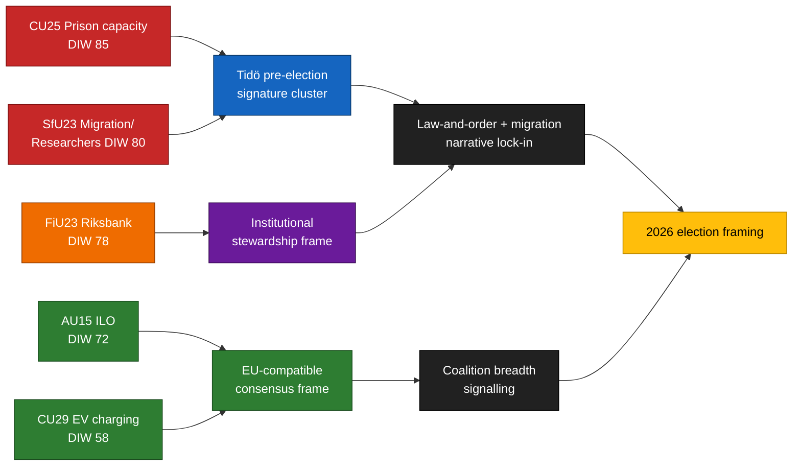

<!-- lang: zh -->
# 执行摘要 — 委员会报告 2026-04-24

**作者**: James Pether Sörling   **运行ID**: 24866836753   **分类**: 公开   **置信度**: 高 (B2)

## 🎯 结论

2026-04-23提交的五份委员会报告围绕Tidö联合政府三大选举标志性支柱展开 — **监狱容量** (`HD01CU25`)、**移民执法（含研究人员流动例外）** (`HD01SfU23`) 和**货币政策机构管理** (`HD01FiU23`) — 并辅以两份获得广泛共识的文件：**国际劳工组织劳工权利批准** (`HD01AU15`) 和**电动汽车家用充电** (`HD01CU29`)。该集群是距2026年9月里克斯达格选举约5个月时的刻意信号组合。实际执行风险集中于 `HD01CU25` 和 `HD01SfU23`；声誉风险集中于 `HD01FiU23`。

## 🧭 本文件支持的3个决策

1. **选举沟通** — 政府传播人员应将CU25 + SfU23议会发言安排在2026年5月一同进行；反对派应以研究人员例外重构SfU23框架，以分裂M和L。
2. **执行监督** — KU和Riksrevisionen应提前将CU25和SfU23纳入2026/27审计范围；FiU23确认里克斯班克独立性年度审查的持续进行。
3. **国际定位** — ILO C190批准(AU15)应与欧盟平台工作指令转化和北欧同行早期批准相结合，以最大化声誉红利。

## ⏱ 60秒速读

- **主要故事**: `HD01CU25` — 监狱容量扩建法案权重最高(DIW 85)。
- **第二条**: `HD01SfU23` (DIW 80) — 移民政策二元化：收紧学习许可但向研究人员开放。
- **货币机构**: `HD01FiU23` (DIW 78) — 里克斯班克年度例行审查，2026年因2024~25资产负债损失而格外突出。
- **共识事项**: `HD01AU15` (国际劳工组织, DIW 72) 和 `HD01CU29` (电动汽车充电, DIW 58)。
- **主要前瞻触发点**: Kriminalvårdens 2026年Q2容量状态报告(~2026-06-23)。偏差≥10%将使政府的犯罪打击叙事逆转。

## 🧠 置信度与假设

集群组成和DIW排名**高**置信度。执行增量**中**置信度。选民框架效应**低**置信度。

## 📊 构成图

## 来源

- `get_dokument({dok_id: "HD01CU25"})` → https://data.riksdagen.se/dokument/HD01CU25 [A1]
- `get_dokument({dok_id: "HD01SfU23"})` → https://data.riksdagen.se/dokument/HD01SfU23 [A1]
- `get_dokument({dok_id: "HD01FiU23"})` → https://data.riksdagen.se/dokument/HD01FiU23 [A1]
- `get_dokument({dok_id: "HD01AU15"})` → https://data.riksdagen.se/dokument/HD01AU15 [A1]
- `get_dokument({dok_id: "HD01CU29"})` → https://data.riksdagen.se/dokument/HD01CU29 [A1]

<!-- source-sha: 1e83ac6587956e9b1ca9cfd53aac08783e617cbd -->
