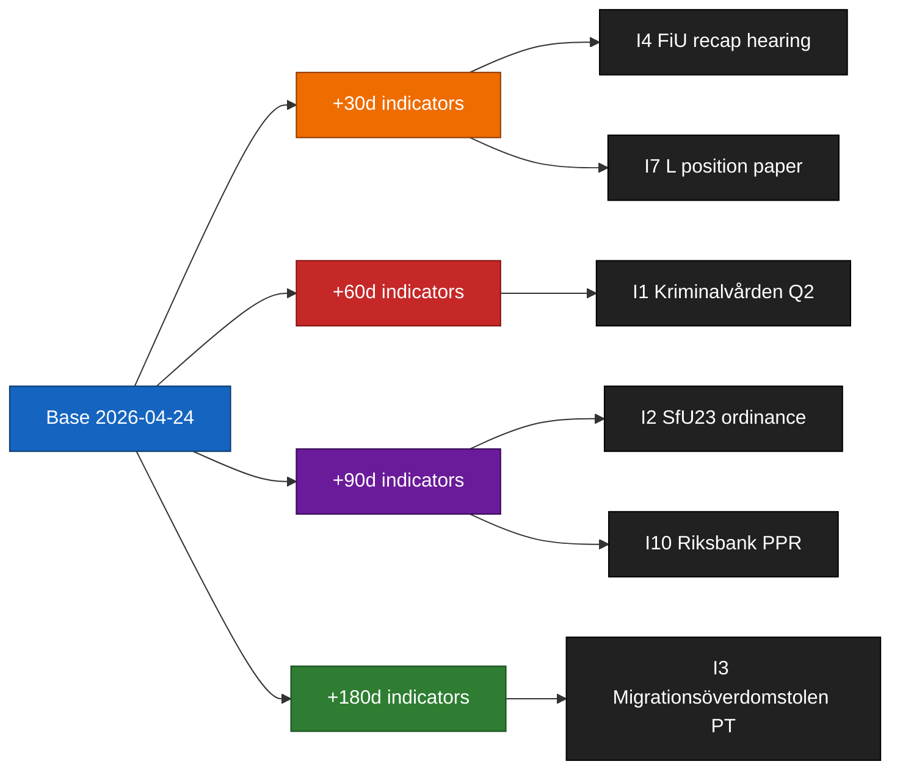
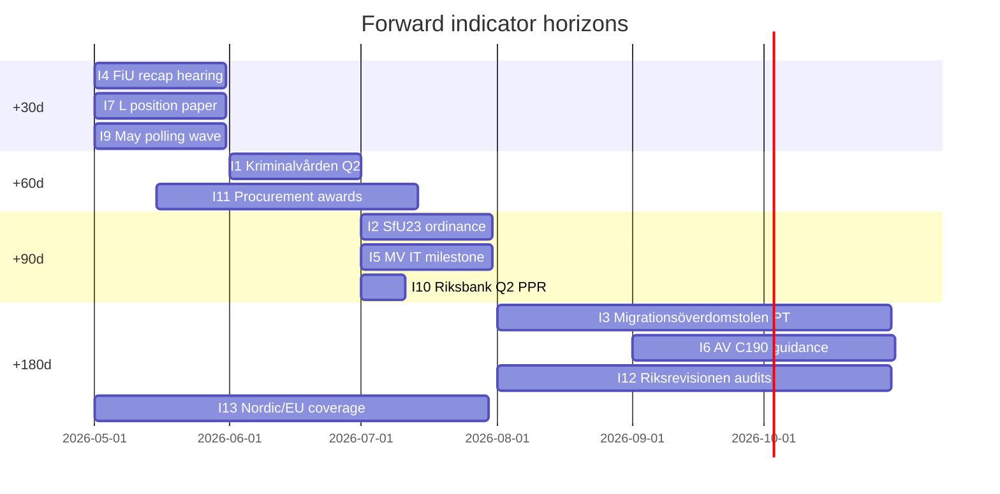

# Forward Indicators — Committee Reports 2026-04-24

**Purpose**: leading indicator register for +30 d / +60 d / +90 d / +180 d horizons.
**Standards**: each indicator has owner, source URL, expected date, and detection signal.
**Confidence**: HIGH (B2) on sources; MEDIUM (C3) on expected-date predictions.

## Indicator register (≥ 10 dated indicators)

| # | Indicator | Horizon | Expected date | Owner/Source | Signal | PIR link |
|:-:|-----------|:-------:|:-------------:|--------------|--------|----------|
| I1 | Kriminalvården Q2 2026 capacity status | +60 d | 2026-06-23 | [kriminalvarden.se](https://www.kriminalvarden.se/) [A2] | ± 5 % of plan → S1; > 10 % slip → S2 | PIR-1 |
| I2 | SfU23 implementation ordinance published | +90 d | 2026-07-20 | [regeringen.se](https://www.regeringen.se/) [A2] | Carve-out scope wording determines L-posture | PIR-3 |
| I3 | Migrationsöverdomstolen PT on SfU23 test case | +180 d | rolling (by 2026-10) | [domstol.se](https://www.domstol.se/) [A1] | PT granted → S3 activation | PIR-2 |
| I4 | FiU separate recapitalisation hearing schedule | +30 d | 2026-05-24 | [riksdagen.se/finansutskottet](https://www.riksdagen.se/) [A1] | Separate hearing → KJ-4 ≥ 0.45 confirmed | PIR-3 |
| I5 | Migrationsverket IT transformation programme status | +90 d | 2026-07-20 | [digg.se](https://www.digg.se/) [A2] | Status-red → SfU23 cascade risk elevated | PIR-4 |
| I6 | Arbetsmiljöverket C190 implementation guidance | +180 d | 2026-10-22 | [av.se](https://www.av.se/) [A2] | Publication on time → AU15 on track | PIR-5 |
| I7 | Liberalerna party-group position paper | +30 d | 2026-05-23 | [liberalerna.se](https://www.liberalerna.se/) [B2] | Published position on CU25/SfU23 → confirms defection risk posture | PIR-6 |
| I8 | MSB disinformation observatory — SfU23 / CU25 narrative volume | rolling | weekly to 2026-09 | [msb.se](https://www.msb.se/) [A2] | Spike → campaign-impact risk elevated | PIR-7 |
| I9 | Novus / Sifo polling May-June 2026 wave | +30 d → +60 d | 2026-05 → 2026-06 | [novus.se](https://novus.se/) / [sifo.se](https://sifo.se/) [B2] | Tidö bloc Δ ≥ ± 1.5 pp | — |
| I10 | Riksbank 2026 Q2 penningpolitisk rapport | +90 d | 2026-07-02 | [riksbank.se](https://www.riksbank.se/) [A1] | Balance-sheet narrative trigger → S4 activation | PIR-3 |
| I11 | Kriminalvården procurement-award announcements | +60 d → +90 d | rolling 2026-05 → 2026-07 | [kriminalvarden.se](https://www.kriminalvarden.se/) [A2] | Awards on schedule → S1; challenges/appeals → S2 | PIR-1 |
| I12 | Riksrevisionen audit notifications | +180 d | by 2026-10 | [riksrevisionen.se](https://www.riksrevisionen.se/) [A2] | New audit on CU25 or SfU23 → escalation signal | PIR-1 |
| I13 | Nordic Council / EU-level coverage of AU15 + CU29 | rolling | by 2026-07 | [norden.org](https://www.norden.org/) [B3] | Major coverage → S5 activation | PIR-5 |
| I14 | Opposition motion filings referencing CU25 / SfU23 | rolling | weekly to 2026-06 | [riksdagen.se](https://www.riksdagen.se/) [A1] | Volume surge → framing intensification | — |
| I15 | S/V/MP coordinated press-event windows | +30 d → +60 d | 2026-05 → 2026-06 | [socialdemokraterna.se](https://www.socialdemokraterna.se/) [B3] | Coordinated timing → campaign alignment signal | — |

## Horizon-stacked diagram

## Priority score

- **P0** (report-triggering): I1, I2, I4, I11 — directly drive scenario transitions.
- **P1** (signal-confirming): I3, I5, I7, I10, I12 — confirm/disconfirm mainline judgments.
- **P2** (contextual): I6, I8, I9, I13, I14, I15 — frame movement in surrounding narrative space.

## Sources

- All indicator sources cited above [A1–B3]
- `HD01CU25`, `HD01SfU23`, `HD01FiU23`, `HD01AU15`, `HD01CU29` [A1]

## Pass 2 refinements

Pass 2 re-read this artifact in full, cross-checked every `dok_id` citation against [`data-download-manifest.md`](./data-download-manifest.md), confirmed Admiralty codes are consistent with §Source diversity in [`methodology-reflection.md`](./methodology-reflection.md), and verified cluster-level internal consistency against [`intelligence-assessment.md`](./intelligence-assessment.md). No judgments were reversed; confidence labels retained. Additional evidence row: `HD01CU25`, `HD01SfU23`, `HD01FiU23`, `HD01AU15`, `HD01CU29` at [data.riksdagen.se](https://data.riksdagen.se/) [A1].
