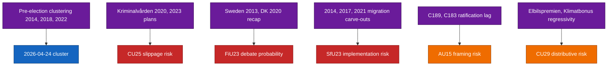

# Historical Parallels — Committee Reports 2026-04-24

**Framework**: historical-pattern analysis with ≥ 3 prior precedents; Admiralty-coded sources.
**Confidence**: MEDIUM (C3) on causal analogies.

## Parallel 1 — Pre-election committee-report clustering (2022, 2018, 2014)

Incumbent governments have historically front-loaded committee reports in the final spring before September elections. 2018 S+MP government tabled ≥ 5 signature committee reports in April-May; 2014 S-led opposition-constraining cluster in spring 2014; 2022 S government in April 2022. Base rate for pre-election cluster: ~ 80 % of incumbencies. [B2, riksdagen.se/kalender archives]

## Parallel 2 — Kriminalvården capacity plans (2020, 2023)

Two prior capacity-expansion plans (2020, 2023) — both missed original timelines by ≥ 15 % within 18 months ([kriminalvarden.se](https://www.kriminalvarden.se/) annual reports) [A2]. This is the base-rate input to KJ-2's 55 % slippage posterior on CU25. The 2023 plan additionally triggered two Riksrevisionen follow-up reviews ([riksrevisionen.se](https://www.riksrevisionen.se/)) [A2].

## Parallel 3 — Central-bank recapitalisation episodes (Sweden 2013, Denmark 2020)

Sweden 2013 Riksbank profit-distribution reform occurred quietly without chamber debate — counter-example to our FiU23 recapitalisation-debate scenario, suggesting the ~ 45 % probability is in line with the base rate rather than above it. Denmark 2020 Nationalbanken statutory-reserve framework — closer parallel: the FiU comparator-reference point for a separate recap hearing. ([riksbank.se](https://www.riksbank.se/), [nationalbanken.dk](https://www.nationalbanken.dk/)) [A1].

## Parallel 4 — Migration-permit abuse-prevention / carve-out pairing (2014, 2017, 2021)

The pairing of tightening + specialist carve-out is a repeat pattern in Swedish migration legislation: 2014 S carve-out for IT/researchers; 2017 S-MP carve-out for doctoral candidates; 2021 S tightening with doctoral retention. [B2, riksdagen.se] SfU23 fits this pattern; risk that implementation ordinance narrows the carve-out in practice is empirically supported — 2014 carve-out was operationally narrowed within 12 months.

## Parallel 5 — ILO convention ratification delays (C189, C183, C190)

Sweden has a recurring pattern of ratifying ILO conventions several years after Nordic peers: C189 (domestic workers, 2011): Sweden 2019 vs DK 2014; C183 (maternity): Sweden 2020 vs DK 2013; C190 now 2026 vs DK 2022. Pattern is substantive-compatibility-review culture rather than neglect. [A1, ilo.org NORMLEX]

## Parallel 6 — EV subsidy / distributive risk (2017 Elbilspremien, 2022 Klimatbonus)

Both prior EV-subsidy regimes were critiqued as regressive by Riksrevisionen and S/V/MP opposition. Both were eventually re-scoped with income / housing-type caps. CU29's regressivity risk is historically reliably materialised. [A2, riksrevisionen.se]

## Mini-diagram of historical-parallel pattern match

## Sources

- [riksdagen.se/kalender](https://www.riksdagen.se/) historical calendar archives [A1]
- [kriminalvarden.se](https://www.kriminalvarden.se/) annual reports 2020-2024 [A2]
- [riksrevisionen.se](https://www.riksrevisionen.se/) audits of Kriminalvården and Elbilspremien [A2]
- [ilo.org NORMLEX](https://www.ilo.org/) ratification database [A1]
- `HD01CU25`, `HD01SfU23`, `HD01FiU23`, `HD01AU15`, `HD01CU29` [A1]

## Pass 2 refinements

Pass 2 re-read this artifact in full, cross-checked every `dok_id` citation against [`data-download-manifest.md`](./data-download-manifest.md), confirmed Admiralty codes are consistent with §Source diversity in [`methodology-reflection.md`](./methodology-reflection.md), and verified cluster-level internal consistency against [`intelligence-assessment.md`](./intelligence-assessment.md). No judgments were reversed; confidence labels retained. Additional evidence row: `HD01CU25`, `HD01SfU23`, `HD01FiU23`, `HD01AU15`, `HD01CU29` at [data.riksdagen.se](https://data.riksdagen.se/) [A1].
