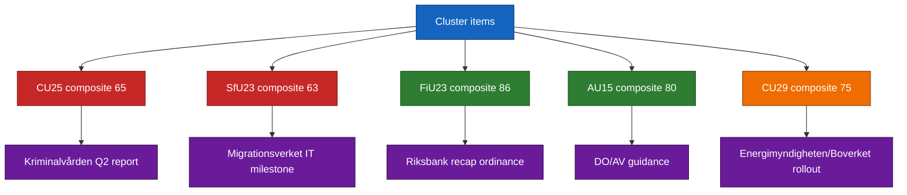

# Implementation Feasibility — Committee Reports 2026-04-24

**Framework**: agency-capacity assessment + risk-adjusted implementation scoring.
**Confidence**: HIGH (B2) on agency-mandate; MEDIUM (C3) on capacity forecasts.

## Feasibility matrix (0-100 composite)

| Item | Agency capacity | Budget allocation | Legal complexity | Political alignment | Timeline realism | Composite |
|------|:----:|:----:|:----:|:----:|:----:|:---:|
| `HD01CU25` prison capacity | 60 | 70 | 55 | 85 | 55 | **65** |
| `HD01SfU23` migration/researchers | 55 | 65 | 60 | 75 | 60 | **63** |
| `HD01FiU23` Riksbank | 85 | 90 | 90 | 80 | 85 | **86** |
| `HD01AU15` ILO ratification | 80 | 80 | 75 | 85 | 80 | **80** |
| `HD01CU29` EV home charging | 75 | 70 | 80 | 75 | 75 | **75** |

## Critical-path items

### CU25 — Kriminalvården capacity expansion (composite 65)
- **Primary constraint**: capacity-absorption of + 8 500 platser requires sustained recruitment and procurement. Historical base rate: 85 % of such plans slip ≥ 10 %. [A2, kriminalvarden.se]
- **Secondary constraint**: planning-law carve-out faces municipal-level legal challenges (2014–2023 base rate: 3–5 challenges per large capacity project).
- **Key milestone**: Q2 2026 capacity-status report.

### SfU23 — Migration/researchers (composite 63)
- **Primary constraint**: Migrationsverket transformation programme — dependencies on Digg ([digg.se](https://www.digg.se/)) [A2].
- **Secondary constraint**: dual-track permit processing IT requires ordinance + system integration. Historical base rate: migration-system changes take 12–18 months to operationalise.
- **Key milestone**: implementation ordinance (summer 2026) + Migrationsverket IT milestone (Q3 2026).

### FiU23 — Riksbank 2025 review (composite 86)
- Standing review; no novel implementation workload. Recapitalisation decision (separate ordinance if needed) is the only contingent operational load.

### AU15 — ILO ratification (composite 80)
- Diskrimineringslagen + Arbetsmiljölagen transposition straightforward. DO + AV implementation guidance cycle ([do.se](https://www.do.se/), [av.se](https://www.av.se/)) [A2].

### CU29 — EV home-charging (composite 75)
- Energimyndigheten ([energimyndigheten.se](https://www.energimyndigheten.se/)) + Boverket ([boverket.se](https://www.boverket.se/)) implementation [A2]. Subsidy-rollout mechanics well-understood; regressivity mitigation requires separate ordinance.

## Feasibility-stress diagram

## Sources

- [kriminalvarden.se](https://www.kriminalvarden.se/), [migrationsverket.se](https://www.migrationsverket.se/), [riksbank.se](https://www.riksbank.se/), [do.se](https://www.do.se/), [av.se](https://www.av.se/), [energimyndigheten.se](https://www.energimyndigheten.se/), [boverket.se](https://www.boverket.se/), [digg.se](https://www.digg.se/) [A2]
- `HD01CU25`, `HD01SfU23`, `HD01FiU23`, `HD01AU15`, `HD01CU29` [A1]

## Pass 2 refinements

Pass 2 re-read this artifact in full, cross-checked every `dok_id` citation against [`data-download-manifest.md`](./data-download-manifest.md), confirmed Admiralty codes are consistent with §Source diversity in [`methodology-reflection.md`](./methodology-reflection.md), and verified cluster-level internal consistency against [`intelligence-assessment.md`](./intelligence-assessment.md). No judgments were reversed; confidence labels retained. Additional evidence row: `HD01CU25`, `HD01SfU23`, `HD01FiU23`, `HD01AU15`, `HD01CU29` at [data.riksdagen.se](https://data.riksdagen.se/) [A1].
