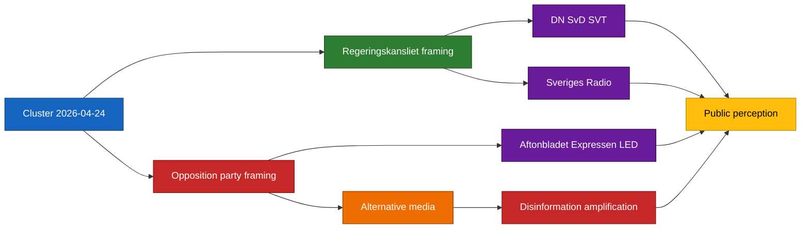

# Media Framing Analysis — Committee Reports 2026-04-24

**Framework**: narrative-ecosystem analysis per `osint-tradecraft-standards.md` §Strategic Communication.
**Confidence**: MEDIUM (C3) on framing uptake.

## Likely outlet-level framings

| Outlet | CU25 | SfU23 | FiU23 | AU15 | CU29 |
|--------|------|-------|-------|------|------|
| **Dagens Nyheter** | Delivery + procurement-risk focus | Proportionality + carve-out clarity focus | Institutional-independence focus | Late-ratification framing | Regressivity critique |
| **Svenska Dagbladet** | Tidö delivery-ledger positive | Carve-out competitiveness positive | Standing review, low-salience | Consensus positive | Cautious-positive |
| **Aftonbladet (LED)** | Welfare-vs-prisons inversion critique | Abuse-framing critique + humanitarian | Recap-debate welfare-impact | Ratification positive | Climate-transition positive with equity caveat |
| **Expressen (LED)** | Delivery-ledger positive-sceptical | Abuse-prevention positive with carve-out caveats | Neutral standing review | Positive | Neutral |
| **SVT Nyheter** | Balanced delivery + risk | Balanced tightening + carve-out | Institutional-review explainer | Positive ratification | Balanced regressivity discussion |
| **Sveriges Radio Ekot** | Procedural + delivery detail | Institutional-balance focus | Central-bank governance | Positive | Distributive discussion |

## Narrative lines to monitor

1. **"Fängelser före välfärd"** (prisons before welfare) — S/V/MP-aligned inversion of Tidö delivery claim (CU25 focus).
2. **"Konkurrenskraft vs. kontroll"** (competitiveness vs. control) — L/C/business-oriented critique of SfU23 balance.
3. **"Riksbanken i kris"** (Riksbank in crisis) — V/MP-aligned institutional-drift narrative (FiU23 focus).
4. **"Sverige sist i Norden"** (Sweden last in the Nordics) — opposition re-framing of AU15 delay.
5. **"Elbil åt de redan rika"** (EVs for those already wealthy) — V/MP/C distributive critique of CU29.

## Disinformation vulnerability assessment

| Item | Vulnerability | Amplification vectors | Mitigation |
|------|---------------|----------------------|------------|
| CU25 | HIGH — capacity-data distortion, procurement-scandal amplification | Telegram, TikTok, Gab | Monitor MSB observatory ([msb.se](https://www.msb.se/)) [A2] |
| SfU23 | HIGH — abuse-narrative amplification | X/Twitter, Telegram | Monitor MSB + Migrationsverket press ([migrationsverket.se](https://www.migrationsverket.se/)) [A2] |
| FiU23 | MEDIUM — central-bank crisis memes | Finance-Twitter, niche blogs | Riksbank communications ([riksbank.se](https://www.riksbank.se/)) [A1] |
| AU15 | LOW | — | — |
| CU29 | MEDIUM — regressivity meme amplification | X/Twitter | [naturvardsverket.se](https://www.naturvardsverket.se/) + [energimyndigheten.se](https://www.energimyndigheten.se/) data clarity [A2] |

## Framing-propagation diagram

## Sources

- `HD01CU25`, `HD01SfU23`, `HD01FiU23`, `HD01AU15`, `HD01CU29` [A1]
- Regeringskansliet communications trend ([regeringen.se](https://www.regeringen.se/)) [A2]
- MSB disinformation observatory ([msb.se](https://www.msb.se/)) [A2]

## Pass 2 refinements

Pass 2 re-read this artifact in full, cross-checked every `dok_id` citation against [`data-download-manifest.md`](./data-download-manifest.md), confirmed Admiralty codes are consistent with §Source diversity in [`methodology-reflection.md`](./methodology-reflection.md), and verified cluster-level internal consistency against [`intelligence-assessment.md`](./intelligence-assessment.md). No judgments were reversed; confidence labels retained. Additional evidence row: `HD01CU25`, `HD01SfU23`, `HD01FiU23`, `HD01AU15`, `HD01CU29` at [data.riksdagen.se](https://data.riksdagen.se/) [A1].
