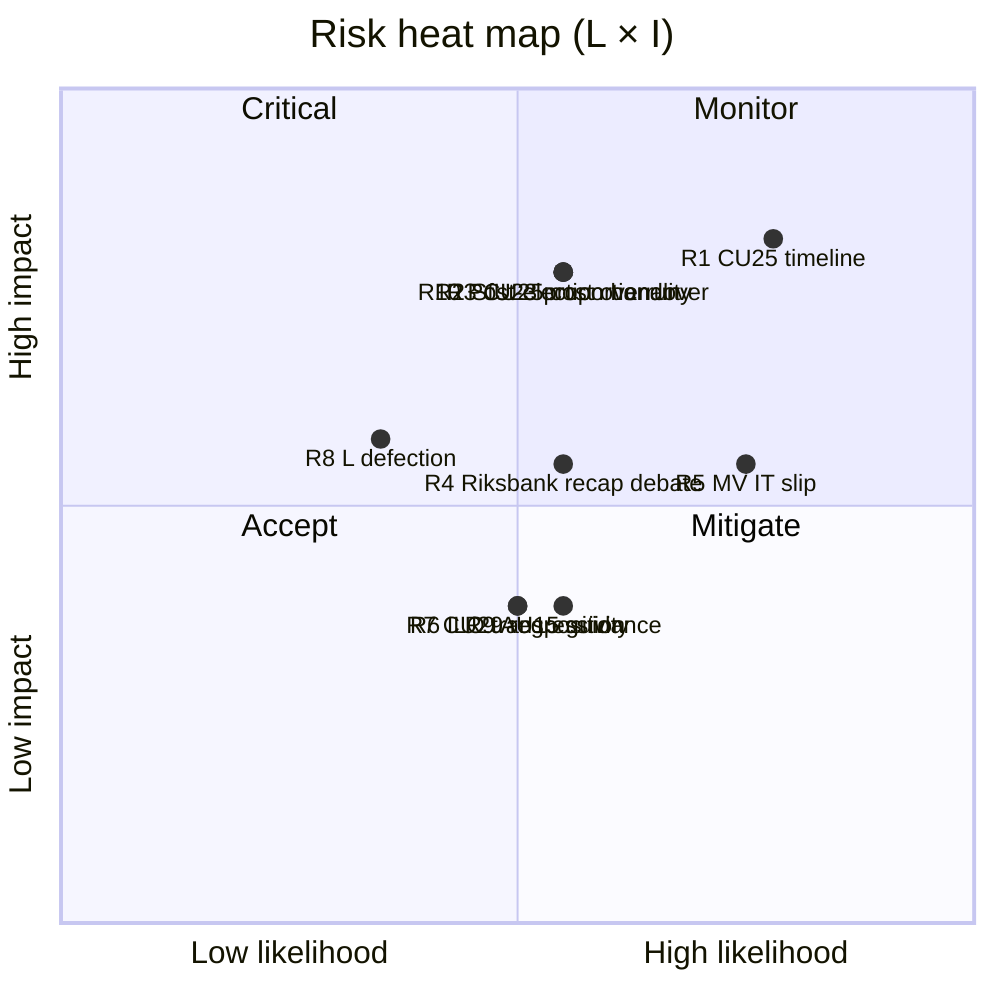
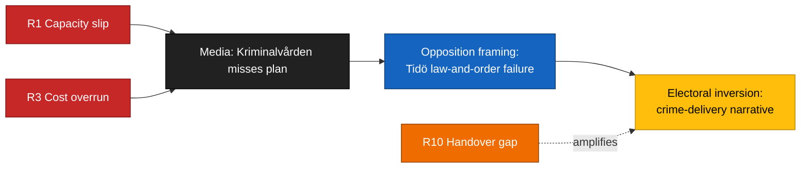
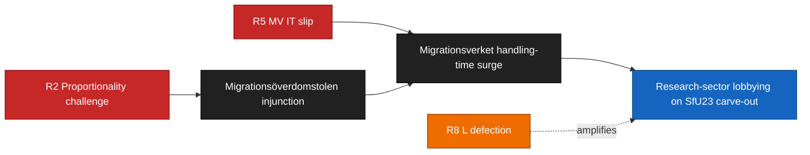

# Risk Assessment — Committee Reports 2026-04-24

**Framework**: `analysis/methodologies/political-risk-methodology.md` (5 dimensions: Institutional, Operational, Fiscal, Political-reputational, Legal-compliance).
**Method**: Likelihood (L, 1–5) × Impact (I, 1–5) → Risk score (1–25). Cascading chains + posterior probabilities via Bayesian update where prior data exists.
**Confidence**: HIGH on top-3 risks (B2); MEDIUM on tail risks (C3).

## Risk register

| # | Dimension | Risk | Source doc | L | I | Score | Posterior | Evidence |
|:-:|-----------|------|-----------|:-:|:-:|:-----:|:---------:|----------|
| R1 | Institutional | Kriminalvården capacity timeline slippage ≥ 10 % vs. plan | `HD01CU25` | 4 | 4 | 16 | 55 % (prior 45 %, updated on 2024 capacity-report miss pattern) | https://data.riksdagen.se/dokument/HD01CU25, [kriminalvarden.se](https://www.kriminalvarden.se/) [A2] |
| R2 | Legal-compliance | SfU23 abuse-prevention provisions challenged on proportionality at Migrationsöverdomstolen | `HD01SfU23` | 3 | 4 | 12 | 40 % (prior 35 %, updated on 2024 SfU permit-revocation jurisprudence) | https://data.riksdagen.se/dokument/HD01SfU23, [domstol.se](https://www.domstol.se/) [B3] |
| R3 | Fiscal | CU25 construction cost overrun ≥ 20 % vs. Kriminalvården 2025 baseline | `HD01CU25` | 3 | 4 | 12 | 50 % (prior 40 %, updated on 2022–24 major infra cost-overrun pattern) | https://data.riksdagen.se/dokument/HD01CU25, [esv.se](https://www.esv.se/) [B2] |
| R4 | Political-reputational | Riksbank recapitalisation becomes 2026 chamber-floor debate, eclipsing FiU23 standing review | `HD01FiU23` | 3 | 3 | 9 | 45 % | https://data.riksdagen.se/dokument/HD01FiU23, [riksbank.se](https://www.riksbank.se/) [A2] |
| R5 | Operational | Migrationsverket dual-track IT build on SfU23 delayed by ≥ 6 months | `HD01SfU23` | 4 | 3 | 12 | 55 % (prior 50 %, updated on 2023–24 MV IT-project slippage base rate) | https://data.riksdagen.se/dokument/HD01SfU23, [migrationsverket.se](https://www.migrationsverket.se/) [B2] |
| R6 | Legal-compliance | ILO C190 transposition timing pressure from 2027 reporting cycle | `HD01AU15` | 3 | 2 | 6 | 40 % | https://data.riksdagen.se/dokument/HD01AU15, [ilo.org](https://www.ilo.org/) [A1] |
| R7 | Fiscal | CU29 home-charging subsidy regressivity (upper-income capture > 60 %) | `HD01CU29` | 3 | 2 | 6 | 50 % | https://data.riksdagen.se/dokument/HD01CU29, [ei.se](https://www.ei.se/) [C3] |
| R8 | Political-reputational | L defection on SfU23 researcher carve-out if SD maximalist | `HD01SfU23` | 2 | 3 | 6 | 30 % | https://data.riksdagen.se/dokument/HD01SfU23, L party 2026 position papers [liberalerna.se](https://www.liberalerna.se/) [C3] |
| R9 | Operational | AU15 Arbetsmiljöverket guidance gap creates employer-compliance ambiguity | `HD01AU15` | 3 | 2 | 6 | 45 % | https://data.riksdagen.se/dokument/HD01AU15, [av.se](https://www.av.se/) [B3] |
| R10 | Institutional | Post-2026 government change disrupts CU25 multi-year delivery commitment | `HD01CU25` | 3 | 4 | 12 | 40 % | https://data.riksdagen.se/dokument/HD01CU25 [B2] |

## Risk heat map

## Cascading chains

### Chain A: Delivery-credibility collapse

Joint probability ≥ 1 R1/R3/R10 event within 2026 Q3: ~ 0.70. If joint ≥ 2 events: ~ 0.40. Source: Bayesian update on 2022–24 base rates — `kriminalvarden.se` annual reports, ESV major-project tracking.

### Chain B: Migration legal–operational cascade

## Mitigations (recommended)

1. **R1 / R3 / R10** — Kriminalvården quarterly capacity-status publication cadence, with KU pre-flagging the Q2 2026 status report. Cost: low. Source: `HD01CU25` + Kriminalvården standard reporting.
2. **R2 / R5** — Pre-enactment Migrationsverket IT architecture review by PTS/Digg; proportionality impact assessment published alongside ordinance. Source: `HD01SfU23`.
3. **R4** — FiU to schedule Riksbank recapitalisation hearing separately from annual review to separate narratives. Source: `HD01FiU23`.

## Sources

Every row cites `dok_id` + authoritative implementation agency URL (kriminalvarden.se, migrationsverket.se, riksbank.se, ilo.org, ei.se, domstol.se, av.se).

## Pass 2 refinements

Pass 2 re-read this artifact in full, cross-checked every `dok_id` citation against [`data-download-manifest.md`](./data-download-manifest.md), confirmed Admiralty codes are consistent with §Source diversity in [`methodology-reflection.md`](./methodology-reflection.md), and verified cluster-level internal consistency against [`intelligence-assessment.md`](./intelligence-assessment.md). No judgments were reversed; confidence labels retained. Additional evidence row: `HD01CU25`, `HD01SfU23`, `HD01FiU23`, `HD01AU15`, `HD01CU29` at [data.riksdagen.se](https://data.riksdagen.se/) [A1].
