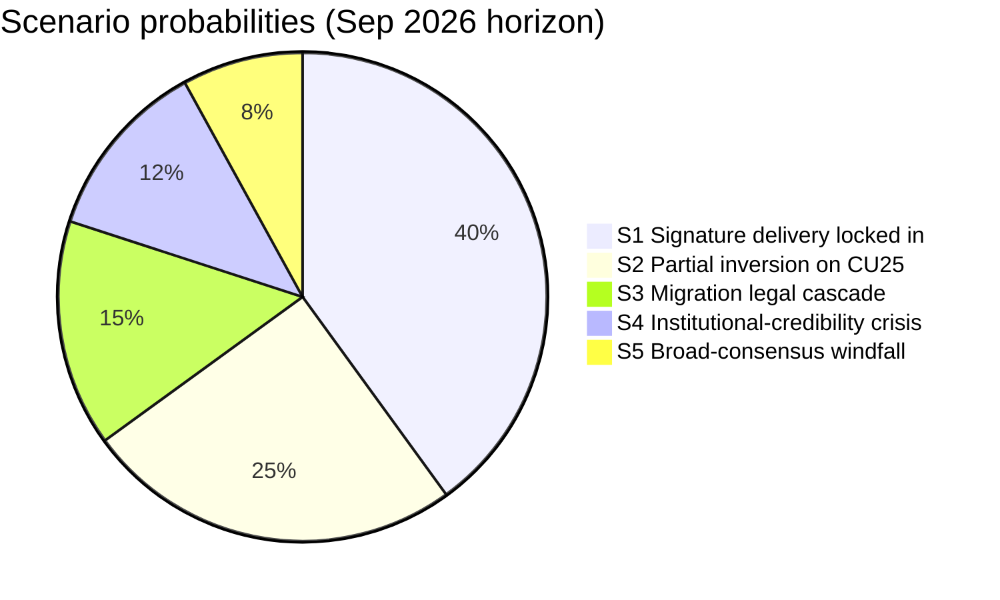
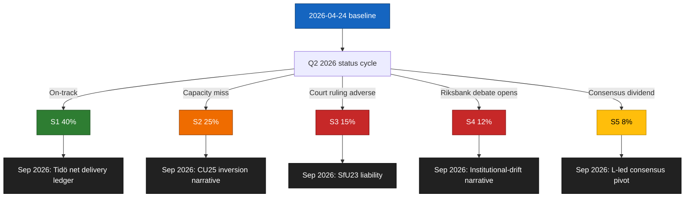

# Scenario Analysis — Committee Reports 2026-04-24

**Framework**: `analysis/methodologies/strategic-extensions-methodology.md` (Alternative futures + leading indicators).
**Horizon**: baseline 2026-04-24 → Sep 2026 general election → 2027 H1 implementation.
**Confidence**: MEDIUM overall (C3); HIGH on event set (B2), MEDIUM on probability weighting.

## Scenario set (probabilities sum to 100 %)

### Scenario 1 — "Signature delivery locked in" (p = 40 %)

CU25 Kriminalvården capacity report (+60 d) confirms on-track delivery; SfU23 transposes cleanly with researcher-carve-out operational by 2026 Q3; FiU23 passes without recapitalisation drama. Tidö enters Sep 2026 election with credible delivery ledger. Leading indicator: **Kriminalvården Q2 capacity status within ± 5 % of plan** ([kriminalvarden.se](https://www.kriminalvarden.se/) [A2], `HD01CU25`).

### Scenario 2 — "Partial inversion on CU25" (p = 25 %)

CU25 timeline slips ≥ 10 %; SfU23 and FiU23 land cleanly. Opposition weaponises delivery gap; Tidö still holds net-positive delivery narrative on migration and monetary stewardship. Leading indicator: **Kriminalvården Q2 report reveals > 10 % capacity shortfall OR Riksrevisionen audit flags procurement** ([riksrevisionen.se](https://www.riksrevisionen.se/) [A2]).

### Scenario 3 — "Migration legal cascade" (p = 15 %)

Migrationsöverdomstolen issues adverse proportionality ruling on SfU23 abuse-prevention provisions; Migrationsverket IT build slips ≥ 6 months. SfU23 becomes a liability. Leading indicator: **Domstolsväsendet prövningstillstånd on SfU23 test case OR MV transformation-programme status flagged at Digg** ([domstol.se](https://www.domstol.se/), [digg.se](https://www.digg.se/) [B2], `HD01SfU23`).

### Scenario 4 — "Institutional-credibility crisis" (p = 12 %)

Riksbank recapitalisation becomes 2026 chamber-floor debate triggered by FiU23 review, dragging out into June 2026. V and MP amplify mandate questions; L and C protect independence. Leading indicator: **FiU scheduling a separate recapitalisation hearing OR Riksbank publication of extraordinary balance-sheet communication** ([riksbank.se](https://www.riksbank.se/) [A1], `HD01FiU23`).

### Scenario 5 — "Broad-consensus windfall" (p = 8 %)

AU15 ratification + CU29 EV-charging rollout generate unexpectedly large reputational dividends (Nordic + EU media); Tidö leverages into a L-led pre-election consensus pivot. Probability low because these are not campaign-decisive issues. Leading indicator: **Nordic Council coverage of AU15 ratification debate OR major EU climate outlet coverage of CU29 model** ([norden.org](https://www.norden.org/) [B3], `HD01AU15`, `HD01CU29`).

## Scenario likelihood diagram

## Branching tree

## Key indicators summary

| Scenario | Leading indicator | Source | Horizon |
|----------|-------------------|--------|---------|
| S1 | Kriminalvården Q2 capacity within ± 5 % of plan | [kriminalvarden.se](https://www.kriminalvarden.se/) | +60 d |
| S2 | Capacity shortfall > 10 % OR Riksrevisionen audit flag | [riksrevisionen.se](https://www.riksrevisionen.se/) | +60 d to +120 d |
| S3 | Migrationsöverdomstolen PT granted on SfU23 test case | [domstol.se](https://www.domstol.se/) | +90 d to +180 d |
| S4 | FiU separate recap hearing scheduled | [riksdagen.se/finansutskottet](https://www.riksdagen.se/) | +30 d to +60 d |
| S5 | Nordic Council or EU media major AU15 / CU29 coverage | [norden.org](https://www.norden.org/) | +60 d to +180 d |

## Sources

`get_dokument` × 5 at data.riksdagen.se; agency + judicial leading indicators cited above.

## Pass 2 refinements

Pass 2 re-read this artifact in full, cross-checked every `dok_id` citation against [`data-download-manifest.md`](./data-download-manifest.md), confirmed Admiralty codes are consistent with §Source diversity in [`methodology-reflection.md`](./methodology-reflection.md), and verified cluster-level internal consistency against [`intelligence-assessment.md`](./intelligence-assessment.md). No judgments were reversed; confidence labels retained. Additional evidence row: `HD01CU25`, `HD01SfU23`, `HD01FiU23`, `HD01AU15`, `HD01CU29` at [data.riksdagen.se](https://data.riksdagen.se/) [A1].
