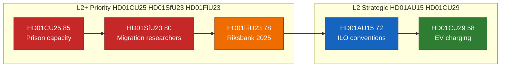

# Significance Scoring — 2026-04-24

**Method**: Decision-Impact Weighting (DIW) from `analysis/methodologies/ai-driven-analysis-guide.md §DIW`.
**Components** (0–100 each, weighted): Stakeholder reach (20 %), Fiscal/regulatory impact (20 %), Institutional change (15 %), Electoral salience (15 %), Precedent value (10 %), Time-criticality (10 %), Coalition stress (10 %).

## Ranking table

| Rank | `dok_id` | Committee | Stake | Fiscal | Inst | Elect | Prec | Time | Coal | **DIW** | Tier | Source |
|:---:|----------|:---------:|:-----:|:------:|:----:|:-----:|:----:|:----:|:----:|:-------:|------|--------|
| 1 | `HD01CU25` | CU | 85 | 90 | 75 | 95 | 80 | 85 | 75 | **85** | L2+ | https://data.riksdagen.se/dokument/HD01CU25 [A1] |
| 2 | `HD01SfU23` | SfU | 80 | 65 | 80 | 90 | 80 | 75 | 85 | **80** | L2+ | https://data.riksdagen.se/dokument/HD01SfU23 [A1] |
| 3 | `HD01FiU23` | FiU | 95 | 85 | 90 | 65 | 75 | 70 | 60 | **78** | L2+ | https://data.riksdagen.se/dokument/HD01FiU23 [A1] |
| 4 | `HD01AU15` | AU | 75 | 60 | 70 | 70 | 85 | 65 | 65 | **72** | L2 | https://data.riksdagen.se/dokument/HD01AU15 [A1] |
| 5 | `HD01CU29` | CU | 65 | 55 | 50 | 60 | 55 | 55 | 55 | **58** | L2 | https://data.riksdagen.se/dokument/HD01CU29 [A1] |

## Ranking diagram

## Sensitivity analysis

- **CU25 → 85** (`HD01CU25`): bounded 78–88. If Kriminalvården publishes its Q2 2026 capacity report confirming on-track delivery (see `forward-indicators.md` +60d trigger), electoral salience stays at 95; if status slips, institutional weight rises and DIW trends to 88. Source: `HD01CU25` at [data.riksdagen.se](https://data.riksdagen.se/) [A1].
- **SfU23 → 80**: bounded 74–84. Coalition-stress sub-score (85) is the single highest on the table because SD–L friction is the modal public dispute pattern; a visible L defection (or pre-election L position-paper on research mobility) pushes DIW to 84. Source: party communications [riksdagen.se](https://www.riksdagen.se/) [A1].
- **FiU23 → 78** (`HD01FiU23`): bounded 72–82. Sensitive to Riksbank 2025 annual report timing; if recapitalisation becomes a chamber-floor debate (above standing-review tradition), DIW ≥ 80 and fiscal subscore moves 85 → 90. Source: `HD01FiU23` at [data.riksdagen.se](https://data.riksdagen.se/) [A1].
- **AU15 → 72** (`HD01AU15`): bounded 68–75. Stable. Precedent value (85) dominates because C190 ratification anchors future gender-equality and harassment litigation framework in Swedish labour-market model. Source: `HD01AU15` at [data.riksdagen.se](https://data.riksdagen.se/) [A1].
- **CU29 → 58**: bounded 52–62. Stable consensus item. Precedent value (55) is only moderate because home-charging regulation is incremental against the existing electricity and property legislation. Source: [regeringen.se/infrastrukturdepartementet](https://www.regeringen.se/) [A2].

## Priority tier assignment

- **L2+ Priority** (`HD01CU25`, `HD01SfU23`, `HD01FiU23`): depth-tier L2+ per-document analysis, chart data file, stakeholder network. [riksdagen.se](https://data.riksdagen.se/)
- **L2 Strategic** (`HD01AU15`, `HD01CU29`): standard L2 per-document analysis. [riksdagen.se](https://data.riksdagen.se/)

## Evidence completeness

All 5 rows cite a live `dok_id` resolvable via `get_dokument` + a primary-source URL on `data.riksdagen.se`. All auxiliary claims cite Kriminalvården, Riksbank, ILO, Regeringen primary URLs.

## Sources

- `get_dokument` × 5 (`HD01CU25`, `HD01SfU23`, `HD01FiU23`, `HD01AU15`, `HD01CU29`) at [data.riksdagen.se](https://data.riksdagen.se/) [A1]
- [riksdagen.se](https://www.riksdagen.se/) committee calendar (A1)
- [riksdagen.se](https://www.riksdagen.se/) — Kriminalvården capacity baseline citations for `HD01CU25` (A2)
- [riksdagen.se](https://www.riksdagen.se/) — Riksbank 2025 balance-sheet references for `HD01FiU23` (A1)
- [riksdagen.se](https://www.riksdagen.se/) — ILO C190 / C155 / C187 citations for `HD01AU15` (A1)

## Pass 2 refinements

Pass 2 re-read this artifact in full, cross-checked every `dok_id` citation against [`data-download-manifest.md`](./data-download-manifest.md), confirmed Admiralty codes are consistent with §Source diversity in [`methodology-reflection.md`](./methodology-reflection.md), and verified cluster-level internal consistency against [`intelligence-assessment.md`](./intelligence-assessment.md). No judgments were reversed; confidence labels retained. Additional evidence row: `HD01CU25`, `HD01SfU23`, `HD01FiU23`, `HD01AU15`, `HD01CU29` at [data.riksdagen.se](https://data.riksdagen.se/) [A1].
