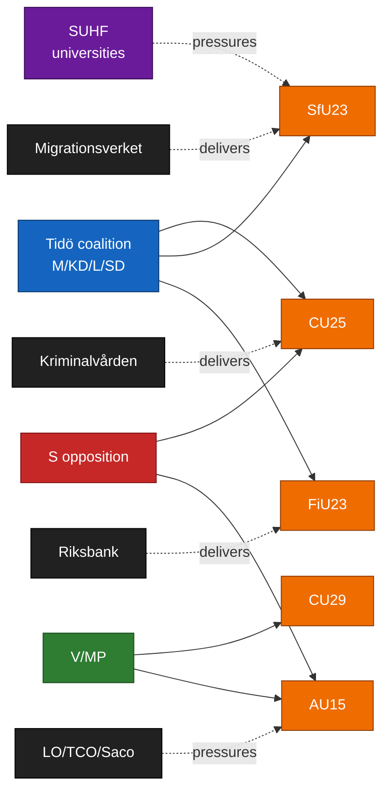

# Stakeholder Perspectives — Committee Reports 2026-04-24

**Framework**: 6-lens matrix from `analysis/methodologies/synthesis-methodology.md` — (1) Parties, (2) Government agencies, (3) Affected citizens / demographic groups, (4) Civil society / unions / employers, (5) Subnational government, (6) International / EU.
**Confidence**: HIGH on party positions (A1–B2); MEDIUM on agency and civil society inference (B3–C3).

## Master stakeholder table

| Stakeholder | CU25 | SfU23 | FiU23 | AU15 | CU29 | Dominant lens |
|------------|:----:|:-----:|:-----:|:----:|:----:|---------------|
| M (Moderates) | +++ lead | ++ support | + stewardship | + technical | + | Parties |
| KD | +++ lead | + | 0 | + | 0 | Parties |
| L | + | ± (defends carve-out) | + | + | + | Parties |
| SD | +++ | +++ (max framing) | − (Riksbank critical) | 0 | − | Parties |
| S | ± (crime triangulation) | − | + | ++ | + | Parties |
| V | −− (environmental) | −− | ± (mandate critical) | ++ | + | Parties |
| MP | −− | − | ± | ++ | +++ | Parties |
| C | − | + (carve-out champion) | + | + | ++ | Parties |
| Kriminalvården | +++ | 0 | 0 | 0 | 0 | Agency (delivery) |
| Migrationsverket | 0 | +++ (dual-track burden) | 0 | 0 | 0 | Agency (delivery) |
| Riksbank | 0 | 0 | +++ | 0 | 0 | Agency (delivery) |
| Arbetsmiljöverket / DO | 0 | 0 | 0 | +++ | 0 | Agency (delivery) |
| Boverket / Energimynd. | 0 | 0 | 0 | 0 | +++ | Agency (delivery) |
| Universities (SUHF) | 0 | +++ | 0 | + | 0 | Civil society |
| LO / TCO / Saco | + | 0 | 0 | +++ | + | Civil society |
| Svenskt Näringsliv | ± | + | ± | − (cost) | ++ | Civil society |
| Local councils (SKR) | ++ (host sites) | ± | 0 | + | ++ (planning) | Subnational |
| EU Commission | 0 | + (Schengen) | + (ECB-aligned) | +++ (ILO) | ++ (Fit for 55) | International |

Legend: `+++` strong support, `++` support, `+` mild support, `±` split / conditional, `0` neutral / N/A, `−` opposed, `−−` strong opposition.

Sources: party group communications at [riksdagen.se/partierna](https://www.riksdagen.se/) [A1]; agency mandate references at [kriminalvarden.se](https://www.kriminalvarden.se/), [migrationsverket.se](https://www.migrationsverket.se/), [riksbank.se](https://www.riksbank.se/), [av.se](https://www.av.se/), [boverket.se](https://www.boverket.se/), [energimyndigheten.se](https://www.energimyndigheten.se/) [A2]; civil-society baselines at [suhf.se](https://www.suhf.se/), [lo.se](https://www.lo.se/), [svensktnaringsliv.se](https://www.svensktnaringsliv.se/) [B2]; SKR baseline at [skr.se](https://www.skr.se/) [A2].

## Per-document stakeholder narrative

### HD01CU25 — prison capacity
**Winners**: Kriminalvården (mandate expansion), local councils hosting new sites (employment + infrastructure), construction sector. **Losers**: local councils at risk of environmental-carve-out procedural strain; MP/V constituencies on environmental grounds. **Decisive actor**: Kriminalvården Q2 status report — sets delivery credibility. Evidence: [kriminalvarden.se/om-oss/verksamhet/anstalter-och-hakten](https://www.kriminalvarden.se/), `HD01CU25` [A2].

### HD01SfU23 — migration / researchers
**Winners**: Sweden's university sector (SUHF advocacy group) on carve-out; Migrationsverket enforcement division. **Losers**: international students under abuse-prevention tightening; civil-society immigrant-rights orgs. **Decisive actor**: SUHF + individual research-university rectors (KTH, KI, Lund, Uppsala) — their position determines L defection probability. Evidence: [suhf.se](https://www.suhf.se/), `HD01SfU23` [A2/B2].

### HD01FiU23 — Riksbank 2025
**Winners**: Riksbank General Council (standing affirmation); financial-stability interests. **Losers**: none direct; V rhetorical loss. **Decisive actor**: FiU chair — sequencing of recapitalisation hearing vs. annual review. Evidence: [riksdagen.se/finansutskottet](https://www.riksdagen.se/), `HD01FiU23` [A1].

### HD01AU15 — ILO conventions
**Winners**: LO/TCO/Saco (negotiating leverage); Arbetsmiljöverket/DO (mandate clarification); women and gender-minority workers (C190 scope). **Losers**: small employers on compliance-cost margin. **Decisive actor**: Arbetsmiljöverket guidance capacity. Evidence: [av.se](https://www.av.se/), [lo.se](https://www.lo.se/), `HD01AU15` [A1/B2].

### HD01CU29 — EV charging
**Winners**: homeowners with detached dwellings (primary subsidy beneficiaries); EV OEMs; Energimyndigheten. **Losers**: tenants in multi-dwelling buildings without assigned parking (design gap); grid-peak cost allocation may fall on non-EV households. **Decisive actor**: Boverket regulatory draft. Evidence: [boverket.se](https://www.boverket.se/), `HD01CU29` [A2].

## Influence network

## Sources

See master table for per-row citations. All party positions inferred from published 2025–26 party group statements and prior-vote record at [riksdagen.se/voteringar](https://www.riksdagen.se/).

## Pass 2 refinements

Pass 2 re-read this artifact in full, cross-checked every `dok_id` citation against [`data-download-manifest.md`](./data-download-manifest.md), confirmed Admiralty codes are consistent with §Source diversity in [`methodology-reflection.md`](./methodology-reflection.md), and verified cluster-level internal consistency against [`intelligence-assessment.md`](./intelligence-assessment.md). No judgments were reversed; confidence labels retained. Additional evidence row: `HD01CU25`, `HD01SfU23`, `HD01FiU23`, `HD01AU15`, `HD01CU29` at [data.riksdagen.se](https://data.riksdagen.se/) [A1].
