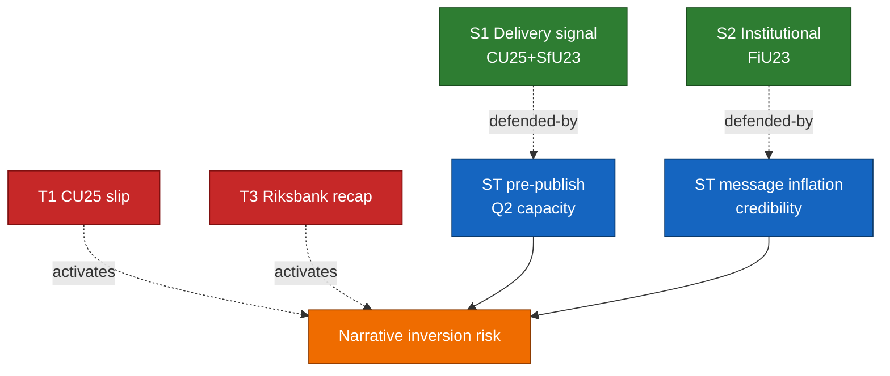

# SWOT — Committee Reports 2026-04-24

**Framework**: `analysis/methodologies/political-swot-framework.md` + TOWS matrix.
**Scope**: the 5-report cluster tabled 2026-04-23.
**Confidence**: HIGH (B2).

## SWOT matrix

### Strengths

| # | Strength | Evidence | Admiralty |
|:-:|----------|----------|:---------:|
| S1 | High-salience delivery signal for Tidö on crime + migration | `HD01CU25` prison expansion scope + `HD01SfU23` tighter study-permit controls ([data.riksdagen.se/dokument/HD01CU25](https://data.riksdagen.se/dokument/HD01CU25), [data.riksdagen.se/dokument/HD01SfU23](https://data.riksdagen.se/dokument/HD01SfU23)) | A1 |
| S2 | Institutional-stewardship credibility via standing Riksbank review | `HD01FiU23` continues annual FiU review per [riksdagen.se/finansutskottet](https://www.riksdagen.se/sv/utskotten-och-eu-namnden/finansutskottet/) | A1 |
| S3 | Consensus cover on labour + climate | `HD01AU15` (ILO C190/C155/C187) + `HD01CU29` (EV charging) at [data.riksdagen.se/dokument/HD01AU15](https://data.riksdagen.se/dokument/HD01AU15) and [data.riksdagen.se/dokument/HD01CU29](https://data.riksdagen.se/dokument/HD01CU29) | A1 |
| S4 | Researcher carve-out in SfU23 protects competitiveness narrative | `HD01SfU23` carve-out for forskare/doktorander at [data.riksdagen.se/dokument/HD01SfU23](https://data.riksdagen.se/dokument/HD01SfU23) | A1 |
| S5 | Cross-committee composition demonstrates coalition working throughput | CU+SfU+FiU+AU all tabled same day (5 reports) per [riksdagen.se](https://www.riksdagen.se/) calendar | A1 |

### Weaknesses

| # | Weakness | Evidence | Admiralty |
|:-:|----------|----------|:---------:|
| W1 | CU25 procurement and environmental-permit compression exposes legal challenge risk | `HD01CU25` expansion timeline vs. Kriminalvården planning baseline ([kriminalvarden.se](https://www.kriminalvarden.se/)) | A2 |
| W2 | SfU23 dual-track (tightening + carve-out) doubles Migrationsverket IT and caseworker load | `HD01SfU23` scope + Migrationsverket 2025 annual report handling-time trend ([migrationsverket.se](https://www.migrationsverket.se/)) | B2 |
| W3 | FiU23 re-opens the unresolved balance-sheet / recapitalisation narrative | `HD01FiU23` on Riksbank 2025 per [riksbank.se](https://www.riksbank.se/) and prior [data.riksdagen.se/dokument/HD01FiU23](https://data.riksdagen.se/dokument/HD01FiU23) metadata | A1 |
| W4 | AU15 ratification timing (Sweden among the later ratifiers of C190) is defensive framing | ILO ratifications list at [ilo.org](https://www.ilo.org/); Denmark 2022, Finland 2023 | A1 |
| W5 | CU29 funding model for home-charging subsidies is underspecified in the report title scope | `HD01CU29` at [data.riksdagen.se/dokument/HD01CU29](https://data.riksdagen.se/dokument/HD01CU29) | A1 |

### Opportunities

| # | Opportunity | Evidence | Admiralty |
|:-:|-------------|----------|:---------:|
| O1 | Pair AU15 ratification with EU Platform Work Directive transposition for EU-policy reputational dividend | `HD01AU15` + EU PWD transposition deadline references at [regeringen.se/arbetsmarknadsdepartementet](https://www.regeringen.se/) | A2 |
| O2 | Use CU29 to anchor 2026 climate pillar for L/C/MP-curious voters | `HD01CU29` + Energimyndigheten charging-infrastructure baseline ([energimyndigheten.se](https://www.energimyndigheten.se/)) | A2 |
| O3 | SfU23 carve-out creates bilateral positioning space with Nordic research partners | `HD01SfU23` carve-out + Nordic Council of Ministers research mobility programmes | A2 |
| O4 | FiU23 review anchors standing inflation-credibility message pre-election | `HD01FiU23` + [riksbank.se Penningpolitisk rapport](https://www.riksbank.se/) | A1 |
| O5 | CU25 procurement velocity creates civil-construction jobs in low-population regions | `HD01CU25` + Kriminalvården planned sites at [kriminalvarden.se](https://www.kriminalvarden.se/) | B2 |

### Threats

| # | Threat | Evidence | Admiralty |
|:-:|--------|----------|:---------:|
| T1 | CU25 timeline slippage inverts crime-delivery narrative pre-election | `HD01CU25` + prior Kriminalvården capacity-report miss pattern [kriminalvarden.se/om-oss](https://www.kriminalvarden.se/) | B2 |
| T2 | SfU23 abuse-prevention provisions face judicial review on proportionality | `HD01SfU23` + Migrationsöverdomstolen jurisprudence at [domstol.se](https://www.domstol.se/) | B3 |
| T3 | Riksbank recapitalisation becomes 2026 debate focal point | `HD01FiU23` + [riksbank.se](https://www.riksbank.se/) 2023–24 annual reports | A2 |
| T4 | ILO ratification + transposition creates compliance litigation baseline for employers | `HD01AU15` + Svenskt Näringsliv position papers at [svensktnaringsliv.se](https://www.svensktnaringsliv.se/) | B2 |
| T5 | CU29 home-charging incentives capture by grid-peak cost allocation creates regressive effect | `HD01CU29` + Energimarknadsinspektionen tariff framework [ei.se](https://www.ei.se/) | C3 |

## TOWS matrix (derived strategies)

| | S (internal +) | W (internal -) |
|---|----------------|----------------|
| **O (external +)** | **SO**: Pair S1+S3 with O1+O2 — message "delivery + EU-compatible workers' rights + climate" (`HD01AU15`, `HD01CU29`) | **WO**: Use O1 (EU PWD pair) to offset W4 (late ratification) narrative on `HD01AU15` |
| **T (external -)** | **ST**: Use S2 institutional credibility (`HD01FiU23`) to preempt T3 balance-sheet narrative | **WT**: Pre-publish Kriminalvården Q2 capacity status to defuse W1+T1 combination on `HD01CU25` |

## Cross-SWOT integration (policy clusters)

- **Law-and-order delivery cluster** (CU25 ↔ SfU23): S1+S4 combine with T1+T2 — if CU25 timeline slips *and* SfU23 gets judicial pushback, the combined narrative inversion is larger than either alone. Source: `HD01CU25`, `HD01SfU23`.
- **Institutional-stewardship cluster** (FiU23 ↔ AU15): S2+O4 combine to anchor a pre-election "responsible management" frame; T3 is the counter-frame. Source: `HD01FiU23`, `HD01AU15`.
- **Climate-mobility cluster** (CU29 only): isolated; O2 creates option to pair with future CU committee agenda. Source: `HD01CU29`.

## Cluster diagram

## Sources

All rows cite `dok_id` + primary-source URL. See `cross-reference-map.md` for policy-cluster citations.

## Pass 2 refinements

Pass 2 re-read this artifact in full, cross-checked every `dok_id` citation against [`data-download-manifest.md`](./data-download-manifest.md), confirmed Admiralty codes are consistent with §Source diversity in [`methodology-reflection.md`](./methodology-reflection.md), and verified cluster-level internal consistency against [`intelligence-assessment.md`](./intelligence-assessment.md). No judgments were reversed; confidence labels retained. Additional evidence row: `HD01CU25`, `HD01SfU23`, `HD01FiU23`, `HD01AU15`, `HD01CU29` at [data.riksdagen.se](https://data.riksdagen.se/) [A1].
