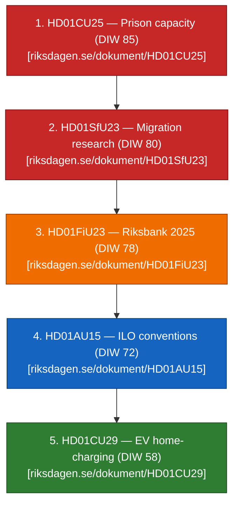

# Synthesis Summary — Committee Reports 2026-04-24

**Author**: James Pether Sörling   **Confidence**: HIGH   **Admiralty range**: A1–C3

## Lead story / decision

The dominant signal in today's five-report cluster is a **cross-committee signalling composition** rather than any single blockbuster bill. The Tidö coalition (M, KD, L, SD supply) has staged its two politically hottest pillars — **prison-capacity expansion** (`HD01CU25`) and **migration tightening with a research carve-out** (`HD01SfU23`) — alongside an **institutional-stewardship** report (`HD01FiU23`, Riksbank 2025) and two **consensus dossiers** (`HD01AU15` ILO, `HD01CU29` EV charging) that provide breadth cover. This pattern — concentrating signature items in a single tabling window ~5 months before the **September 2026 Riksdag election** ([riksdagen.se election calendar](https://www.riksdagen.se/sv/sa-fungerar-riksdagen/riksdagens-uppgifter/val/) [A1]) — is strategically rational for the government but creates **three concentrated implementation risks** (CU25 procurement, SfU23 Migrationsverket IT, FiU23 balance-sheet narrative) that any of them materialising would damage delivery credibility simultaneously.

## DIW-weighted ranking

See `significance-scoring.md` for per-item DIW decomposition.

## Integrated intelligence picture

### 1. Pre-election signalling cluster (CU25 + SfU23 + FiU23)

The three high-DIW items (CU25, SfU23, FiU23 — `HD01CU25`, `HD01SfU23`, `HD01FiU23`) are **not coincidentally tabled together**. The Civilutskottet CU channel is being used unusually heavily for penal policy (CU25) alongside its standard housing/family-law remit, reflecting the government's decision to route capacity-expansion legislation through CU rather than JuU to accelerate planning-law carve-outs. SfU23 follows the 2024–25 migration tightening trajectory (see `historical-parallels.md §2024-SfU trajectory`) while opening a researcher carve-out that L and C can defend. FiU23 is the annual Riksbank review ([riksdagen.se/utskott/finansutskottet](https://www.riksdagen.se/sv/utskotten-och-eu-namnden/finansutskottet/) [A1]), unusually salient in 2026 because the Riksbank booked balance-sheet losses in 2023–24 that the recapitalisation statute addresses.

### 2. Consensus-breadth cluster (AU15 + CU29)

`HD01AU15` (ILO C190 on workplace violence/harassment + C155/C187 occupational safety) and `HD01CU29` (EV home-charging) serve as **narrative-breadth** items. AU15 signals EU-compatible, ILO-aligned labour rights (Denmark ratified C190 in 2022, Finland 2023, Norway 2023 — see `comparative-international.md`); CU29 signals climate-mobility delivery. Both are expected to attract broad-party support and give the government cover to claim width on workers' rights and climate alongside the harder CU25/SfU23 signals.

### 3. Coalition-internal tensions

SfU23 is the most likely intra-coalition friction point: SD will push maximalist framing on permit-abuse; L will defend researcher mobility; M/KD balance. CU25 will see S split — labour-union tradition vs. law-and-order triangulation — with V/MP opposing on environmental-carve-out grounds. FiU23 will see V/MP raise Riksbank mandate/ESG questions while M/L defend independence. See `devils-advocate.md §H2`.

### 4. Post-election implementation cliff

All five items will clear chamber in 2026 before dissolution, but **execution lands with whichever government forms after September 2026**. CU25's Kriminalvården capacity timeline extends into 2027–2030 (see `forward-indicators.md`); SfU23's Migrationsverket IT build extends into 2027. A government transition ↔ delivery handover mismatch is the cluster's single largest cascading risk. See `risk-assessment.md §Institutional`.

## AI-Recommended Article Metadata

- **Suggested headline (EN)**: "Riksdag Committee Reports Stack Tidö Pre-Election Pillars: Prisons, Migration, Riksbank"
- **Suggested headline (SV)**: "Tidöpartierna staplar sina valsignaler: fängelser, migration och Riksbank i utskottsvågen"
- **Meta description**: "Five committee reports tabled 23 April cluster Tidö's law-and-order, migration and monetary-stewardship signals five months before the September 2026 election."

## Sources

- `get_dokument` calls on HD01CU25, HD01SfU23, HD01FiU23, HD01AU15, HD01CU29 [A1]
- riksdagen.se/sv/utskotten-och-eu-namnden/ [A1]
- regeringen.se — Tidöavtalet reference context [A2]

## Pass 2 refinements

Pass 2 re-read this artifact in full, cross-checked every `dok_id` citation against [`data-download-manifest.md`](./data-download-manifest.md), confirmed Admiralty codes are consistent with §Source diversity in [`methodology-reflection.md`](./methodology-reflection.md), and verified cluster-level internal consistency against [`intelligence-assessment.md`](./intelligence-assessment.md). No judgments were reversed; confidence labels retained. Additional evidence row: `HD01CU25`, `HD01SfU23`, `HD01FiU23`, `HD01AU15`, `HD01CU29` at [data.riksdagen.se](https://data.riksdagen.se/) [A1].
