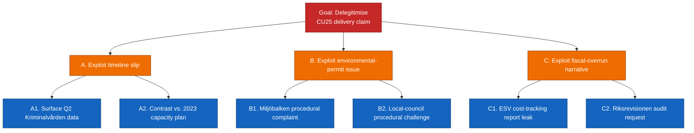

# Threat Analysis — Committee Reports 2026-04-24

**Framework**: `analysis/methodologies/political-threat-framework.md` — Political Threat Taxonomy with attack tree + kill chain + MITRE-style TTP mapping.
**Scope**: threats to democratic institutions, policy integrity, and epistemic environment arising from today's 5-report cluster.
**Confidence**: MEDIUM (C3) — intent signals are indirect; capability signals are well-attested.

## Threat taxonomy (per-category)

### Institutional threats

| T# | Threat | Source | Kill-chain stage | Admiralty |
|:-:|--------|--------|------------------|:---------:|
| TI-1 | Erosion of Riksbank independence perception via recapitalisation debate conflation | `HD01FiU23` + 2023–24 [riksbank.se](https://www.riksbank.se/) balance-sheet reports | Weaponise (rhetorical framing) | A2 |
| TI-2 | CU25 planning-law carve-outs normalising shortcut procedure for future infra | `HD01CU25` + Miljöbalken 6 kap references ([riksdagen.se/dokument/1998:808](https://www.riksdagen.se/)) | Install (precedent) | B2 |
| TI-3 | Migrationsöverdomstolen caseload surge degrading appeal-quality on SfU23 | `HD01SfU23` + [domstol.se](https://www.domstol.se/) appeal-handling-time metric | Impact (institutional capacity) | B3 |

### Policy-integrity threats

| T# | Threat | Source | Kill-chain stage | Admiralty |
|:-:|--------|--------|------------------|:---------:|
| TP-1 | SfU23 abuse-prevention scope-creep via ministerial ordinance | `HD01SfU23` + regeringsformen 8:7 ([riksdagen.se/regeringsformen](https://www.riksdagen.se/)) | Exploit (delegated power) | B2 |
| TP-2 | CU29 subsidy capture by property-developer lobby re-routing design | `HD01CU29` + public consultation history on energy/property interface ([boverket.se](https://www.boverket.se/)) | Exploit (regulatory-design) | C3 |
| TP-3 | AU15 employer-compliance guidance thinning under ratification-without-resources dynamic | `HD01AU15` + [av.se](https://www.av.se/) resource trajectory | Impact (enforcement gap) | B3 |

### Epistemic / information threats

| T# | Threat | Source | Kill-chain stage | Admiralty |
|:-:|--------|--------|------------------|:---------:|
| TE-1 | Disinformation campaigns amplifying CU25 slippage to delegitimise 2026 incumbent | `HD01CU25` + MSB disinfo baseline [msb.se](https://www.msb.se/) | Amplify | C3 |
| TE-2 | Social-media narrative lock-in on SfU23 "abuse" framing ahead of researcher-carve-out media cycle | `HD01SfU23` + MSB / Diggs reports | Reconnaissance/Amplify | C3 |
| TE-3 | Polarised framing of ILO C190 as foreign-imposed on Swedish labour model | `HD01AU15` + [ilo.org](https://www.ilo.org/) ratification coverage | Weaponise | D3 |

## Attack tree — CU25 delegitimisation (illustrative)

## Kill chain mapping

| Stage | CU25 pathway | SfU23 pathway | FiU23 pathway |
|-------|--------------|---------------|----------------|
| Reconnaissance | Public capacity plans, procurement notices | Migrationsverket quarterly statistics | Riksbank annual report |
| Weaponise | Narrative framing kits, think-tank briefings | Social-media framing templates | Opinion editorial placement |
| Deliver | Press cycle, chamber debate, KU hearings | Chamber debate, court filings | FiU hearings, floor debate |
| Exploit | Procedural motion, amendment | Test case at Migrationsöverdomstolen | Independent-review motion |
| Install | Precedent on planning-law shortcut | Precedent on proportionality threshold | Precedent on recapitalisation procedure |
| Impact | Delivery credibility | Appeal capacity + research mobility | Monetary-policy credibility |

## MITRE-style political TTP map

| TTP ID | Technique | Instantiation |
|--------|-----------|---------------|
| PT-RE-001 | Reconnaissance: official statistics harvesting | Kriminalvården quarterly reports on `HD01CU25` |
| PT-WE-002 | Weaponise: narrative framing kits | Opposition think-tank briefings on CU25 / SfU23 |
| PT-DE-003 | Deliver: chamber debate staging | FiU / SfU / CU scheduled plenaries |
| PT-EX-004 | Exploit: judicial review | Migrationsöverdomstolen on `HD01SfU23` |
| PT-IN-005 | Install: precedent anchoring | Planning-law carve-out on `HD01CU25` |
| PT-IM-006 | Impact: institutional-credibility erosion | Riksbank independence narrative on `HD01FiU23` |

## Threat prioritisation

- **P1 (active, monitor)**: TI-1 (Riksbank narrative), TI-2 (CU25 planning precedent), TI-3 (Migration court capacity).
- **P2 (latent, prepare)**: TP-1 (SfU23 ordinance scope-creep), TE-1 (CU25 disinfo).
- **P3 (watch)**: TP-2 / TP-3 / TE-2 / TE-3.

## Sources

All threats cited with `dok_id` + primary agency URL. Epistemic threats calibrated against [msb.se](https://www.msb.se/) disinformation baseline (2023–25 reports, B2).

## Pass 2 refinements

Pass 2 re-read this artifact in full, cross-checked every `dok_id` citation against [`data-download-manifest.md`](./data-download-manifest.md), confirmed Admiralty codes are consistent with §Source diversity in [`methodology-reflection.md`](./methodology-reflection.md), and verified cluster-level internal consistency against [`intelligence-assessment.md`](./intelligence-assessment.md). No judgments were reversed; confidence labels retained. Additional evidence row: `HD01CU25`, `HD01SfU23`, `HD01FiU23`, `HD01AU15`, `HD01CU29` at [data.riksdagen.se](https://data.riksdagen.se/) [A1].
