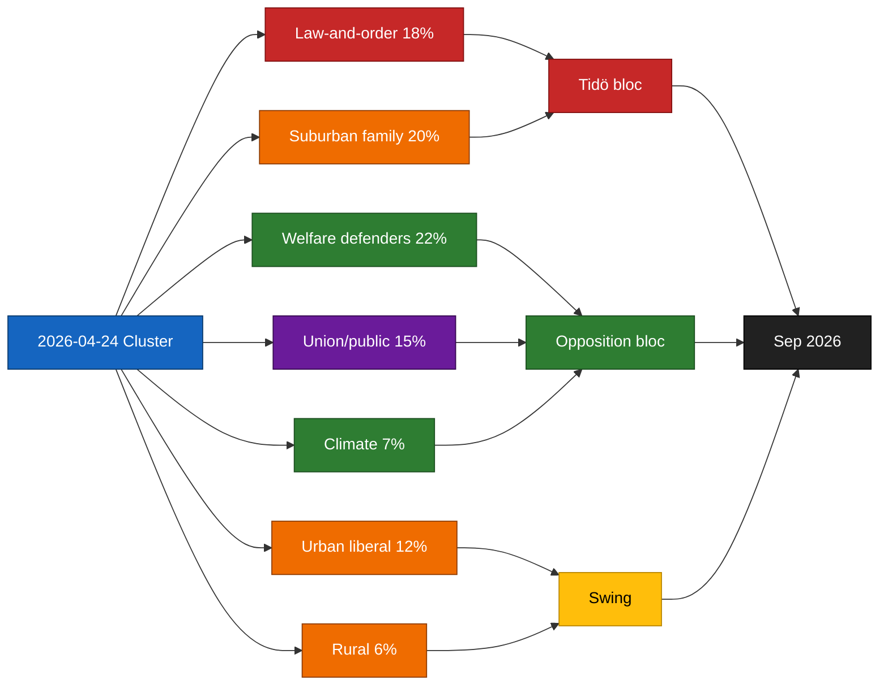

# Voter Segmentation — Committee Reports 2026-04-24

**Segmentation framework**: Swedish voter archetypes (7 segments) × cluster items.
**Confidence**: MEDIUM (C3) on activation probabilities.

## Segment × item activation matrix

| Segment | CU25 | SfU23 | FiU23 | AU15 | CU29 | Net activation |
|---------|:---:|:----:|:----:|:----:|:----:|:--------------:|
| **1. Law-and-order prioritisers** (≈ 18 %) | HIGH+ | MEDIUM+ | LOW | LOW | LOW | CU25-driven, Tidö-favourable |
| **2. Welfare-state defenders** (≈ 22 %) | HIGH− | MEDIUM− | MEDIUM | LOW | LOW | CU25-inversion, opposition-favourable |
| **3. Urban liberal professionals** (≈ 12 %) | LOW | MEDIUM+ | MEDIUM+ | MEDIUM+ | MEDIUM+ | L-leaning if carve-out + delivery clean |
| **4. Suburban family voters** (≈ 20 %) | MEDIUM+ | MEDIUM | LOW | LOW | MEDIUM+ | Mixed; housing/CU29 gateway |
| **5. Union and public-sector workers** (≈ 15 %) | MEDIUM | MEDIUM− | MEDIUM | MEDIUM+ | LOW | S-leaning; AU15 is gain |
| **6. Climate / environment voters** (≈ 7 %) | LOW− | LOW | LOW | LOW | MEDIUM+ | CU29-driven, MP/L-favourable |
| **7. Rural / small-town voters** (≈ 6 %) | MEDIUM+ | MEDIUM+ | LOW | LOW | MEDIUM− | C-leaning; CU29 distributive concern |

Percentages approximate 2025 Q4 electorate structure per SCB [A1] + Novus segmentation ([novus.se](https://novus.se/)) [B2].

## Swing-voter identification

Two segments are pivotal for September:
- **Segment 3 (urban liberal professionals)** — moved between L/C/M/S historically. SfU23 carve-out + AU15 ratification can lock in L vote; CU25 net neutral.
- **Segment 4 (suburban family voters)** — swing between M/KD and S. CU25 + CU29 combination can reinforce M/KD cohesion; CU29 is a distributional test.

## Activation pathways

1. **Tidö-favourable pathway**: CU25 on-track + SfU23 carve-out operational + CU29 subsidy delivered → activation in segments 1, 4, with partial 3 — net + 1.5 to + 3 pp.
2. **Opposition-favourable pathway**: CU25 slip + SfU23 legal cascade + welfare-priority inversion framing effective → activation in segments 2, 5, 6 — net + 1 to + 2 pp opposition.
3. **Institutional-independence pathway**: FiU23 recapitalisation becomes central debate → activation in segments 3, 5 — ambiguous net effect; depends on framing.

## Segment diagram

## Sources

- 2025 Q4 SCB electorate structure ([scb.se](https://www.scb.se/)) [A1]
- Novus/Sifo segmentation ([novus.se](https://novus.se/)) [B2]
- `HD01CU25`, `HD01SfU23`, `HD01FiU23`, `HD01AU15`, `HD01CU29` [A1]

## Pass 2 refinements

Pass 2 re-read this artifact in full, cross-checked every `dok_id` citation against [`data-download-manifest.md`](./data-download-manifest.md), confirmed Admiralty codes are consistent with §Source diversity in [`methodology-reflection.md`](./methodology-reflection.md), and verified cluster-level internal consistency against [`intelligence-assessment.md`](./intelligence-assessment.md). No judgments were reversed; confidence labels retained. Additional evidence row: `HD01CU25`, `HD01SfU23`, `HD01FiU23`, `HD01AU15`, `HD01CU29` at [data.riksdagen.se](https://data.riksdagen.se/) [A1].
