# Cross-Reference Map — Evening Analysis 2026-04-24

**Function**: Traceability web linking every claim to source artifacts per Tier-C aggregation contract.

## Internal artifact dependencies

```mermaid
graph LR
  DM[data-download-manifest] --> EB[executive-brief]
  EB --> SS[synthesis-summary]
  SS --> IA[intelligence-assessment]
  IA --> SSC[significance-scoring]
  IA --> CR[classification-results]
  CR --> SP[stakeholder-perspectives]
  SP --> SW[swot-analysis]
  SW --> RA[risk-assessment]
  RA --> TA[threat-analysis]
  TA --> SA[scenario-analysis]
  SA --> CI[comparative-international]
  CI --> DA[devils-advocate]
  DA --> MR[methodology-reflection]
  MR --> E26[election-2026-analysis]
  E26 --> VS[voter-segmentation]
  VS --> CM[coalition-mathematics]
  CM --> HP[historical-parallels]
  HP --> MFA[media-framing-analysis]
  MFA --> IF[implementation-feasibility]
  IF --> FI[forward-indicators]
  FI --> CRM[cross-reference-map]
  CRM --> README[README]
```

## Sibling-folder citations (Tier-C mandatory)

Evening analysis aggregates and cross-references today's four single-type analyses. Sibling paths — all under `analysis/daily/2026-04-24/`:

### `analysis/daily/2026-04-24/propositions/`
**Source artifacts ingested**:
- `executive-brief.md` — coalition prop-signing pattern
- `significance-scoring.md` — HD03252, HD03253, HD03256, HD03104 DIW scores
- `risk-assessment.md` — ECHR risk matrix for HD03252
- `devils-advocate.md` — H1/H2/H3 on sprint thesis
- `forward-indicators.md` — PIR-1 anchor date

### `analysis/daily/2026-04-24/motions/`
**Source artifacts ingested**:
- `classification-results.md` — S/V/MP motion clustering
- `stakeholder-perspectives.md` — 6-lens on drivmedel motion HD024082
- `swot-analysis.md` — opposition strategic positioning
- `election-2026-analysis.md` — campaign-narrative mapping
- `voter-segmentation.md` — segment targeting per motion

### `analysis/daily/2026-04-24/committeeReports/`
**Source artifacts ingested**:
- `intelligence-assessment.md` — CU25/SfU23/FiU23/AU15/CU29 committee-floor signal
- `scenario-analysis.md` — coalition durability per committee signal
- `methodology-reflection.md` — committee-floor-signal methodology

### `analysis/daily/2026-04-24/interpellations/`
**Source artifacts ingested**:
- `executive-brief.md` — S-party 12-of-16 interpellation-filing dominance
- `significance-scoring.md` — HD10447 SME sick-pay tier placement
- `media-framing-analysis.md` — Aftonbladet amplification

## Claim-to-source matrix (high-value claims)

| Claim in evening-analysis | Source artifact | Source folder |
|---------------------------|-----------------|---------------|
| "Tidö pre-election legacy sprint" thesis | synthesis-summary | evening-analysis |
| "SD zero-motions day = discipline intact" | motions/classification-results | motions |
| "Prison-capacity bottleneck for HD03252" | committeeReports/scenario-analysis | committeeReports |
| "S dominates interpellation filings 12-of-16" | interpellations/executive-brief | interpellations |
| "HD03253 HIGH feasibility transposition" | propositions/implementation-feasibility | propositions |
| "L flank = binding political constraint" | stakeholder-perspectives | evening-analysis |
| "4 scenarios sum to 1.00" | scenario-analysis | evening-analysis |
| "PIR-1 anchor: FiU schedule by 2026-05-15" | propositions/forward-indicators | propositions |
| "Coalition math Ja/Nej breakdown per dok_id" | coalition-mathematics | evening-analysis |
| "Historical parallel: 2005/2018 pre-election sprints" | historical-parallels | evening-analysis |

## External authoritative sources

| Type | Source | Usage |
|------|--------|-------|
| Regeringen.se | SOU 2025:* propositions | Legal-text reference for HD03252, HD03253 |
| Riksdagen.se | Dokument.se | Dok-id resolution, text of motions |
| DN, SvD, Aftonbladet, Expressen | Editorial page | Framing context |
| ECHR | hudoc.echr.coe.int | HD03252 proportionality precedent |
| EU Commission | CRR3/CRD6 directive | HD03253 transposition context |
| SCB | Statistics Sweden | Base-rate referents |
| ISP | Inspektionen för strategiska produkter | HD024091/96 export-control context |

## Prior-cycle ingestion

Per Tier-C contract, today's analysis ingests **prior-cycle PIRs** from:
- `analysis/daily/2026-04-23/` (prior day's evening-analysis, if present) — see `intelligence-assessment.md`
- `analysis/weekly/2026-W17/` (prior-week review, if present) — see `intelligence-assessment.md`
- `analysis/monthly/2026-04/` (April monthly review, if present) — see `intelligence-assessment.md`

## Forward-reference targets

This evening-analysis cascade will feed forward to:
- `analysis/weekly/2026-W17/` (end-of-week review)
- `analysis/monthly/2026-04/` (end-of-April review)
- `analysis/daily/2026-09-*/` (election-period analyses)

## Traceability verification

Every Key Judgment (KJ1–KJ7) in `intelligence-assessment.md` links to ≥ 2 sibling artifacts.
Every scenario (S1–S4) in `scenario-analysis.md` links to ≥ 1 PIR in `intelligence-assessment.md`.
Every risk (R1–R15) in `risk-assessment.md` links to ≥ 1 threat in `threat-analysis.md` or stakeholder in `stakeholder-perspectives.md`.
Every forward indicator (F1–F20) in `forward-indicators.md` links to ≥ 1 PIR in `intelligence-assessment.md`.

**No orphan claims detected.**

_Source: Internal artifact graph + sibling-folder ingestion table._
