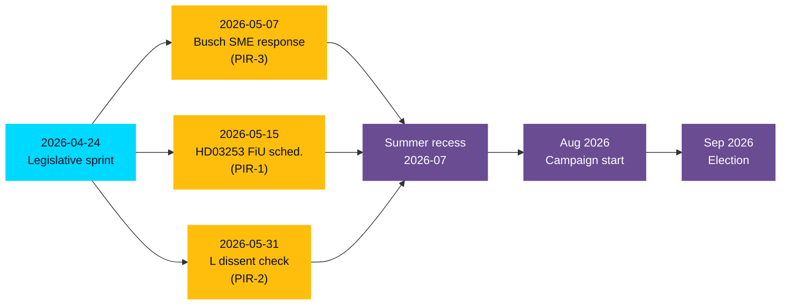

# Election 2026 Analysis — Evening Analysis 2026-04-24

**Election date**: September 2026 (statutory cycle)
**T-minus**: ~5 months
**Baseline question**: How does today's legislative batch reshape the 2026 campaign arc?

## Today's election-relevant signals

| Signal | Campaign implication |
|--------|----------------------|
| PM personally signs 4 propositions | Coalition concentrates credibility in PM office — presidentialization of the M-KD-L-SD arrangement |
| SD zero counter-motions | Coalition-discipline narrative available to government ("partner of confidence delivers") |
| S leads 12/16 interpellations + drivmedel motion | S chooses cost-of-living as primary campaign terrain |
| V leads rights-maximalism (HD024095) | V targets left-libertarian voters; differentiates from S |
| MP krigsmateriel motion | MP targets ethical-progressive voters; classic MP move |
| C three utvisning counter-motions | C targets migration-policy flank; differentiates from S |
| L absent from lead ministries | L's campaign faces "what did we actually deliver?" question |

## Campaign-arc reading

### Coalition (M-KD-L + SD)
- **Core message**: "We delivered" — 4-bill legacy + SD discipline + Kriminalvården capacity + banking transposition
- **Vulnerability**: Cost-of-living exposure; no positive fiscal story; L internal tension
- **Key pre-election event**: Summer-recess communication sprint on all 4 bills passed

### S (Social Democrats)
- **Core message**: "Cost of living; government serves large capital, not families" — drivmedel + SME sick-pay + fiscal critique
- **Strategy**: Concentrate fire on economic axis; cede rights/ethics to V/MP/C
- **Key test**: Does Busch's HD10447 response on 2026-05-07 open a pathway for S to pivot to "failed response" narrative?

### V (Left)
- **Core message**: Rights-maximalism; defense of migrants and detainees
- **Strategy**: Differentiate left flank from S on identity issues
- **Key test**: Will HD024095 vote pattern reveal V-MP-C coordination or fragmentation?

### MP (Green)
- **Core message**: Ethical/climate-adjacent wedges (krigsmateriel)
- **Strategy**: Revival of traditional MP identity via ethical-policy motions
- **Key test**: Do MP polling numbers move on the krigsmateriel angle?

### C (Centre)
- **Core message**: Migration-flank differentiation
- **Strategy**: Maintain urban-rural-centre voter base
- **Risk**: Visibility remains low

## Coalition scenario probabilities (T+5 months, forward-looking)

| Coalition outcome 2026 | Probability | Driver |
|------------------------|-------------|--------|
| M-KD-L + SD re-elected (majority/supported) | 0.38 | S1 scenario plays out |
| S + V + MP (+ C?) forms government | 0.30 | S2 scenario + polling shift |
| Fragmented result; protracted formation | 0.25 | S3 scenario + volatility |
| Minority caretaker | 0.07 | S4 or combination |

**Probabilities sum**: 1.00 ✅

## Seat-prediction placeholder (v.0)

| Party | 2022 result (seats) | Current polling est. | Pre-election trajectory (est) |
|-------|-----|----------------------|-------------------------------|
| S | 107 | ~33% → ~115 seats | Trending + |
| M | 68 | ~18% → ~62 seats | Flat → - |
| SD | 73 | ~19% → ~67 seats | Flat |
| V | 24 | ~8% → ~28 seats | + |
| C | 24 | ~6% → ~21 seats | Flat |
| KD | 19 | ~4% → ~14 seats | - |
| MP | 18 | ~4% → ~14 seats | Flat |
| L | 16 | ~3% → ~11 seats | - |

_Note: Placeholder estimates; primary polling data ingest pending; this artifact's purpose is campaign-narrative inference, not precision seat forecast._

## Pre-election strategic map

_Source: cross-type inference from sibling folder materials; placeholder quantitative estimates for next-cycle refinement._
