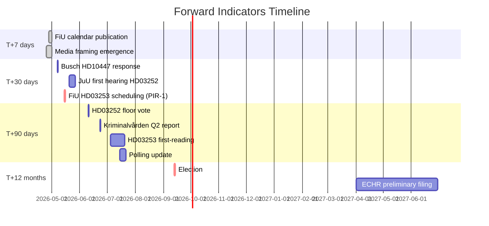

# Forward Indicators — Evening Analysis 2026-04-24

**Framework**: Four-horizon dated-indicator system per `ai-driven-analysis-guide.md §Step 10`.
**Horizons**: T+7 days · T+30 days · T+90 days · T+12 months.
**Indicator types**: Calendar-anchored · Event-triggered · Threshold-triggered.

## T+7 days (by 2026-05-01)

| # | Indicator | Trigger | Expected signal | Interpretation if YES | Interpretation if NO |
|---|-----------|---------|------------------|------------------------|----------------------|
| F1 | FiU session calendar published | calendar release | HD03253 first hearing date | S1 scenario reinforced | S3 indicator |
| F2 | DN/SvD editorial on HD03252 | editorial publication | Proportionality framing | Framing contest live | Coalition framing dominant |
| F3 | Aftonbladet front-page on SME sick-pay | front page | HD10447 narrative amplification | S wedge traction | Wedge contained |

## T+30 days (by 2026-05-24)

| # | Indicator | Trigger | Expected signal | Interpretation if YES | Interpretation if NO |
|---|-----------|---------|------------------|------------------------|----------------------|
| F4 | Minister Busch HD10447 response | 2026-05-07 session | Refusal / compromise / review | Campaign inflection | Routine defense |
| F5 | JuU first hearing on HD03252 | schedule | Proportionality motion discussed | PIR-4 activation | Routine passage path |
| F6 | L public comment on HD03252 | media appearance | L position clarity | Coalition reinforced | L flank signal |
| F7 | Kriminalvården monthly capacity update | end of May publication | Capacity trend | On-track | PIR-5 pre-flag |
| F8 | FiU schedule HD03253 (PIR-1) | 2026-05-15 deadline | Scheduling event | S1 reinforced | S3 activated |

## T+90 days (by 2026-07-23)

| # | Indicator | Trigger | Expected signal | Interpretation if YES | Interpretation if NO |
|---|-----------|---------|------------------|------------------------|----------------------|
| F9 | HD03252 floor vote outcome | June 2026 | Coalition discipline on amendments | Sprint narrative succeeds | Fracture emerges |
| F10 | Q2 Kriminalvården capacity report | 2026-06-23 | Bed-count vs plan | On-plan = S1 | Off-plan = S2 |
| F11 | Polling shift (YouGov/Novus) | Quarterly | +/- 3pp shift bloc-to-bloc | Scenario discrimination | Status quo |
| F12 | HD03253 first-reading complete | June/July | Transposition timeline | S1 reinforced | S3 signals |
| F13 | ECHR filing signal on HD03252 | post-enactment | Filing preliminaries | R2 activated | Latent remains |
| F14 | SD 30-day motion-filing rate | rolling | Coalition discipline index | < 2 motions = S1 | > 3 motions = signal |

## T+12 months (by 2027-04-24)

| # | Indicator | Trigger | Expected signal | Interpretation |
|---|-----------|---------|------------------|-----------------|
| F15 | September 2026 election outcome | Sep 2026 | Mandatsiffror | Scenario S1/S2/S3/S4 resolution |
| F16 | EU Commission letter on CRR3 transposition | post-deadline | Regulatory letter | R1 confirmed or avoided |
| F17 | First ECHR chamber-level filing on HD03252 | Q2-Q3 2027 | Case registration | R2 activated |
| F18 | Kriminalvården annual capacity report | Q1 2027 | Capacity delivery | Operational promise-keeping |
| F19 | SME sick-pay legislation under new government? | post-election | Legislative proposal | Post-S1 or post-S2 directly |
| F20 | Riksbank-independence debate escalation | ongoing | Institutional debate | Black-swan latent |

## Indicator priority ranking

**Tier-1 (decision-forcing, < 30 days)**:
- F4 (Busch response 2026-05-07)
- F6 (L position on HD03252)
- F8 (PIR-1: FiU HD03253 schedule)

**Tier-2 (scenario-discriminating, 30–90 days)**:
- F9 (HD03252 floor vote)
- F10 (Kriminalvården Q2)
- F11 (polling shift)
- F12 (HD03253 first-reading)

**Tier-3 (strategic, >90 days)**:
- F15 (election outcome)
- F16-F20 (post-election)

## Calendar placement

## Indicator-to-PIR mapping

| Forward Indicator | Linked PIR |
|-------------------|------------|
| F4 | PIR-3 |
| F5 | PIR-4 |
| F6 | PIR-2 |
| F7, F10, F18 | PIR-5 |
| F8 | PIR-1 |
| F13, F17 | PIR-2 (and emerging) |
| F15 | All scenarios |
| F16 | PIR-1 final resolution |
| F20 | PIR-7 |

## Null-indicator watch

Three **absence** signals to monitor (dog-that-did-not-bark):

- **SD silence on HD03252**: if SD remains silent through JuU, coalition discipline reinforced
- **L silence on HD03252**: if L declines public comment for 30 days, coalition internal-management succeeded
- **MP silence on drivmedel**: if MP joins drivmedel cluster (currently S-led), opposition consolidation sharpened

## Monitoring cadence

- **Daily**: F1-F3 (T+7 watch)
- **Weekly**: F4-F8 + null-indicators
- **Bi-weekly**: Polling updates (F11)
- **Monthly**: F9-F14 comprehensive review
- **Quarterly**: F15-F20 strategic review

_Source: Synthesis of sibling forward-indicators artifacts; calendar-anchoring per published Riksdag session plan._
