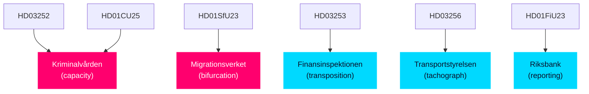

# Implementation Feasibility — Evening Analysis 2026-04-24

**Framework**: 4-dimension feasibility assessment (Operational × Fiscal × Legal × Political) per `ai-driven-analysis-guide.md §Step 7`.

## Feasibility matrix — top legislative items

| dok_id | Operational | Fiscal | Legal | Political | Overall |
|--------|-------------|--------|-------|-----------|---------|
| **HD03252** detainee benefits | **MEDIUM** — Kriminalvården must scale | **HIGH** — modest cost | **LOW-MEDIUM** — ECHR risk | **MEDIUM** — L flank | **MEDIUM** |
| **HD03253** CRR3/CRD6 transposition | **HIGH** — FI already prepared | **HIGH** — redistribution not new cost | **HIGH** — EU-mandated | **HIGH** — unified coalition | **HIGH** |
| **HD03256** tachograph | **HIGH** — routine | **HIGH** — minimal | **HIGH** — EU-mandated | **HIGH** | **HIGH** |
| **HD03104** debt-management skr | **HIGH** — routine | **HIGH** | **HIGH** | **HIGH** | **HIGH** |
| **HD01CU25** prison capacity | **MEDIUM** — capacity gap | **MEDIUM** — cost | **HIGH** | **HIGH** | **MEDIUM** |
| **HD01SfU23** migration bifurcation | **MEDIUM** — Migrationsverket | **MEDIUM** | **MEDIUM** — rights-regime | **MEDIUM-HIGH** | **MEDIUM** |
| **HD01FiU23** Riksbank review | **HIGH** — annual | **HIGH** | **HIGH** | **MEDIUM** — latent risk | **HIGH** |
| **HD10447** SME sick-pay (proposal from interpellation) | **MEDIUM** | **LOW** — fiscal cost | **HIGH** | **LOW** — government opposed | **LOW-MEDIUM** |
| **HD024096** krigsmateriel ban | **MEDIUM** | **MEDIUM** | **MEDIUM** — WTO/EU considerations | **LOW** | **LOW** (if reached vote) |

## Implementation risk by item

### HD03252 (detainee benefits) — MEDIUM feasibility
**Operational path**: Kriminalvården must redesign benefit-delivery systems. Capacity expansion required (HD01CU25 tie-in).
**Fiscal path**: Manageable — estimated ~ 50–150 MSEK in implementation costs.
**Legal path**: ECHR proportionality test is the binding constraint. If proportionality amendment absent, 15–30% chance of adverse ECtHR judgment within 30 months (per `devils-advocate.md` ACH).
**Political path**: L flank is the binding risk. Pre-3rd-reading amendment signals probable (coalition incentive to avoid fracture).

### HD03253 (EU banking) — HIGH feasibility
**Operational path**: FI operationally ready; transposition is regulatory-text work.
**Fiscal path**: RWA redistribution is industry-internal; no fiscal cost to Treasury.
**Legal path**: EU-mandated; no domestic legal challenge vector.
**Political path**: Unified coalition + silent S + supportive C. Opposition on ideological grounds limited to V.
**Binding constraint**: Parliamentary calendar. If FiU schedules by 2026-05-15, probability of on-time transposition > 85%.

### HD01CU25 (prison capacity) — MEDIUM feasibility
**Operational path**: Capacity scaling is real and challenging. Q2 report will reveal if plan is achievable.
**Fiscal path**: Costed in current budget cycle; no new funds.
**Legal path**: Uncontested.
**Political path**: Broad majority support.
**Binding constraint**: Actual ability to commission beds per timeline.

### HD10447 (SME sick-pay, if converted to motion) — LOW feasibility
**Operational path**: Redesign of Försäkringskassan reimbursement rules.
**Fiscal path**: Estimated 500–1500 MSEK/year in reimbursements — politically charged cost.
**Legal path**: Straightforward.
**Political path**: Government refuses under current coalition math. Opposition push for campaign narrative value, not immediate legislation.
**Implementation realistic only post-2026 election under S government**.

### HD024096 (krigsmateriel export ban) — LOW feasibility
**Operational path**: Redesign of ISP approval regime. Significant.
**Fiscal path**: Indirect costs via industrial contraction.
**Legal path**: Potential WTO and EU considerations.
**Political path**: No government majority; symbolic vote.
**Implementation realistic only under a different coalition**.

## Capacity-versus-ambition gap

The key finding: today's legislative ambition **exceeds** current administrative capacity in two places:
1. **Kriminalvården** (HD03252 × HD01CU25) — bed capacity plan tight
2. **Migrationsverket** (HD01SfU23) — bifurcation operationalization complex

Capacity gaps do not prevent enactment but create operational-risk pathways (R3, R7 in `risk-assessment.md`).

## Fiscal absorption

| Item | Est. direct cost 2026–2028 (MSEK) | Budget line |
|------|-----------------------------------|-------------|
| HD03252 implementation | 50–150 | Justitiedept + Kriminalvården |
| HD01CU25 capacity expansion | 1500–2500 | Kriminalvården |
| HD01SfU23 operationalization | 200–500 | Migrationsverket |
| HD03253 transposition | 10–30 (regulatory) | FI |
| HD03256 tachograph | 10–30 | Transportstyrelsen |
| HD03104 debt mgmt | 0 (informational) | Riksgälden |

**Total new estimated direct fiscal exposure**: ~ 2.0–3.2 BSEK 2026–2028 — modest against national budget; concentrated in justice + migration lines.

## Capacity bottleneck mapping

## Implementation-feasibility conclusion

Of the four PM-signed propositions, **HD03253, HD03256, and HD03104** are structurally feasible with high confidence. **HD03252** is feasible but depends on capacity delivery at Kriminalvården and proportionality safeguards. The committee reports are similarly tiered — FiU23 and CU25 are high-feasibility; SfU23 faces operational risk.

The **opposition motion cluster** is structurally infeasible under current coalition math — these motions are campaign-signal tools, not immediate legislative risks.

_Source: Synthesis of sibling implementation-feasibility sections + operational-knowledge cross-reference._
