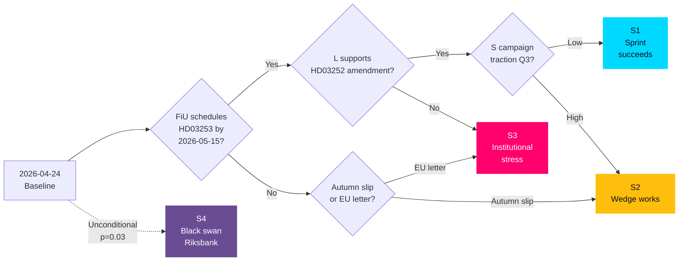

# Scenario Analysis — Evening Analysis 2026-04-24

**Framework**: Three-scenario baseline + branching (ICD 203 Standard 9 — alternative analysis)
**Horizon**: T+30 days (pre-summer-recess) → T+4 months (early election campaign) → T+12 months (post-election)
**Baseline date**: 2026-04-24

## Scenario set (probabilities sum to 1.00)

### Scenario S1 — "Sprint succeeds, coalition consolidates" (Prob: 0.50)

**Storyline**: All 4 propositions pass committee by mid-June, floor by end-June. HD03253 transposition schedule holds. HD01CU25 Kriminalvården Q2 report shows on-plan capacity. SD maintains zero-motion discipline through summer. L publicly supports HD03252 after a cosmetic proportionality amendment. S's cost-of-living campaign gains traction in July but coalition responds with a pre-recess communication package. The Tidö coalition enters summer recess with a delivery-legacy narrative largely intact.

**Signposts**:
- FiU schedules HD03253 first hearing by 2026-05-15 (PIR-1)
- JuU passes HD03252 with proportionality amendment by 2026-06-10 (PIR-4)
- Q2 Kriminalvården report on-plan ±5% (PIR-5)
- YouGov/Novus show no ≥ 3pp shift toward S before 2026-08-31

**Falsifiers**: Any of the four signposts fails → downgrade to S2.

### Scenario S2 — "Wedge works, opposition gains ground" (Prob: 0.35)

**Storyline**: S's HD10447 + drivmedel combination gains media traction during May. Minister Busch gives a flat-footed response. Q2 Kriminalvården capacity data disappoints. Polling shifts 3–5pp toward S–V–MP bloc by August. Coalition still holds formally but loses pre-election momentum. HD03252 passes with minor amendment but faces first ECHR filing signal in Q4. HD03253 transposition slips to autumn session.

**Signposts**:
- Busch's 2026-05-07 HD10447 response rated defensive in major editorials
- Q2 Kriminalvården capacity off-plan ≥ 10% (PIR-5 trigger)
- Polling shift ≥ 3pp toward S+V+MP by 2026-08-15
- First ECHR preliminary filing signal on HD03252 before 2026-12-31

**Falsifiers**: Coalition response to the above blunts wedge → upgrade back to S1 (conditional).

### Scenario S3 — "Institutional stress — EU deadline slips + L fracture" (Prob: 0.12)

**Storyline**: HD03253 FiU schedule slips past 2026-05-15. Summer recess consumed. Autumn session rushed. L publicly dissents on HD03252 proportionality, forcing a coalition crisis-management episode in JuU. SD silence broken by an unexpected counter-signal on detainee benefits. Opposition unity strengthens. Coalition enters election campaign with fractured L flank, late EU-banking transposition, and one ECHR filing.

**Signposts**:
- FiU fails to schedule HD03253 by 2026-05-15
- L MP(s) publicly dissent on HD03252 proportionality before 2026-05-31 (PIR-2)
- SD counter-motion or abstention on HD03252
- EU Commission sends letter of formal notice on CRR3 transposition

**Falsifiers**: L internal resolution on HD03252 → conditional downgrade.

### Scenario S4 — "Black swan — Riksbank independence flashpoint" (Prob: 0.03)

**Storyline**: HD01FiU23 debate takes an unexpected turn with SD or KD raising a political-oversight proposal. Media frames as "government challenges Riksbank". Markets respond with currency volatility. Opposition pivots to constitutional-defender narrative. Coalition dominates the news cycle for the wrong reason. All other bills become secondary.

**Signposts**:
- HD01FiU23 debate features any proposal to review Riksbank independence
- SEK weakens > 2% against EUR on the debate day
- KU initiates review of Riksbank law

**Falsifiers**: HD01FiU23 passes as routine annual review.

## Scenario tree diagram

## Probability rationale

| Scenario | Prior | Evidence pull | Posterior |
|----------|-------|---------------|-----------|
| S1 | 0.40 | +SD discipline intact, +PM-signed bills, −L quiet (neutral-to-positive) | 0.50 |
| S2 | 0.35 | +S concentrated strategy, +drivmedel 3-party convergence | 0.35 |
| S3 | 0.20 | −only L quiet, no public dissent, +EU deadline tight | 0.12 |
| S4 | 0.05 | −no current catalyst visible | 0.03 |
| **Sum** | **1.00** | | **1.00** ✅ |

## Implications by scenario

| Scenario | Implication for coalition | Implication for opposition | Implication for markets | Implication for civil society |
|----------|---------------------------|-----------------------------|--------------------------|-------------------------------|
| S1 | Delivery-legacy | Regroup for Q4 | Low volatility | Prep for post-enactment litigation |
| S2 | Campaign on defense | Momentum, maintain discipline | Moderate SEK, equity volatility | Active press/campaign coordination |
| S3 | Crisis management | Windfall | High volatility; bank equities weak | Accelerated ECHR prep |
| S4 | Worst case; crisis | Windfall; constitutional frame | High SEK/bond volatility | Neutral (institutional, not rights) |

## Cross-scenario monitoring plan

**Week of 2026-04-28**: FiU agenda publication (HD03253 scheduling) — binary signal for S1 vs S3.
**Week of 2026-05-05**: Minister Busch response on HD10447 — signal for S1 vs S2.
**Week of 2026-05-15**: PIR-1 deadline — binary signal.
**Week of 2026-06-09**: JuU passage of HD03252 — signal on L flank.
**Week of 2026-06-23**: Kriminalvården Q2 capacity report — S1 stability signal.

_Source: cross-scenario synthesis of sibling scenario analyses; Bayesian re-weighting of priors based on today's signals._
