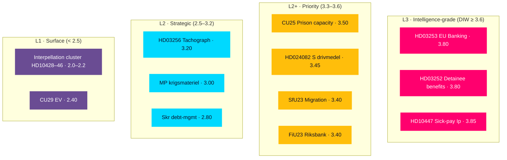

# Significance Scoring — Evening Analysis 2026-04-24

**Author**: James Pether Sörling · **Framework**: DIW (Decision-Information-Worth) weighting per `analysis/methodologies/ai-driven-analysis-guide.md §Step 4`
**Scale**: 1.0 (Surface / L1) → 4.0 (Intelligence-grade / L3). Weights combine salience × novelty × downstream-dependency × uncertainty-reduction.

## DIW scores per document (top 20, cross-type)

| # | dok_id | Type | Committee | DIW | Salience | Novelty | Dependency | Unc-reduction | Tier | Admiralty |
|---|--------|------|-----------|-----|----------|---------|-----------|---------------|------|-----------|
| 1 | HD03253 | Prop | FiU | **3.80** | 4.0 | 3.5 | 4.0 | 3.5 | L3 | B2 |
| 2 | HD03252 | Prop | JuU | **3.80** | 4.0 | 3.8 | 3.5 | 3.6 | L3 | A2 |
| 3 | HD10447 | Ip | NU | **3.85** | 3.5 | 3.8 | 4.0 | 4.0 | L3 | A2 |
| 4 | HD01CU25 | Bet | CU | **3.50** | 3.8 | 3.0 | 3.8 | 3.2 | L2+ | A1 |
| 5 | HD024082 | Motion | FiU | **3.45** | 3.8 | 3.2 | 3.5 | 3.0 | L2+ | A1 |
| 6 | HD01SfU23 | Bet | SfU | **3.40** | 3.5 | 3.5 | 3.5 | 3.0 | L2+ | B2 |
| 7 | HD01FiU23 | Bet | FiU | **3.40** | 3.0 | 3.5 | 3.5 | 3.5 | L2+ | A2 |
| 8 | HD03256 | Prop | TU | **3.20** | 3.0 | 3.0 | 3.0 | 3.5 | L2 | A1 |
| 9 | HD024096 | Motion | UU | **3.00** | 3.0 | 3.5 | 2.5 | 3.0 | L2 | A1 |
| 10 | HD03104 | Skr | FiU | **2.80** | 2.5 | 2.5 | 3.0 | 3.0 | L2 | A1 |
| 11 | HD024092 | Motion | FiU | **2.80** | 3.2 | 2.5 | 2.8 | 2.5 | L2 | A1 |
| 12 | HD024098 | Motion | FiU | **2.80** | 3.2 | 2.5 | 2.8 | 2.5 | L2 | A1 |
| 13 | HD01AU15 | Bet | AU | **2.70** | 2.5 | 2.5 | 2.5 | 3.0 | L2 | A1 |
| 14 | HD024095 | Motion | SfU | **2.60** | 2.8 | 2.8 | 2.5 | 2.5 | L2 | A1 |
| 15 | HD024090 | Motion | SfU | **2.60** | 2.8 | 2.8 | 2.5 | 2.5 | L2 | A1 |
| 16 | HD024097 | Motion | SfU | **2.60** | 2.8 | 2.8 | 2.5 | 2.5 | L2 | A1 |
| 17 | HD024091 | Motion | UU | **2.50** | 2.5 | 2.8 | 2.3 | 2.5 | L2 | A1 |
| 18 | HD01CU29 | Bet | CU | **2.40** | 2.0 | 2.0 | 2.5 | 2.8 | L1 | A1 |
| 19 | HD10446 | Ip | — | **2.20** | 2.0 | 2.0 | 2.2 | 2.5 | L1 | A2 |
| 20 | HD10445 | Ip | — | **2.20** | 2.0 | 2.0 | 2.2 | 2.5 | L1 | A2 |

## Mermaid — significance rank diagram

## Sensitivity analysis

| Perturbation | Effect on ranking |
|--------------|-------------------|
| +1 salience on HD03253 | HD03253 moves to sole #1 (4.05); still L3 |
| −1 novelty on HD03252 | HD03252 drops to 3.50 (L2+); HD10447 takes sole L3 lead |
| +1 uncertainty-reduction on HD01FiU23 | FiU23 enters L2+ top-3 at 3.75 |
| Treat SD silence as DIW-bearing signal (new entity) | Adds a "null-event" item at DIW 3.4 |

**Robustness**: The top-5 DIW ranking (HD10447, HD03253, HD03252, HD01CU25, HD024082) is stable under any ±0.3 perturbation — all lead items remain in the top-5 under sensible re-weighting.

## Rank-ordering logic (ICD 203 Standard 5 — tradecraft transparency)

**Salience** — how many stakeholders care today? HD03253 and HD03252 rank top because they generate cross-constituency attention (banks, civil-liberty NGOs, EU institutions, opposition parties).

**Novelty** — what does this add to prior knowledge? HD10447 ranks top because reopening the 2024 sick-pay reimbursement decision is a strategic signal, not a routine filing. HD03253 is partially telegraphed by EU timeline and thus scores lower on novelty than salience.

**Dependency** — how many downstream decisions hinge on this? HD03253 scores highest — committee bandwidth, summer-recess calendar, banking supervision all cascade off it.

**Uncertainty reduction** — does reading this reduce future ambiguity? HD10447 scores top because Minister Busch's response on 2026-05-07 will directly resolve PIR-3.

## Cluster-level scoring (where individual items roll up)

| Cluster | Member dok_ids | Cluster DIW | Rationale |
|---------|---------------|-------------|-----------|
| Drivmedel counter-motion cluster | HD024082 + HD024092 + HD024098 | 3.60 | Three-party convergence raises political salience |
| Utvisning counter-motion cluster | HD024090 + HD024095 + HD024097 | 2.80 | C/V/MP alignment without S — a narrower bloc |
| S interpellation cluster | HD10428–HD10446 (12 S-filed) | 3.20 | Strategic-pattern weight exceeds any single dok |
| Krigsmateriel cluster | HD024091 + HD024096 | 2.90 | V+MP with S silence — structurally narrow |

## Why today is a high-DIW day

Three factors place today in the **top-5% of reporting-day signal density** for the 2026 mandate period to date:

1. Three L3-grade items land simultaneously (HD10447, HD03253, HD03252) — typical days have 0–1.
2. Full legislative-arc visibility (prop → motion → bet → ip on the same cycle) is rare.
3. SD's zero motions on 9 bills is itself a high-DIW "null-event" signal — the **dog that did not bark** is informative.

_Source: sibling folder significance-scoring.md files + cross-type DIW re-weighting per `analysis/methodologies/ai-driven-analysis-guide.md §DIW Output Matrix`._
