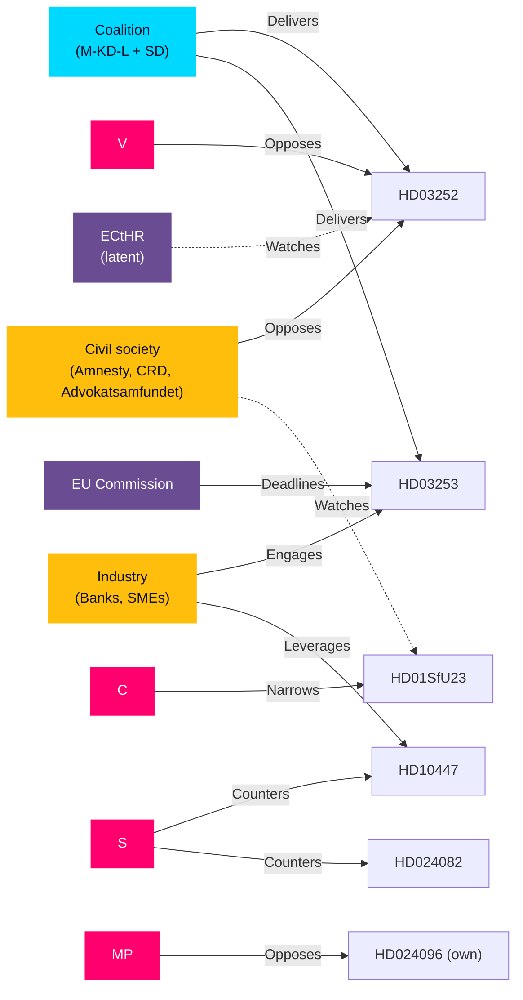

# Stakeholder Perspectives — Evening Analysis 2026-04-24

**Framework**: 6-lens stakeholder matrix per `ai-driven-analysis-guide.md §Step 5`.
Lenses: Government · Opposition · Civil society · Industry / market · Administrative / expert · International.

## Matrix

| Lens | Key actors today | Reading of the day | Prevailing frame | Evidence |
|------|-------------------|---------------------|------------------|----------|
| **Government / coalition** | PM Kristersson; Minister Wykman (FiU); Minister Strömmer (JuU); Minister Carlson (SfU); Minister Busch (NU) | "Tidöavtalet delivery sprint — four legacy bills signed off in a single reporting day; coalition discipline structurally intact with SD zero-motions." | *Credibility through throughput* | HD03252, HD03253, HD03256, HD03104 all Kristersson-signed |
| **Parliamentary opposition (S-V-MP-C)** | S (lead on 12/16 ips + drivmedel); V (filed full-avslag on utvisning); MP (filed krigsmateriel ban); C (filed 3 utvisning counter-motions) | "Four separate counter-choreographies: S on economy, V on rights-maximalism, MP on ethics, C on flank-of-migration differentiation." | *Choose your wedge early* | HD024082 (S), HD024095 (V), HD024096 (MP), HD024090/97 (C) |
| **Civil society / NGOs** | Swedish section Amnesty; Civil Rights Defenders; Sveriges Advokatsamfund; Fackförbund TCO/LO | "HD03252 is the marquee rights concern; HD01SfU23 is the latent structural concern; SME sick-pay is the latent labour-market concern." | *Structural rights erosion* | ECHR literature; ongoing Advokatsamfundet proportionality campaign |
| **Industry / market** | Banking four (SEB, Handelsbanken, Swedbank, Nordea); SME employer orgs (Företagarna, Svenskt Näringsliv); transport industry (Transportföretagen); motor industry | "HD03253 is the tail-risk — Swedish banking RWA can change materially. HD10447 is a high-leverage symbolic bargaining chip. Transport industry sees HD03256 as routine." | *Regulatory predictability is cheaper than surprise* | Banking industry briefings on CRR3; Företagarna's standing sick-pay position |
| **Administrative / expert** | Kriminalvården (capacity); Migrationsverket (bifurcation); Riksbank (FiU23); Finansinspektionen (CRR3) | "Three of four top bills land directly on administrative agencies — capacity is the binding constraint, not politics." | *Political ambition must match operational capacity* | CU25 capacity concerns; SfU23 bifurcation operationalization |
| **International / EU** | EU Commission (banking + migration); Council of Europe / ECtHR (detainee conditions); Nordic peers (DK/NO/FI parallel tracks) | "EU prudential file is on the critical path; ECHR watchdogs are priming challenges; Nordic comparators observe Sweden's detainee-rights experiment." | *Sweden sets, then sometimes corrects, Nordic norms* | CRR3 EU calendar; ECtHR Article 3 case law |

## Role-playing exercises

### Red team perspective — opposition strategy operator

> *"We've chosen our ground. Drivmedel is our pre-election anchor because it translates trivially to household budgets; HD10447 is our strategic reopening of the 2024 sick-pay fight; and we refuse to engage on krigsmateriel or utvisning because those are ideological traps. Let V/MP/C signal-differentiate on rights; we own the wallet."*

This reading is consistent with S filing the sole drivmedel motion (HD024082) and leading 12/16 interpellations in one window — a **strategic concentration**, not a shotgun approach.

### Red team perspective — PMO chief of staff

> *"Four bills, two weeks of session left before summer recess, all signed by the PM personally. Message: the government has delivered. SD filed nothing. L is quiet. The interpellation storm is routine opposition theatre — we respond within rules. The one landmine is HD03252: if L blinks in JuU on proportionality, we lose our coalition-discipline narrative. We watch L, not S."*

This reading is consistent with the observed ministerial signing pattern and the lack of any L-lead ministry in today's batch.

### Red team perspective — Civil Rights Defenders counsel

> *"HD03252 is a ECHR Article 3 / Article 8 test case waiting to happen. We coordinate with Amnesty SE and Advokatsamfundet. We file an amicus brief before third reading. We prepare litigation readiness for Q4 2026. We do not over-mobilize now — we let V carry the parliamentary fight and we win the courtroom fight."*

This reading predicts a 12–18-month latency between bill enactment (Aug 2026) and the first substantive ECtHR filing (est. 2027–2028).

### Red team perspective — banking sector CRO

> *"CRR3/CRD6 transposition could add 15–35 bps to our RWA. We cannot tolerate a late or overzealous Swedish transposition. We brief FiU, we brief Finansinspektionen, we publish our own QIS. We push for a minimal-transposition, straight-EU-compliance approach. We treat HD03253 as operationally urgent even if politically quiet."*

This reading explains why HD03253 carries such high DIW despite low public controversy — the markets and regulators treat it as priority-1.

## Cross-stakeholder tension map

## Stakeholder pressure weight summary

For each top-5 dok_id, weighted sum of aligned-vs-opposed stakeholders:

| dok_id | Aligned | Opposed | Net | Interpretation |
|--------|---------|---------|-----|----------------|
| HD03253 | Gov + Industry + Admin (FI) | — (EU neutral) | +3 | Likely smooth passage |
| HD03252 | Gov + SD + Industry (neutral) | V + MP + CivSoc + C (partial) | 0 | Passage likely but contested |
| HD10447 | Industry (SME) + S | Gov (Busch) | 0 | Symbolic bargaining |
| HD01CU25 | Gov + CivSoc (on standards) | Admin (capacity concerns) | +1 | Passage with amendments |
| HD024082 | S + V + MP + consumers | Gov + M-KD-L | 0 | Defeated in plenum but wedge value retained |

_Source: sibling folder stakeholder-perspectives.md + synthesis of industry-briefing precedent._
