# Synthesis Summary — Evening Analysis 2026-04-24

**Author**: James Pether Sörling · **Confidence**: HIGH (B2) · **Mode**: Tier-C aggregation · **Run ID**: 24906725202
**Admiralty range**: A1–C3 · **WEP language**: "highly likely" / "likely" / "possible" / "unlikely" per Kent Scale

## Lead story (decision-grade)

> The Kristersson government on 2026-04-24 simultaneously advanced a **four-bill legislative package** (detainee benefits, EU banking, tachograph enforcement, debt review), received **five committee reports** clustering its Tidö pre-election signals (prisons, migration, Riksbank, ILO, EV), and fielded **16 opposition interpellations** — while SD filed **zero counter-motions** against any of the 9 open government bills. This is the profile of a coalition entering **pre-election delivery mode** roughly 16 months before the September 2026 Riksdag election, with the SD party-of-confidence remaining structurally disciplined and S concentrating opposition firepower on economic wedges rather than identity politics.

## DIW-weighted ranking (cross-type, top 10)

| Rank | dok_id | Type | DIW | Theme | Admiralty | Source folder |
|------|--------|------|-----|-------|-----------|---------------|
| 1 | HD03253 | Prop | 3.80 | EU Banking Package (CRR3/CRD6) — systemic-fiscal | B2 | propositions |
| 2 | HD03252 | Prop | 3.80 | Detainee benefit restriction — civil-liberty / ECtHR | A2 | propositions |
| 3 | HD10447 | Ip | 3.85 | SME sick-pay reimbursement — S economic wedge | A2 | interpellations |
| 4 | HD01CU25 | Bet | 3.50 | Prison capacity expansion — delivery-risk | A1 | committeeReports |
| 5 | HD024082 | Motion | 3.45 | S drivmedel counter-motion (prop 236) — climate wedge | A1 | motions |
| 6 | HD01SfU23 | Bet | 3.40 | Migration bifurcation (study/research) — coalition-tension | B2 | committeeReports |
| 7 | HD01FiU23 | Bet | 3.40 | Riksbank annual review — monetary institutional | A2 | committeeReports |
| 8 | HD03256 | Prop | 3.20 | Tachograph enforcement — transport-industry | A1 | propositions |
| 9 | HD024096 | Motion | 3.00 | MP krigsmateriel export ban — foreign-policy wedge | A1 | motions |
| 10 | HD03104 | Skr | 2.80 | 5-year debt-management evaluation — fiscal credibility | A1 | propositions |

**Sensitivity**: Ranking robust under ±1 DIW tier perturbation. HD03253 and HD03252 remain co-leaders under any sensible re-weighting because both carry systemic-grade exposure (one fiscal, one rights-based).

## Integrated intelligence picture

### Thematic convergence

Today's 45 active documents cluster into **four coherent narrative threads** that together describe the Tidö coalition's final pre-election positioning:

1. **Coercive-authority expansion** — HD03252 (detainee benefits), HD03256 (tachograph enforcement), HD01CU25 (prison capacity). All three raise the **visible-enforcement** profile ahead of September 2026. Effective dates are front-loaded: HD03256 (1 Jul 2026), HD03252 (1 Aug 2026), HD01CU25 capacity milestones (Q2–Q3 2026).
2. **Financial/monetary institutional** — HD03253 (EU Banking), HD01FiU23 (Riksbank review), HD03104 (debt management). The government frames fiscal competence as a core deliverable; Riksbank independence debate (FiU23) remains a latent controversy.
3. **Migration and labour** — HD01SfU23 (study/research permit bifurcation), HD01AU15 (ILO ratification). The coalition is threading a needle — tightening on irregular migration while loosening on highly-skilled arrivals. Bifurcation is a concession to M's business-vote flank over SD's closed-border preference.
4. **Opposition counter-choreography** — 20 motions concentrated on drivmedel (FiU), utvisning (SfU), and krigsmateriel (UU); 16 interpellations 75% S-filed. The opposition is running a *three-party division-of-labour* — S holds the economic centre, V holds the rights-flank, MP holds foreign policy — with C on procedural tightening only.

### Cross-type signals

- **Prop → Motion → Committee → Interpellation pipeline** is unusually complete today: HD03252 (prop) will generate JuU counter-motion(s) by 8 May, then the JuU betänkande, then interpellation debate. The full legislative arc is visible.
- **SD silence** is the single most structurally revealing signal. Zero motions against 9 props means SD will vote the Tidö line on all current bills — closing the right-flank escape route for opposition messaging.
- **S economic-wedge concentration** (drivmedel + sick-pay + Riksbank critique) signals S has decided the 2026 campaign will be fought on *cost of living and SME resilience* rather than migration or identity.

## Mermaid — cross-type narrative architecture

```mermaid
flowchart LR
  subgraph Gov["Kristersson government (M-KD-L + SD CPA)"]
    direction TB
    HD03252["HD03252 Detainee benefits"]:::coercive
    HD03253["HD03253 EU Banking"]:::financial
    HD03256["HD03256 Tachograph"]:::coercive
    HD03104["Skr HD03104 Debt review"]:::financial
  end
  subgraph Comm["Committee Reports (5)"]
    direction TB
    HD01CU25["CU25 Prison capacity"]:::coercive
    HD01SfU23["SfU23 Migration bifurcation"]:::migration
    HD01FiU23["FiU23 Riksbank review"]:::financial
    HD01AU15["AU15 ILO"]:::consensus
    HD01CU29["CU29 EV charging"]:::consensus
  end
  subgraph Opp["Opposition actions"]
    direction TB
    Motions["20 motions (S/V/MP/C) — SD = 0"]:::opp
    Ip["16 interpellations (S × 12)"]:::opp
    HD10447["HD10447 SME sick-pay"]:::opp
  end
  Gov --> Comm
  Gov --> Opp
  Opp --> Narrative["Election-2026 wedge framing"]:::outcome
  Comm --> Narrative
  classDef coercive fill:#ff006e,stroke:#ff006e,color:#fff
  classDef financial fill:#00d9ff,stroke:#00d9ff,color:#0a0e27
  classDef migration fill:#ffbe0b,stroke:#ffbe0b,color:#0a0e27
  classDef consensus fill:#8ac926,stroke:#8ac926,color:#0a0e27
  classDef opp fill:#6a4c93,stroke:#6a4c93,color:#fff
  classDef outcome fill:#1a1e3d,stroke:#00d9ff,color:#e0e0e0
```

## AI-recommended article metadata

- **EN headline (72 chars)**: "Tidö's pre-election sprint: banks, prisons, detainees, and SD silence"
- **SV headline (74 chars)**: "Tidöregeringens valspurt: banker, fängelser, häkten — och SD:s tystnad"
- **EN meta description (156 chars)**: "Government advances 4 bills and 5 committee reports; opposition files 20 motions in 72h — SD files zero. Evening intelligence on Sweden's pre-election sprint."
- **SV meta description (158 chars)**: "Regeringen driver fyra propositioner och fem betänkanden; oppositionen lämnar 20 motioner på 72 timmar — SD noll. Kvällsanalys av valspurtens politiska arkitektur."
- **Primary keywords**: Tidöavtalet, Riksdagen 2026, EU bankpaket CRR3, säkerhetsförvaring, drivmedelsskatt, Patrik Lundqvist, Ulf Kristersson, Niklas Wykman, Gunnar Strömmer, SD-disciplin, valet 2026.

## Confidence & uncertainty

- **HIGH (A1)**: Document identity, authors, effective dates, filings, committee routing, SD zero-count.
- **MEDIUM (B2)**: Pre-election-sprint narrative (SAT used: **Key Assumptions Check** + **Red-Team challenge** in `devils-advocate.md`).
- **LOW (C3)**: Precise RWA impact magnitudes (HD03253 QIS pending), ECtHR rejection probability (HD03252 depends on facts-of-implementation), summer-recess enactment rate (depends on FiU bandwidth).

**Key uncertainties flagged for next-cycle PIRs** (see `intelligence-assessment.md §PIRs for next cycle`):

- PIR-1: Will FiU publish HD03253 transposition schedule before 2026-05-15?
- PIR-2: Will any L minister publicly dissent on HD03252 proportionality before 2026-05-31?
- PIR-3: Will S escalate HD10447 to a motion/budget amendment after Busch's 2026-05-07 answer?

## Tradecraft summary

- **ICD 203** applied: sources characterised, confidence labelled, alternative hypotheses entertained (`devils-advocate.md`), key assumptions identified (`methodology-reflection.md`).
- **Admiralty 6×6**: every evidence row annotated; source diversity ≥ 3 for P0/P1 claims (cross-validated across sibling folders).
- **SATs invoked**: ACH (in `devils-advocate.md`), Red-Team (scenario S4 in `scenario-analysis.md`), Key Assumptions Check, Outside-In (`comparative-international.md`).
- **Neutrality arithmetic**: Each of the 8 parties is named and treated by observable action — Regeringspartier (M, KD, L) as bill-drivers, SD by its zero motions, S/V/MP/C by their filed motions and interpellations.

_Source: cross-reads of `analysis/daily/2026-04-24/propositions|motions|committeeReports|interpellations/synthesis-summary.md` + `intelligence-assessment.md` + `executive-brief.md`._
