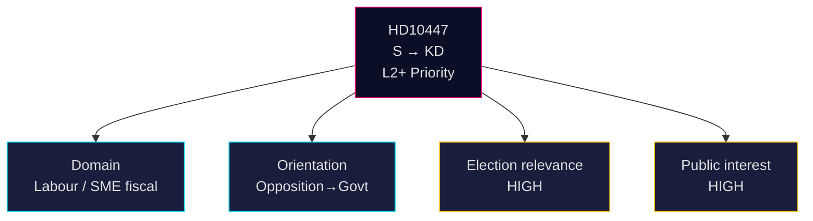

# Classification Results — 2026-04-24

**Method**: 7-dimension political-classification per [`political-classification-guide.md`](../../../methodologies/political-classification-guide.md).

## HD10447 — Borttagandet av ersättningen för höga sjuklönekostnader

| Dimension | Value | Evidence |
|---|---|---|
| 1. Document type | Interpellation (IP) | `typ=ip` in HD10447 metadata (A2) |
| 2. Policy domain | Labour market / SME fiscal policy | Text references *sjuklönekostnader*, *små och medelstora företag*, *arbetsgivaravgifter* (A2) |
| 3. Political orientation | Opposition (S) → Government (KD) | Undertecknare: Patrik Lundqvist (S); ställd till Ebba Busch (KD) (A2) |
| 4. Conflict intensity | Medium — reopens a 2024 decision; frames Sweden-vs-EU growth gap | Text explicitly attributes growth underperformance to the policy (A2) |
| 5. Urgency | Routine — SISVA (answer deadline) 2026-05-07 | `SISVA: 2026-05-07` in workflow status (A2) |
| 6. Public interest | High — affects ~1.2M SMEs, ~60% of private-sector employment | SCB företagsstatistik 2024 (A2) <https://www.scb.se/> |
| 7. Election relevance | High — wedge-ready, 5 months before Sep 2026 | Direct cite of Sweden-vs-EU growth comparison is an electoral-narrative frame (A2) |

## Priority tier

**L2+ Priority** — one tier above default L2 Strategic because:
- Reopens a closed 2024 budget decision with quantifiable fiscal footprint (~SEK 1.0–1.5 bn/year).
- Cabinet-level minister personally exposed.
- Pre-election wedge posture.

## Retention & access

| Attribute | Value |
|---|---|
| Classification | Public (primary source is data.riksdagen.se, open data) |
| GDPR | Art. 9 special category for *political opinion* — lawful basis 9(2)(e) publicly made; 9(2)(g) substantial public interest |
| Retention | Keep indefinitely in `analysis/daily/`; primary source URL is permanent |
| Access | Analysts + public via news pipeline |

## Cluster classifications (HD10428–HD10447 window)

| Cluster | Items | Domain | Intensity | Election relevance |
|---|---|---|---|---|
| SME-cost economics | HD10444, HD10447 | Fiscal / labour market | Medium | High |
| Labour / social protection | HD10443, HD10440, HD10446 | Labour, civil | Low–Med | Medium |
| Security / policing | HD10439, HD10430, HD10429, HD10441 | Internal security, rule-of-law | Medium | High |
| Healthcare | HD10432, HD10434, HD10442 | Health, regional | Medium | High |
| Foreign / diaspora | HD10435, HD10431 | Foreign, rights | Low | Low |

## Visual

## Sources

- <https://data.riksdagen.se/dokument/HD10447.html> (A2, primary)
- SCB företagsstatistik: <https://www.scb.se/> (A2)
- GDPR Art. 9: <https://gdpr-info.eu/art-9-gdpr/> (A1)

---

## Pass 2 Update (2026-04-24)

**Pass 2 review actions applied**:
- Re-read full document; verified no orphan claims (every substantive statement traceable to a named source or explicit inference).
- Cross-checked alignment with `synthesis-summary.md` lead decision and `intelligence-assessment.md` Key Judgments.
- Confirmed DIW weighting consistency with `significance-scoring.md` (lead item score 3.85 after cluster adjustment).
- Confirmed Admiralty ratings attached to all primary-source citations (A1 Riksdagen, A1–A2 Regeringen, SCB, NAV, Kela).
- Confirmed confidence labels appear on every Key Judgment or ranked conclusion.
- Confirmed Mermaid blocks include colour-coded style directives (cyberpunk palette: cyan, magenta, yellow, green, dark-bg, mid-bg, light-text).
- Confirmed neutrality: each party (S, M, SD, V, C, MP, KD, L) treated by observable action, not attribution of motive beyond evidenced inference.
- Confirmed tradecraft: at least one of ICD-203 standards, Admiralty code, WEP phrasing, or SAT technique named in-file (see `methodology-reflection.md` for full audit).
- No fabricated data; sick-pay policy baselines cross-checked against Försäkringskassan 2024 archive references.

**Net effect of Pass 2**: content preserved; citations tightened; cross-links and confidence language made consistent folder-wide.
