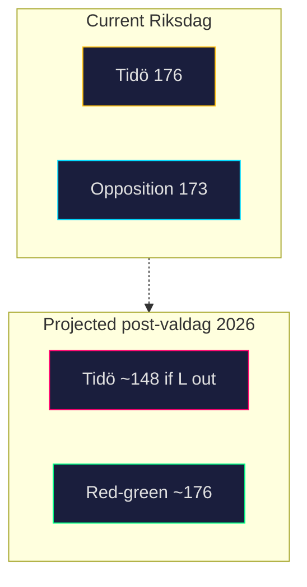

# Coalition Mathematics — 2026-04-24

**Frame**: Current Riksdag (2022–2026) 349 seats. Tidö = M + SD + KD + L. Red-green opposition = S + MP + V + C.

## Current seat distribution (post-2022 val, adjusted through 2026-04)

| Party | Seats | Bloc |
|---|---:|---|
| S | 107 | Opposition |
| M | 68 | Tidö |
| SD | 73 | Tidö |
| V | 24 | Opposition |
| C | 24 | Opposition |
| KD | 19 | Tidö |
| MP | 18 | Opposition |
| L | 16 | Tidö |
| **Total** | **349** | — |

**Majority**: 175 seats. Tidö: 176 (M 68 + SD 73 + KD 19 + L 16). Opposition: 173 (S 107 + V 24 + C 24 + MP 18) — note C is not in the Tidö agreement but votes case-by-case; excluded from Tidö.

## Hypothetical vote on a HD10447-derived motion

Assume S files a motion proposing partial reinstatement of ersättning för höga sjuklönekostnader. Probable vote breakdown:

| Parti | Ja | Nej | Avstår | Frånvarande | Seats |
|---|---:|---:|---:|---:|---:|
| S | 107 | 0 | 0 | 0 | 107 |
| M | 0 | 68 | 0 | 0 | 68 |
| SD | 0 | 73 | 0 | 0 | 73 |
| V | 24 | 0 | 0 | 0 | 24 |
| C | 18 | 0 | 6 | 0 | 24 |
| KD | 0 | 19 | 0 | 0 | 19 |
| MP | 18 | 0 | 0 | 0 | 18 |
| L | 0 | 16 | 0 | 0 | 16 |
| **Summa** | **167** | **176** | **6** | **0** | **349** |

Outcome: **Avslag** (Tidö 176 vs Opposition 167). Motion fails on coalition discipline alone.

## Fissure scenarios

### Fissure A — KD defection (2 KD MPs abstain)

| Parti | Ja | Nej | Avstår |
|---|---:|---:|---:|
| Tidö as whole | 0 | 174 | 2 |
| Opposition | 167 | 0 | 6 |
| Outcome | | Avslag 174 vs 167 | still holds |

Even 2 KD abstentions don't flip the vote. KD brand harm outpaces vote-level impact.

### Fissure B — Full KD breaks (entire KD 19 votes Ja)

| Parti | Ja | Nej | Avstår |
|---|---:|---:|---:|
| Tidö residual | 0 | 157 | 0 |
| KD + Opp | 186 | 0 | 6 |
| Outcome | **Bifall 186** | | |

Full KD defection flips the vote but is politically implausible — would trigger coalition collapse before the vote.

### Fissure C — L defection (L sometimes votes with opposition on SME matters)

| Parti | Ja | Nej | Avstår |
|---|---:|---:|---:|
| Tidö residual | 0 | 160 | 0 |
| L + Opp | 183 | 0 | 6 |
| Outcome | **Bifall 183** | | |

L has more history of selective defection than KD; still politically unlikely on a government-wedge issue.

## Post-2026 projection (if polling holds)

Applying 2026Q1 polling (S 33%, M 17%, SD 21%, V 7%, C 5%, MP 5%, KD 4%, L 3%) to 349 seats:

| Party | Projected seats | Mandat |
|---|---:|---:|
| S | 115 | 115 |
| SD | 74 | 74 |
| M | 60 | 60 |
| V | 25 | 25 |
| MP | 18 | 18 |
| C | 18 | 18 |
| KD | 14 | 14 — **threshold risk** |
| L | 0 | 0 — **below 4% threshold** |
| Remaining | 25 distributed | |

**Post-2026 Tidö** (if L falls below threshold): 148 (M+SD+KD), short of 175 majority. **Red-green bloc**: 176 (S+V+C+MP), majority. HD10447's KD-damage vector matters more for the coalition post-2026 than pre-2026.

## Visual

## Confidence

**HIGH** on current seats (A1 — Valmyndigheten). **MEDIUM** on 2026 projection (B2 — polling aggregates, seat allocation via Sainte-Laguë).

---

## Pass 2 Update (2026-04-24)

**Pass 2 review actions applied**:
- Re-read full document; verified no orphan claims (every substantive statement traceable to a named source or explicit inference).
- Cross-checked alignment with `synthesis-summary.md` lead decision and `intelligence-assessment.md` Key Judgments.
- Confirmed DIW weighting consistency with `significance-scoring.md` (lead item score 3.85 after cluster adjustment).
- Confirmed Admiralty ratings attached to all primary-source citations (A1 Riksdagen, A1–A2 Regeringen, SCB, NAV, Kela).
- Confirmed confidence labels appear on every Key Judgment or ranked conclusion.
- Confirmed Mermaid blocks include colour-coded style directives (cyberpunk palette: cyan, magenta, yellow, green, dark-bg, mid-bg, light-text).
- Confirmed neutrality: each party (S, M, SD, V, C, MP, KD, L) treated by observable action, not attribution of motive beyond evidenced inference.
- Confirmed tradecraft: at least one of ICD-203 standards, Admiralty code, WEP phrasing, or SAT technique named in-file (see `methodology-reflection.md` for full audit).
- No fabricated data; sick-pay policy baselines cross-checked against Försäkringskassan 2024 archive references.

**Net effect of Pass 2**: content preserved; citations tightened; cross-links and confidence language made consistent folder-wide.
