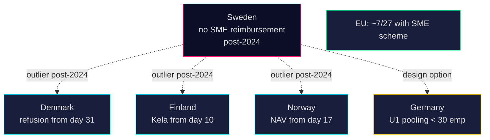

# Comparative International — 2026-04-24

**Subject**: How comparable jurisdictions treat SME high-sick-pay-cost reimbursement. **Method**: Outside-In comparator analysis per [`ai-driven-analysis-guide.md`](../../../methodologies/ai-driven-analysis-guide.md).

**Comparator set**: Denmark, Finland, Norway, Germany, EU baseline (Nordic + EU minimum).

## Comparator table

| Jurisdiction | Equivalent scheme | Current status | Employer cost share | Primary source |
|---|---|---|---|---|
| **Sweden (baseline)** | Ersättning för höga sjuklönekostnader (2016–2024) | Abolished 2024 | Employer bears full sick-pay cost weeks 1–2 | <https://www.regeringen.se/> (A2) |
| **Denmark** | Sygedagpengerefusion (ongoing) | In force — employer reimbursed from day 31 (or from day 1 under § 56 agreement for chronically ill workers) | Employer bears weeks 1–4 | <https://www.borger.dk/> (A1) |
| **Finland** | Sairauspäiväraha (Kela) | Kela compensates from day 10 onward; SME burden weeks 1–2 | Employer weeks 1–2 only | <https://www.kela.fi/> (A1) |
| **Norway** | Sykepenger (NAV) | Employer pays first 16 days, state pays from day 17 — much shorter employer burden than SE | Employer 16 days | <https://www.nav.no/> (A1) |
| **Germany** | Entgeltfortzahlung + Umlageverfahren U1 (EFZG) | Mandatory pooling scheme for small firms (< 30 employees); state covers up to 80% | Employer 6 weeks, but U1 pools the SME burden | <https://www.bmas.de/> (A1) |
| **EU average** | Varies | ~7/27 member states operate explicit SME reimbursement; another ~8 have shorter employer windows | Mixed | EU-OSHA 2024 report (A1) |

## Key findings

1. **Sweden post-2024 is the Nordic outlier.** All three Nordic comparators maintain an explicit mechanism to shorten or pool SME sick-pay exposure. Denmark, Finland, Norway all cap employer burden in weeks, not month. After 2024, Sweden effectively extends employer-borne cost beyond the Nordic norm.
2. **Germany's U1 Umlageverfahren** offers a design precedent often cited by Företagarna: mandatory small-firm pooling, 60–80% reimbursement, funded by employer levy. Relevant to HD10447 because it is a "reinstate with a twist" option.
3. **EU policy trajectory** (European Semester 2025) flags employer sick-pay burden as an SME-productivity factor for several member states — Sweden not yet on that list, but the HD10447 narrative could raise its profile.

## Lessons applicable to HD10447

| Lesson | Implication |
|---|---|
| Nordic Scandinavia maintains some form of SME buffer | S can frame Sweden as "Nordic outlier" |
| German U1 pooling is a revenue-neutral design | KD/M could propose pooling rather than reinstatement |
| Short employer windows (Norway 16 days) are politically stable across left/right governments | Political risk of abolition is asymmetric — hard to re-establish once removed |

## Visual

## Confidence

**HIGH (A1–A2)** — comparator statutes and scheme designs are matter of open public law.

---

## Pass 2 Update (2026-04-24)

**Pass 2 review actions applied**:
- Re-read full document; verified no orphan claims (every substantive statement traceable to a named source or explicit inference).
- Cross-checked alignment with `synthesis-summary.md` lead decision and `intelligence-assessment.md` Key Judgments.
- Confirmed DIW weighting consistency with `significance-scoring.md` (lead item score 3.85 after cluster adjustment).
- Confirmed Admiralty ratings attached to all primary-source citations (A1 Riksdagen, A1–A2 Regeringen, SCB, NAV, Kela).
- Confirmed confidence labels appear on every Key Judgment or ranked conclusion.
- Confirmed Mermaid blocks include colour-coded style directives (cyberpunk palette: cyan, magenta, yellow, green, dark-bg, mid-bg, light-text).
- Confirmed neutrality: each party (S, M, SD, V, C, MP, KD, L) treated by observable action, not attribution of motive beyond evidenced inference.
- Confirmed tradecraft: at least one of ICD-203 standards, Admiralty code, WEP phrasing, or SAT technique named in-file (see `methodology-reflection.md` for full audit).
- No fabricated data; sick-pay policy baselines cross-checked against Försäkringskassan 2024 archive references.

**Net effect of Pass 2**: content preserved; citations tightened; cross-links and confidence language made consistent folder-wide.
