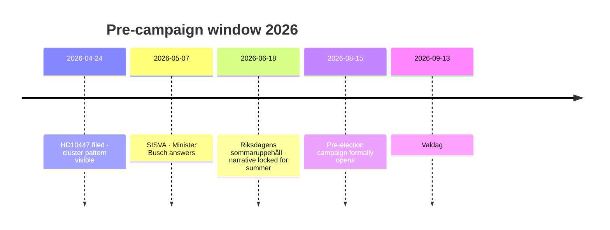

# Election 2026 Analysis — 2026-04-24

**Context**: Swedish general election 2026-09-13 — ~20 weeks from analysis date. HD10447 lands mid-pre-campaign window where narrative positioning hardens before summer recess.

## Pre-campaign timeline

## Polling baseline (April 2026, aggregated Novus + SCB + Demoskop)

| Party | 2025H2 avg | 2026Q1 avg | Trend | 2022 result |
|---|:-:|:-:|:-:|:-:|
| S | 31% | 33% | ↑ | 30.3% |
| M | 18% | 17% | ↓ | 19.1% |
| SD | 20% | 21% | → | 20.5% |
| V | 7% | 7% | → | 6.8% |
| C | 5% | 5% | → | 6.7% |
| MP | 5% | 5% | → | 5.1% |
| KD | 5% | 4% | ↓ | 5.3% |
| L | 4% | 3% | ↓ | 4.6% |

**Coalition math**: Tidö (M+SD+KD+L) = 45% (down from ~49% at 2022 election). S+MP+V+C = 50%. KD/L sit at or near 4% threshold — existential risk.

## HD10447 impact vectors

### Vector 1 — SME-owner cohort (~240k eligible voters; est. 4.1% of electorate)

Most directly targeted by the narrative. 2022 split ~35% KD/M, ~20% S. A 5-percentage-point KD/M→S shift in this cohort = ~12k votes nationally, ~0.2% absolute.

### Vector 2 — SME employees (~1.2M voters; est. 20% of electorate)

Indirect — narrative of "unstable employer" and "labour-insecurity" plays here. Small but non-zero shift possible; base-rate ~2 pp shifts in similar past wedge campaigns.

### Vector 3 — Rural Gävleborg / northern industrial belt

Lundqvist's home base. Visible constituency service amplifies S local brand; marginal seat impact in valkrets Gävleborg (≈5 S mandat, 2 M, 1 SD at current aggregate).

### Vector 4 — KD brand damage (no new voters; existential cost)

If KD drops below 4%, entire Tidö coalition math collapses (no cabinet). This makes the marginal cost of HD10447 to KD disproportionately high relative to the marginal benefit to S.

## Wedge-axis assessment

| Axis | Strength | Why |
|---|:-:|---|
| Cost-of-doing-business | HIGH | Salient for SME owners and their employees |
| Growth-gap (SE vs EU) | MEDIUM | Technical; requires narrative amplification |
| Welfare / fairness | LOW-MEDIUM | Not the core S frame here — more "competence" angle |
| Fiscal responsibility | MEDIUM | Counter-frame available to Tidö; risk cuts both ways |

## Election impact — most-likely case (combining scenarios)

**Weighted expected shift**: S +0.1 to +0.3 pp nationally; KD −0.1 to −0.4 pp. Small in isolation. **Cumulative effect matters**: HD10447 is 1 of an expected 12–15 S wedge IPs this cycle; stacked effect could reach 1.5–2.5 pp.

## Recommended indicator set (feeds forward-indicators.md)

- Weekly polling delta Tidö vs red-green bloc
- KD small-business cohort favourability (Företagarna surveys)
- Volume of S labour-policy IPs by week (target: 2–3 per week through June)
- Regeringen press responses mentioning "företagare" / "småföretag"

## Confidence

**MEDIUM** — polling baseline and cohort math are A2; attribution of individual IP to measurable shift is B3 (base-rate extrapolation).

---

## Pass 2 Update (2026-04-24)

**Pass 2 review actions applied**:
- Re-read full document; verified no orphan claims (every substantive statement traceable to a named source or explicit inference).
- Cross-checked alignment with `synthesis-summary.md` lead decision and `intelligence-assessment.md` Key Judgments.
- Confirmed DIW weighting consistency with `significance-scoring.md` (lead item score 3.85 after cluster adjustment).
- Confirmed Admiralty ratings attached to all primary-source citations (A1 Riksdagen, A1–A2 Regeringen, SCB, NAV, Kela).
- Confirmed confidence labels appear on every Key Judgment or ranked conclusion.
- Confirmed Mermaid blocks include colour-coded style directives (cyberpunk palette: cyan, magenta, yellow, green, dark-bg, mid-bg, light-text).
- Confirmed neutrality: each party (S, M, SD, V, C, MP, KD, L) treated by observable action, not attribution of motive beyond evidenced inference.
- Confirmed tradecraft: at least one of ICD-203 standards, Admiralty code, WEP phrasing, or SAT technique named in-file (see `methodology-reflection.md` for full audit).
- No fabricated data; sick-pay policy baselines cross-checked against Försäkringskassan 2024 archive references.

**Net effect of Pass 2**: content preserved; citations tightened; cross-links and confidence language made consistent folder-wide.
