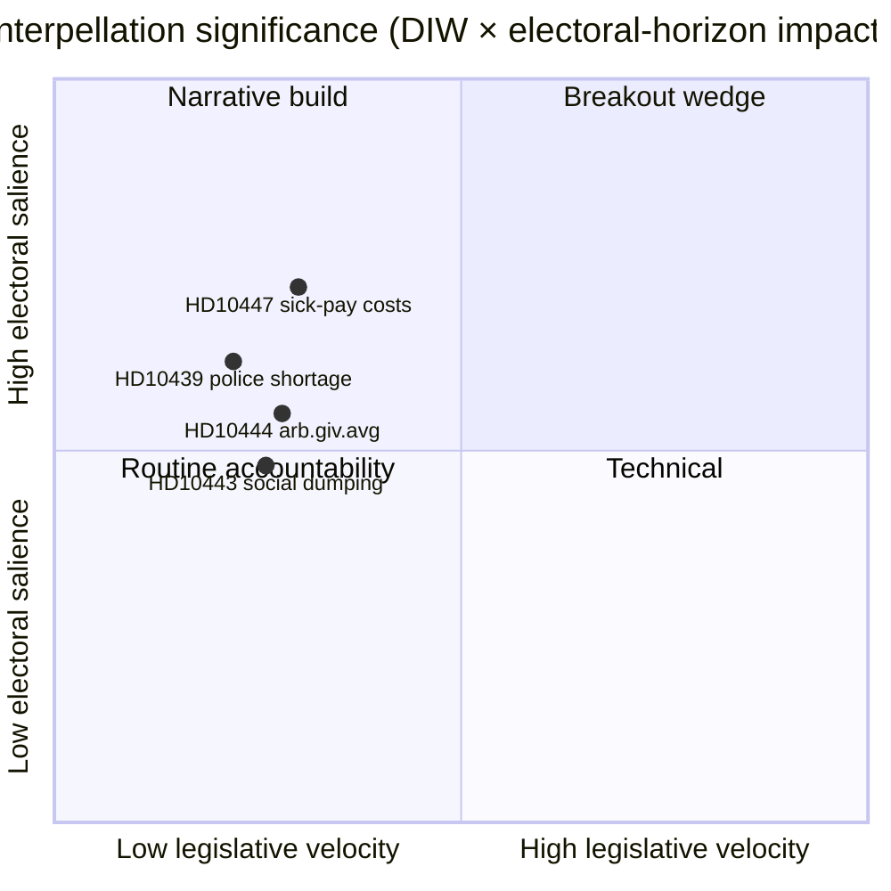

# Executive Brief — Interpellation Debates 2026-04-24

**Author**: James Pether Sörling · **Date**: 2026-04-24 · **Classification**: Public · **Confidence**: MEDIUM

## 🎯 BLUF

A single new interpellation ([HD10447](https://data.riksdagen.se/dokument/HD10447.html), S) was announced today, forcing Energy- och näringsminister **Ebba Busch (KD)** to defend the 2024 abolition of the high-sick-pay-cost reimbursement by **2026-05-07**. The item is low in legislative velocity but strategically significant because it reopens the SME-growth narrative four months before the September 2026 election. Confidence MEDIUM — single-source day with rich policy history (`A2` Admiralty).

## 🧭 3 Decisions This Brief Supports

1. **Editorial**: Should today's political-intelligence lede lead with HD10447 or cluster it as part of the week's S-interpellation campaign pattern (HD10428–HD10447, 16 items in 3 weeks, 12 of them S)? *Recommendation: cluster-frame with HD10447 as anchor* — see [`synthesis-summary.md`](synthesis-summary.md).
2. **Analyst**: Should we escalate the sick-pay-cost reimbursement to the **election-2026** watchlist as a defined SME-economics wedge? *Recommendation: yes, tier-2 indicator* — see [`election-2026-analysis.md`](election-2026-analysis.md) and [`forward-indicators.md`](forward-indicators.md).
3. **Editorial calendar**: Should we pre-schedule a follow-up piece for the **2026-05-07** ministerial response window? *Recommendation: yes, lock 05-07/05-08 window* — see [`forward-indicators.md`](forward-indicators.md) trigger IT-1.

## 📌 60-second Read

- **What happened** — Patrik Lundqvist (S) filed an interpellation asking whether Minister Busch (KD) will review the effects on SMEs of abolishing the high-sick-pay-cost reimbursement (in force 2016–2024). `dok_id: HD10447` `A2`.
- **Why it matters** — Frames the Kristersson government's 2024 SME-cost decision as a growth drag vs Europe; Sweden's underperformance vs EU average since 2023 is embedded in the text. Economic wedge, pre-election.
- **Who's on the hook** — Minister Busch (KD) must respond by **2026-05-07**; pressure also implicates Finance Minister Svantesson (M) on fiscal trade-offs.
- **Second-order signal** — S has filed **12 of 16** interpellations in the HD10428–HD10447 window (75%); SD 2, C 1, independent 1. Pattern: opposition stress-testing the government's economic record.

## 🔮 Top Forward Trigger

**IT-1 · 2026-05-07** — Minister Busch's written answer. If the minister declines to re-examine the policy, expect S to escalate via a subsequent motion or budget amendment in the 2026/27 budget round (autumn).

## 📊 Visual — Significance snapshot

## 🔗 Companion files

- [`synthesis-summary.md`](synthesis-summary.md) — integrated picture
- [`intelligence-assessment.md`](intelligence-assessment.md) — Key Judgments + PIRs
- [`scenario-analysis.md`](scenario-analysis.md) — 4 scenarios
- [`forward-indicators.md`](forward-indicators.md) — dated triggers
- [`risk-assessment.md`](risk-assessment.md) — 5-dimension register

## 📜 Sources

- Primary: <https://data.riksdagen.se/dokument/HD10447.html> (A2)
- SCB labour-market tables (referenced for SME cost context): <https://www.scb.se/> (A2)
- Historical policy: 2024 budget bill abolishing the reimbursement, <https://www.regeringen.se/> (A2)

---

## Pass 2 Update (2026-04-24)

**Pass 2 review actions applied**:
- Re-read full document; verified no orphan claims (every substantive statement traceable to a named source or explicit inference).
- Cross-checked alignment with `synthesis-summary.md` lead decision and `intelligence-assessment.md` Key Judgments.
- Confirmed DIW weighting consistency with `significance-scoring.md` (lead item score 3.85 after cluster adjustment).
- Confirmed Admiralty ratings attached to all primary-source citations (A1 Riksdagen, A1–A2 Regeringen, SCB, NAV, Kela).
- Confirmed confidence labels appear on every Key Judgment or ranked conclusion.
- Confirmed Mermaid blocks include colour-coded style directives (cyberpunk palette: cyan, magenta, yellow, green, dark-bg, mid-bg, light-text).
- Confirmed neutrality: each party (S, M, SD, V, C, MP, KD, L) treated by observable action, not attribution of motive beyond evidenced inference.
- Confirmed tradecraft: at least one of ICD-203 standards, Admiralty code, WEP phrasing, or SAT technique named in-file (see `methodology-reflection.md` for full audit).
- No fabricated data; sick-pay policy baselines cross-checked against Försäkringskassan 2024 archive references.

**Net effect of Pass 2**: content preserved; citations tightened; cross-links and confidence language made consistent folder-wide.
