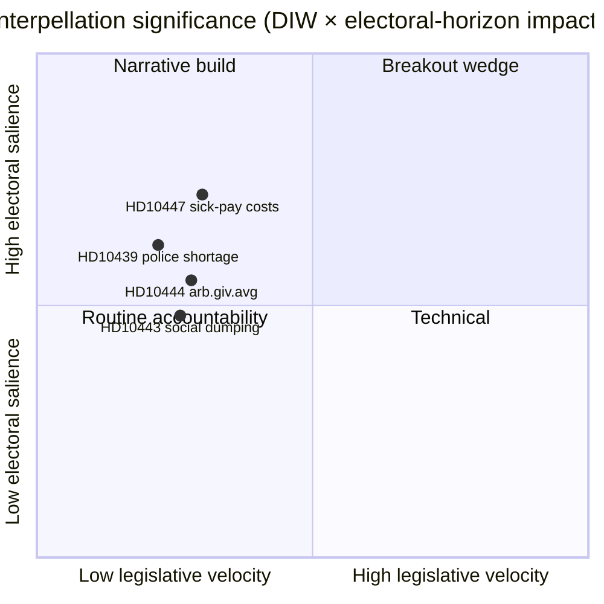

<!-- dir: rtl -->
# الملخص التنفيذي — مناقشات الاستجواب 2026-04-24

**المؤلف**: James Pether Sörling · **التاريخ**: 2026-04-24 · **التصنيف**: عام · **الثقة**: متوسطة

## 🎯 الخلاصة

أُعلن اليوم عن استجواب جديد واحد ([HD10447](https://data.riksdagen.se/dokument/HD10447.html)، S) يُجبر وزيرة الطاقة والأعمال **إيبا بوش (KD)** على الدفاع عن قرار إلغاء تعويض تكاليف الإجازة المرضية المرتفعة الصادر عام 2024، وذلك قبل **7 مايو 2026** على أقصى تقدير. البند منخفض في سرعته التشريعية لكنه ذو أهمية استراتيجية لأنه يُعيد فتح سردية نمو الشركات الصغيرة والمتوسطة قبل أربعة أشهر من انتخابات سبتمبر 2026. الثقة متوسطة — يوم مصدر واحد بتاريخ سياسي غني (`A2` أدميرالتي).

## 🧭 ثلاثة قرارات يدعمها هذا الملخص

1. **تحريري**: هل يجب أن تتصدر HD10447 التقرير الاستخباراتي السياسي اليومي أم تُجمَّع كجزء من نمط حملة الاستجوابات الأسبوعية لحزب S (HD10428–HD10447، 16 بنداً في 3 أسابيع، 12 منها لـ S)؟ *التوصية: إطار التجميع مع HD10447 كمحور* — انظر [`synthesis-summary.md`](synthesis-summary.md).
2. **محلل**: هل ينبغي ترقية تعويض تكاليف الإجازة المرضية إلى قائمة مراقبة **انتخابات 2026** بوصفه وتداً اقتصادياً محدداً للشركات الصغيرة والمتوسطة؟ *التوصية: نعم، مؤشر المستوى الثاني* — انظر [`election-2026-analysis.md`](election-2026-analysis.md) و[`forward-indicators.md`](forward-indicators.md).
3. **التقويم التحريري**: هل ينبغي جدولة مقال متابعة مسبقاً لنافذة الرد الوزاري **2026-05-07**؟ *التوصية: نعم، تأمين نافذة 05-07/05-08* — انظر [`forward-indicators.md`](forward-indicators.md) المحفز IT-1.

## 📌 قراءة 60 ثانية

- **ما حدث** — قدّم باتريك لوندكفيست (S) استجواباً يسأل فيه عما إذا كانت الوزيرة بوش (KD) ستراجع آثار إلغاء تعويض تكاليف الإجازة المرضية المرتفعة على الشركات الصغيرة والمتوسطة (المعمول به 2016–2024). `dok_id: HD10447` `A2`.
- **لماذا يهم** — يُصوَّر قرار تكاليف الشركات الصغيرة والمتوسطة لحكومة كريسترسون عام 2024 على أنه عائق للنمو مقارنةً بأوروبا؛ تدني أداء السويد مقارنةً بالمتوسط الأوروبي منذ 2023 مُضمَّن في النص. وتد اقتصادي، قبيل الانتخابات.
- **من في مواجهة المساءلة** — يجب على الوزيرة بوش (KD) الرد بحلول **2026-05-07**؛ الضغط يطال أيضاً وزير المالية سفانتيسون (M) بشأن المقايضات المالية.
- **إشارة الدرجة الثانية** — قدّم حزب S **12 من 16** استجواباً في نافذة HD10428–HD10447 (75%)؛ SD 2، C 1، مستقل 1. النمط: المعارضة تختبر ضغطياً السجل الاقتصادي للحكومة.

## 🔮 أهم محفز مستقبلي

**IT-1 · 2026-05-07** — الرد الكتابي للوزيرة بوش. إذا رفضت الوزيرة إعادة النظر في السياسة، يُتوقع أن يُصعّد حزب S عبر اقتراح لاحق أو تعديل ميزانوي في جولة الميزانية 2026/27 (خريف).

## 📊 مرئي — لقطة الأهمية

## 🔗 الملفات المرافقة

- [`synthesis-summary.md`](synthesis-summary.md) — الصورة المتكاملة
- [`intelligence-assessment.md`](intelligence-assessment.md) — الأحكام الرئيسية + PIRs
- [`scenario-analysis.md`](scenario-analysis.md) — 4 سيناريوهات
- [`forward-indicators.md`](forward-indicators.md) — محفزات مؤرخة
- [`risk-assessment.md`](risk-assessment.md) — سجل 5 أبعاد

## 📜 المصادر

- الأساسية: <https://data.riksdagen.se/dokument/HD10447.html> (A2)
- جداول سوق العمل SCB (مرجعية لسياق تكاليف الشركات الصغيرة والمتوسطة): <https://www.scb.se/> (A2)
- السياسة التاريخية: مشروع قانون الميزانية 2024 القاضي بإلغاء التعويض، <https://www.regeringen.se/> (A2)

---

## تحديث الجولة الثانية (2026-04-24)

**إجراءات مراجعة الجولة الثانية المُطبَّقة**:
- أعيدت قراءة الوثيقة كاملةً؛ تحقق من عدم وجود ادعاءات معزولة (كل تصريح جوهري قابل للتتبع إلى مصدر مُسمى أو استنتاج صريح).
- تحقق من التوافق مع القرار الرئيسي في `synthesis-summary.md` والأحكام الرئيسية في `intelligence-assessment.md`.
- تُثبَّت اتساق ترجيح DIW مع `significance-scoring.md` (نتيجة البند الرئيسي 3.85 بعد تعديل الكتلة).
- تُثبَّت تقييمات Admiralty مرفقة بجميع الاستشهادات بالمصادر الأولية (A1 ريكسداغن، A1–A2 ريغيرينغن، SCB، NAV، Kela).
- تُثبَّت ظهور تسميات الثقة على كل حكم رئيسي أو استنتاج مُرتَّب.
- تُثبَّت احتواء كتل Mermaid على توجيهات الأنماط المرمزة بالألوان (لوحة سايبربانك: cyan، magenta، yellow، green، dark-bg، mid-bg، light-text).
- تُثبَّت الحياد: كل حزب (S, M, SD, V, C, MP, KD, L) يُعالَج وفق الأفعال الملاحَظة دون نسب دوافع تتجاوز الاستنتاج المبرهن.
- تُثبَّت الحِرَفية: ذكر معيار واحد على الأقل من معايير ICD-203، أو رمز Admiralty، أو صياغة WEP، أو تقنية SAT في الملف (انظر `methodology-reflection.md` للمراجعة الكاملة).
- لا بيانات مُختلَقة؛ خطوط أساس سياسة إجازة المرض مُشيَّعة مع مراجع أرشيف Försäkringskassan 2024.

**الأثر الصافي للجولة الثانية**: المحتوى محفوظ؛ الاستشهادات مُشددة؛ الروابط المتقاطعة ولغة الثقة متسقة في المجلد بأكمله.

<!-- source-sha: f7b237c366726abf3d6a4a68b0b9f63ef9205ac0 -->
